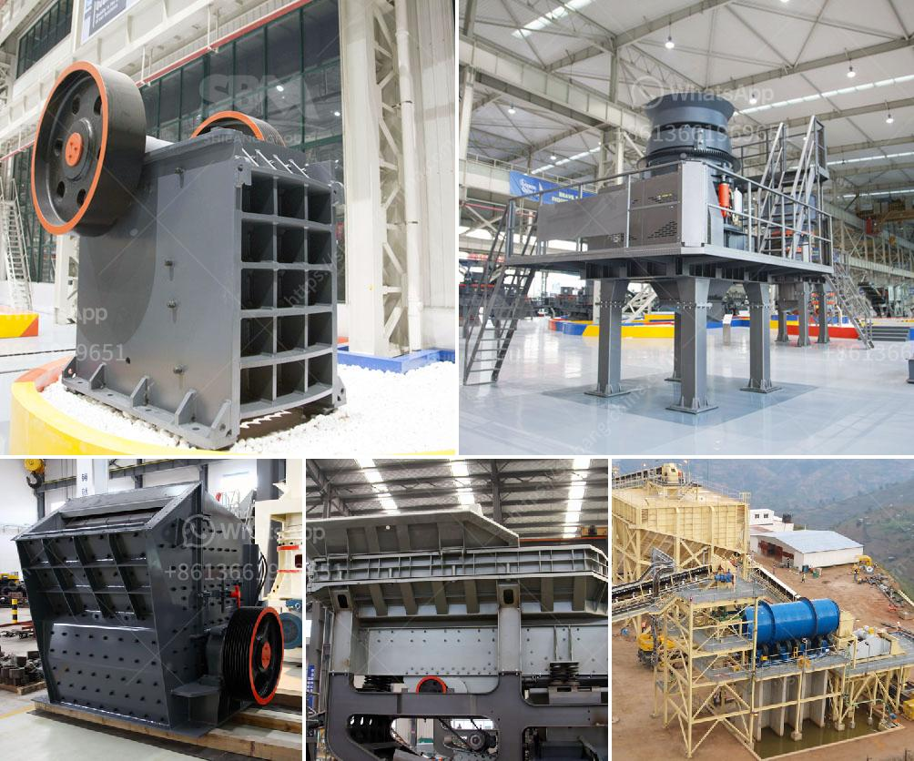

<h3>How is limestone processed flowchart?</h3>
Limestone is a sedimentary rock that is primarily composed of calcium carbonate (CaCO3) in the form of the mineral calcite. It is abundant, versatile, and has been widely used for thousands of years in various construction and industrial applications. Throughout history, limestone has been processed into different forms to meet specific needs. Understanding the flowchart of how limestone is processed can give a deeper insight into the various stages involved in the production of this versatile material.

The first step in processing limestone is the extraction from mines. Modern extraction techniques usually involve drilling and blasting the rock to break it into smaller pieces, followed by equipment such as excavators and loaders to transport the limestone to a crushing plant.

The extracted limestone is usually crushed into smaller sizes before further processing. The crushing process ensures that the limestone is properly broken down into fine granules. The smaller the limestone particles, the easier it is to dissolve in water and react with other compounds.

After crushing, the limestone is further processed by grinding it into a fine powder. The grinding process is carried out using either ball mills or vertical roller mills, which are water-cooled cylinders that rotate and grind the limestone into a fine powder. This powder is then homogenized and stored in silos for further processing.

The next step in the flowchart is calcination, which involves heating the limestone powder to a high temperature (around 900-1000°C). This process is carried out in large kilns, where the limestone is heated under controlled conditions. The high temperature causes the limestone to undergo a chemical transformation, converting calcium carbonate into calcium oxide (lime) and releasing carbon dioxide gas.

The calcined lime is then hydrated by adding water to it. This hydration process leads to the formation of calcium hydroxide (slaked lime or hydrated lime), which is highly alkaline and commercially valuable. Hydrated lime has several industrial applications, including water treatment, construction, and chemical manufacturing processes.

The final step in the process is packaging and distribution of the processed limestone products. Depending on the specific application, the limestone can be packaged and shipped in various forms, including bulk, bags, or even as a slurry for specialized industries.

It is important to note that the flowchart provided here represents a generalized process of how limestone is typically processed. Variations may occur depending on the specific requirements of the end product and the machinery and techniques employed.

In conclusion, the process of how limestone is processed involves several stages, including extraction, crushing, grinding, calcination, hydration, and packaging. Each step plays a crucial role in transforming the raw limestone into a versatile material that can be used for various applications. By understanding the flowchart of limestone processing, we can appreciate the complex and fascinating journey that this rock takes from the earth to our everyday lives.
<h3>Contact us</h3><ul><li><strong>Whatsapp:&nbsp;<a href="https://wa.me/8613661969651">+8613661969651</a></strong></li><li><a href="https://swt.shibang-china.com/?git&amp;zhl&amp;How is limestone processed flowchart"><strong>Online Service(chat now)</strong></a></li></ul><h3>Related</h3><ul><li><a href='How to work jaw crusher and impact crusher .md'>How to work jaw crusher and impact crusher ?</a></li><li><a href='How is iron ore crushed ready for processing.md'>How is iron ore crushed ready for processing?</a></li><li><a href='how to own quarry in nigeria.md'>how to own quarry in nigeria?</a></li><li><a href='How to maintain the jaw crusher.md'>How to maintain the jaw crusher?</a></li><li><a href='how to load cone crusher .md'>how to load cone crusher ?</a></li></ul>