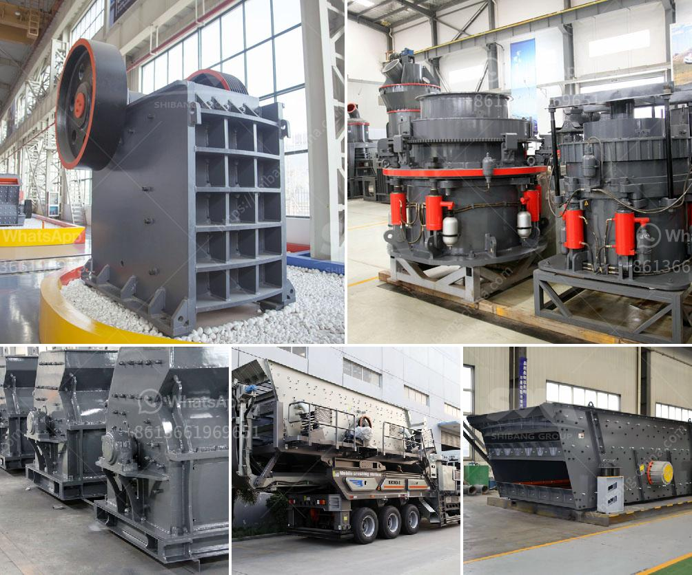

<h3>How is manganese extracted?</h3>
Manganese is a crucial element used predominantly in the steel industry. It is frequently found in minerals such as pyrolusite, rhodochrosite, and manganite, among others. Manganese is extracted through several methods but the most common and efficient method is through pyrometallurgical techniques.

The extraction process begins with the mining of manganese-rich ores. These ores, usually found in surface deposits, are then transported to a processing plant for further refinement.

The first step in manganese extraction is the blasting of the ore deposit. This is followed by the removal of the overlying rock and soil through bulldozers and excavators, or by using explosives in case of hard rock deposits. Once the ore is exposed, it is then drilled, fragmented, and loaded into haul trucks to be transported to the processing plant.

At the processing plant, the ore undergoes a series of crushing, washing, and screening processes. This helps separate the manganese-rich material from the unwanted rock and other impurities. The crushed ore is then fed into a ball mill, where it is ground to a fine powder. Water is added to create a slurry and chemicals such as sulfuric acid and hydrochloric acid are used to leach out the manganese from the ore.

During the leaching process, the pH level and temperature are carefully controlled to optimize manganese extraction. The leaching solution is then passed through a series of tanks and filters to separate the liquid, containing the dissolved manganese, from the solid residue.

Once the desired concentration of manganese is achieved, the solution is further purified through a solvent extraction process. This involves adding organic compounds to the solution, which selectively bind with manganese ions. The organic compound is then separated from the solution, leaving behind a highly purified manganese solution.

The purified manganese solution undergoes electrolysis. In this process, an electric current is passed through the solution, causing the manganese ions to deposit onto electrodes. These solid manganese deposits, known as cathodes, are collected and further processed to obtain the final manganese product.

The final step in manganese extraction is refining. The cathodes are dissolved in sulfuric acid, and impurities such as iron and other metals are removed through precipitation or filtration. The remaining solution is then electrolyzed once again to obtain a higher purity manganese deposit. This deposit is then cast into ingots or processed further to produce manganese alloys, which are used in the production of steel.

Manganese extraction is a complex and energy-intensive process that requires careful planning and precise execution. However, advancements in technology have made the process more efficient and sustainable. Research and development efforts are ongoing to find alternative methods that are less energy-intensive and environmentally friendly, ensuring the future availability of this crucial element.

In conclusion, manganese extraction is primarily achieved through pyrometallurgical techniques. The process involves mining, crushing, leaching, solvent extraction, electrolysis, and refining. Manganese is an essential element in the steel industry, and its extraction plays a vital role in meeting the growing global demand for steel products. Continuous advancements in extraction methods are necessary to ensure a sustainable supply of manganese for various industrial applications.
<h3>Contact us</h3><ul><li><strong>Whatsapp:&nbsp;<a href="https://wa.me/8613661969651">+8613661969651</a></strong></li><li><a href="https://swt.shibang-china.com/?git&amp;zhl&amp;How is manganese extracted"><strong>Online Service(chat now)</strong></a></li></ul><h3>Related</h3><ul><li><a href='How much does a stone crusher of 150 tonnes cost.md'>How much does a stone crusher of 150 tonnes cost?</a></li><li><a href='How to increase the capacity of ball mill .md'>How to increase the capacity of ball mill ?</a></li><li><a href='how many tons per hour for the rock crusher .md'>how many tons per hour for the rock crusher ?</a></li><li><a href='How to Build a Sand Washing Plant in Indonesia ？.md'>How to Build a Sand Washing Plant in Indonesia ？</a></li><li><a href='How to separate the gold from the powdered sand .md'>How to separate the gold from the powdered sand ?</a></li></ul>