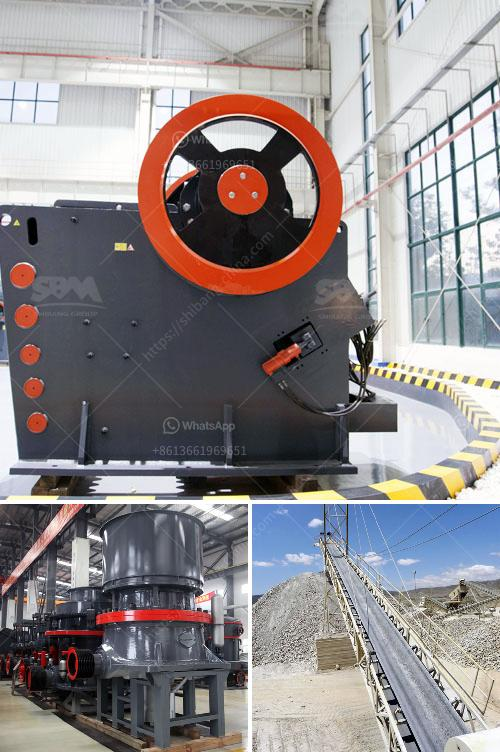

<h3>How is mill used in the copper ore mining process?</h3>
The mining process of copper ore is complex and requires several stages of processing. Copper extraction involves crushing, grinding, and subsequent separation of the ore from the waste rock. As one of the leading suppliers of copper equipment, Fote Machinery has introduced an advanced milling technique to produce the best copper concentrate available. This article will discuss how mills are used in the copper ore mining process.

The first step in copper mining is crushing the ore into smaller pieces. This is done using mechanical equipment, such as jaw crushers and cone crushers, or manually using hammers. Crushing is the process of reducing the size of the ore particles to facilitate further processing.

Grinding is the next step in the copper ore mining process. Ore particles are crushed and ground to a size that can be used as feedstock for further processing. Mills are used to grind the ore particles to achieve a suitable particle size range. Grinding mills are categorized as either primary, secondary, or tertiary, depending on their purpose.

Primary mills are used for initial grinding operations where the ore is reduced to a size suitable for further processing. Secondary mills are used to further grind the ore in order to increase the surface area of the particles and improve mineral liberation. Tertiary mills are used for final grinding to achieve the desired particle size for efficient mineral separation.

There are different types of mills used in the copper ore mining process, including ball mills, rod mills, autogenous (AG) mills, and semi-autogenous (SAG) mills. These mills differ based on their grinding media and the grinding process they use.

Ball mills are the most commonly used type of mill in the copper ore grinding process. They are relatively simple in design, featuring a horizontal cylinder with a rotating drum, for inside grinding and mixing. Balls made of steel, ceramic, or rubber are placed inside the cylinder, which is then rotated at a certain speed, causing the balls to cascade and grind the ore particles. Ball mills are versatile and can handle both wet and dry grinding of copper ore.

Rod mills are another type of mill commonly used in copper ore grinding. They are similar to ball mills in terms of operation and consist of a rotating cylinder filled with rods for grinding and mixing. However, the ratio of rod length to diameter is generally 1.5:1 or less, making them more suitable for fine grinding.

Autogenous mills rely on ore itself as grinding media, while semi-autogenous mills use both ore and steel balls for grinding. These mills are often used in the primary grinding stage, where the ore is quite coarse. Autogenous and semi-autogenous mills are energy-efficient and can handle large quantities of ore.

In conclusion, mills play a crucial role in the copper ore mining process. They are used to crush and grind the ore to achieve the desired particle size for efficient mineral separation. Different types of mills are used, including ball mills, rod mills, autogenous mills, and semi-autogenous mills, each designed to suit specific milling applications. The use of mills ensures cost-effective and efficient copper extraction, leading to high-quality copper concentrate.
<h3>Contact us</h3><ul><li><strong>Whatsapp:&nbsp;<a href="https://wa.me/8613661969651">+8613661969651</a></strong></li><li><a href="https://swt.shibang-china.com/?git&amp;zhl&amp;How is mill used in the copper ore mining process"><strong>Online Service(chat now)</strong></a></li></ul><h3>Related</h3><ul><li><a href='how to load cone crusher .md'>how to load cone crusher ?</a></li><li><a href='how to grinder calcium carbonate stone crusher machine.md'>how to grinder calcium carbonate stone crusher machine?</a></li><li><a href='How to Improve the Crusher Productivity of Jaw Crusher ？.md'>How to Improve the Crusher Productivity of Jaw Crusher ？</a></li><li><a href='How to work jaw crusher and impact crusher .md'>How to work jaw crusher and impact crusher ?</a></li><li><a href='How to disassemble jaw crushers.md'>How to disassemble jaw crushers?</a></li></ul>