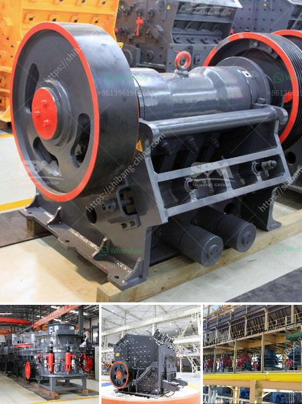

<h3>How is nickel extracted from its ore?</h3>
Nickel is a valuable metal that is primarily extracted from its ore, known as pentlandite. Pentlandite is a mineral found in large, often disseminated deposits. It is a ferrous nickel sulfide with a chemical formula of (Ni,Fe)9S8. This ore is an important source of nickel because it contains a significant amount of the metal compared to other nickel-bearing minerals.

The extraction of nickel from its ore involves various processes including crushing, roasting, leaching, and purification. Each step is explained below.

The first step in extracting nickel is crushing the ore into smaller fragments. This is done to increase the surface area of the ore, making it easier to extract the metal. Crushing also ensures that the nickel minerals are freed from the waste rock, resulting in a higher concentration of nickel.

Once the ore is crushed, it is then roasted. Roasting is a process that involves heating the ore in the presence of air or oxygen. This helps in converting any nickel sulfide minerals, such as pentlandite, into nickel oxide, which is more easily processed.

After roasting, the nickel oxide is leached using a strong acid solution, usually sulfuric acid. Leaching is a chemical process that involves dissolving the desired metal from the ore. In the case of nickel, sulfuric acid is used to dissolve the nickel oxide, resulting in a solution of nickel sulfate.

The next step is purification, which involves removing impurities from the nickel sulfate solution. This is done through a process called solvent extraction. Solvent extraction involves the use of an organic solvent that selectively binds to the desired metal, in this case, nickel. The impurities are left behind, while the nickel is extracted into the organic solvent.

Once the nickel is extracted into the organic solvent, it is then stripped from the solvent using another chemical agent. This process is known as stripping, and it results in a pure nickel solution.

The final step in the extraction of nickel is the precipitation of nickel metal from the pure solution. This is usually done by the addition of a reducing agent, such as hydrogen gas or carbon monoxide. The reducing agent reacts with the nickel ions in the solution, causing them to form solid nickel metal. The metal is then collected, purified, and processed into various nickel products, such as nickel alloys or electroplating materials.

Overall, the extraction of nickel from its ore is a complex process that involves several steps, including crushing, roasting, leaching, purification, and precipitation. Each step plays a crucial role in creating a pure and usable form of nickel. The demand for nickel continues to increase due to its numerous applications in various industries, such as stainless steel production, batteries, and electronics. As such, efficient and sustainable extraction methods are necessary to meet this growing demand while minimizing the environmental impact.
<h3>Contact us</h3><ul><li><strong>Whatsapp:&nbsp;<a href="https://wa.me/8613661969651">+8613661969651</a></strong></li><li><a href="https://swt.shibang-china.com/?git&amp;zhl&amp;How is nickel extracted from its ore"><strong>Online Service(chat now)</strong></a></li></ul><h3>Related</h3><ul><li><a href='How to move and install a mobile rock crusher.md'>How to move and install a mobile rock crusher?</a></li><li><a href='How to extract manganese from ore.md'>How to extract manganese from ore?</a></li><li><a href='How to set up stone crushing business in kenya .md'>How to set up stone crushing business in kenya ?</a></li><li><a href='How to operate rock crusher equipment safely .md'>How to operate rock crusher equipment safely ?</a></li><li><a href='How to start gold ball mill unit.md'>How to start gold ball mill unit?</a></li></ul>