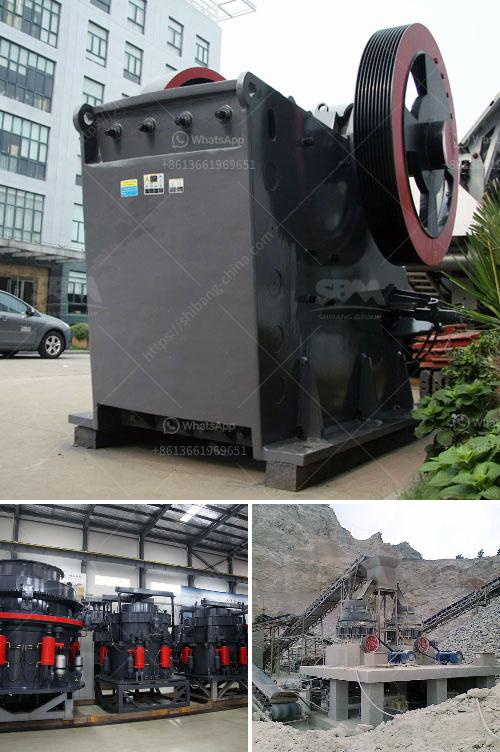

<h3>How is the cone crusher working?</h3>
Cone crushers are vital pieces of equipment in many industries, including mining, construction, and recycling. They operate by squeezing materials between a mantle and a concave, or bowl liner. The crusher cavity is filled with rock material throughout the crushing process. One of the key components of the cone crusher is the eccentric sleeve, which moves in an eccentric pattern, causing the mantle to rotate and squeeze the rock material.

When the cone crusher is turned on, the motor drives the eccentric sleeve through the V-belt, and the transmission shaft rotates. The main shaft is equipped with a main shaft upper bearing and a main shaft lower bearing, causing the eccentric sleeve to rotate. The mantle, which is constantly in contact with the rock material, moves up and down, creating a squeezing action. As the mantle moves, it squeezes the rock material between itself and the concave, crushing it into smaller pieces.

To prevent damage caused by overload situations, cone crushers are equipped with a hydraulic setting adjustment system. This system allows the operator to adjust the crusher settings to achieve the desired product size. This can be done remotely through a control panel, or manually using a hydraulic system. By adjusting the crusher settings, the operator can control the size and shape of the final product.

Another important component of cone crushers is the feed opening. The size of the feed opening determines the maximum size of the rock material that can be fed into the crusher. The larger the feed opening, the larger the maximum size of the rock material that can be crushed. However, it's important to note that the size of the feed opening also affects the production capacity of the crusher. A larger feed opening allows for higher production rates.

Additionally, cone crushers are equipped with a hydraulic system that allows for quick and easy clearing of blockages. If there is an uncrushable object, such as a piece of metal, entering the crusher cavity, the hydraulic system can release the pressure and lift the mantle, allowing the object to pass through. This feature reduces downtime and prevents damage to the crusher.

In summary, cone crushers work by squeezing rock material between a mantle and a concave, or bowl liner. The eccentric sleeve moves in an eccentric pattern, causing the mantle to rotate and squeeze the rock material. The hydraulic setting adjustment system allows the operator to control the size and shape of the final product, while the feed opening determines the maximum size of the rock material that can be fed into the crusher. The hydraulic system also allows for quick and easy clearing of blockages. Overall, cone crushers are efficient, versatile machines that are crucial in various industries.
<h3>Contact us</h3><ul><li><strong>Whatsapp:&nbsp;<a href="https://wa.me/8613661969651">+8613661969651</a></strong></li><li><a href="https://swt.shibang-china.com/?git&amp;zhl&amp;How is the cone crusher working"><strong>Online Service(chat now)</strong></a></li></ul><h3>Related</h3><ul><li><a href='How to buy mobile crusher .md'>How to buy mobile crusher ?</a></li><li><a href='How to increase the output of ball mill.md'>How to increase the output of ball mill?</a></li><li><a href='How to build a small crusher production line ？.md'>How to build a small crusher production line ？</a></li><li><a href='How to collect crusher dust.md'>How to collect crusher dust?</a></li><li><a href='How to extend the working life of a jaw crushing plate.md'>How to extend the working life of a jaw crushing plate?</a></li></ul>