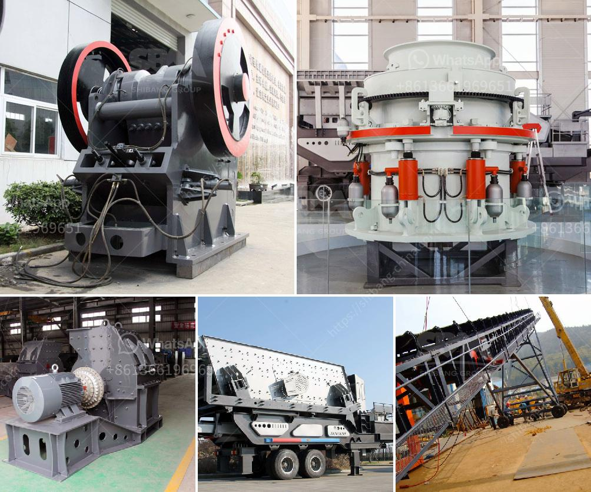

<h3>How many kilowatts motor is equipped with jaw crusher ？</h3>
The jaw crusher is a common piece of equipment in many mining and construction projects. It is used as a primary crusher for a variety of materials, including hard rocks and ores. One of the key components of the jaw crusher is the motor, which powers the machine's movement and jaw's action. With different types and models of jaw crushers available in the market, the power requirements for these machines can vary.

The power output of the motor is measured in kilowatts (kW). It determines the efficiency and performance of the jaw crusher, as it drives the main shaft and ensures the crushing process. The power required for the jaw crusher depends on several factors, including the feed size, desired product size, and capacity.

Typically, jaw crushers require a motor with a power range of 5-7.5 kW. This ensures power-efficient operation and allows the crusher to handle different materials and capacities effectively. However, for larger jaw crushers or heavy-duty applications, the power requirement may increase.

In the case of heavy-duty or industrial jaw crushers, the motor power can range from 15 kW to 30 kW or even higher. These crushers are designed to handle large feed sizes and high-capacity requirements. The increased power ensures that the crusher can handle the demanding applications without any issues.

When choosing the motor power for a jaw crusher, it is essential to consider the specific requirements of the application. Factors such as the feed size and capacity should be evaluated to determine the appropriate power rating. Oversizing the motor can lead to unnecessary energy consumption, while undersizing it may result in reduced production capacity and potentially damage the crusher.

It is also important to note that the power requirement for the motor may vary based on the design and manufacturer of the jaw crusher. Different manufacturers may have different motor specifications and options available. Therefore, it is essential to consult the equipment specifications provided by the manufacturer or work with a knowledgeable professional to determine the optimal motor power for the jaw crusher.

In conclusion, the motor power required for a jaw crusher can vary depending on factors such as the feed size, capacity, and specific application. Typically, jaw crushers require a motor power range of 5-7.5 kW, but for heavy-duty or industrial jaw crushers, the power requirement may increase to 15 kW or higher. It is crucial to evaluate the specific requirements and consult the equipment specifications to determine the appropriate motor power for a jaw crusher.
<h3>Contact us</h3><ul><li><strong>Whatsapp:&nbsp;<a href="https://wa.me/8613661969651">+8613661969651</a></strong></li><li><a href="https://swt.shibang-china.com/?git&amp;zhl&amp;How many kilowatts motor is equipped with jaw crusher ？"><strong>Online Service(chat now)</strong></a></li></ul><h3>Related</h3><ul><li><a href='How to operate aggregate crushing plant.md'>How to operate aggregate crushing plant?</a></li><li><a href='How to increase the productivity of the cone crusher ？.md'>How to increase the productivity of the cone crusher ？</a></li><li><a href='How to calculate the running cost of a crusher.md'>How to calculate the running cost of a crusher?</a></li><li><a href='How can we solve the problem of the crusher bearing heating.md'>How can we solve the problem of the crusher bearing heating?</a></li><li><a href='How to adjust rotary kiln support rollers.md'>How to adjust rotary kiln support rollers?</a></li></ul>