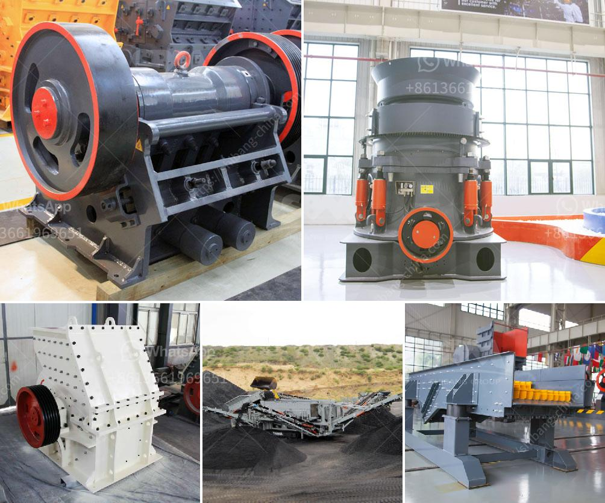

<h3>How many tons per hour can a jaw crusher produce?</h3>
When it comes to purchasing a jaw crusher, you may have to consider several factors such as the manufacturer, the type of crusher, and its capacity. It's natural to ask "how many tons of material per hour can a jaw crusher produce?" The answer depends on the capacity of the jaw crusher as well as the hardness of the feed material. Let's delve deeper into this topic.

Jaw crushers are commonly used in various industries like mining, building materials, and construction due to their ability to crush materials of any hardness, as well as their low-cost operation and easy maintenance. However, the jaw crusher's performance mainly depends on the characteristics of the material being crushed.

The capacity of a jaw crusher is measured by the amount of material that can pass through the crushing chamber per unit of time. This is typically given in terms of tons per hour (tph). The capacity of a jaw crusher can be influenced by factors such as the type of feed material, the feed size, and the required product size.

To get an accurate estimate of jaw crusher's production capacities, you have to consider the actual material characteristics. For instance, limestone commonly used as a feed material for jaw crushers, has a typical density of 2.7 g/cm3, which corresponds to a theoretical output of 2000 metric tons per hour. However, the actual production depends on factors like the reduction ratio, feed size, and clay content.

For example, a jaw crusher with a closed setting of 3" (76.2 mm) will have an output capacity of 240 tph (tons per hour), while a jaw crusher that has a 24" x 36" (61 cm x 91 cm) feed opening and a setting of 2.5" (6.35 cm) produces 200 tph (tons per hour). This is mainly due to the fact that the lower the capacity (tph) at which the jaw crusher operates, the greater the reduction ratio it can achieve. This means that with the same jaw opening, a crusher with a higher reduction ratio will have a higher capacity.

It's important to understand that the theoretical output capacities mentioned above are estimates and may vary depending on the specific application. These estimates are a good starting point for assessing the capacity of your jaw crusher, but it's always advisable to consult the manufacturer for more precise information based on the actual conditions and materials being processed.

To summarize, the capacity of a jaw crusher depends on its characteristics, including the type of crusher and the hardness of the feed material. While you can use estimates as a guideline, it's essential to consult with the manufacturer and consider the specific factors of your application to determine the accurate production capacity of a jaw crusher.
<h3>Contact us</h3><ul><li><strong>Whatsapp:&nbsp;<a href="https://wa.me/8613661969651">+8613661969651</a></strong></li><li><a href="https://swt.shibang-china.com/?git&amp;zhl&amp;How many tons per hour can a jaw crusher produce"><strong>Online Service(chat now)</strong></a></li></ul><h3>Related</h3><ul><li><a href='How to wash clay out of bauxite.md'>How to wash clay out of bauxite?</a></li><li><a href='How to crush calcium carbonate.md'>How to crush calcium carbonate?</a></li><li><a href='How much does a rock crusher cost in Zimbabwe.md'>How much does a rock crusher cost in Zimbabwe?</a></li><li><a href='How does a jaw crusher crush limestone.md'>How does a jaw crusher crush limestone?</a></li><li><a href='How to manufacture artificial sand.md'>How to manufacture artificial sand?</a></li></ul>