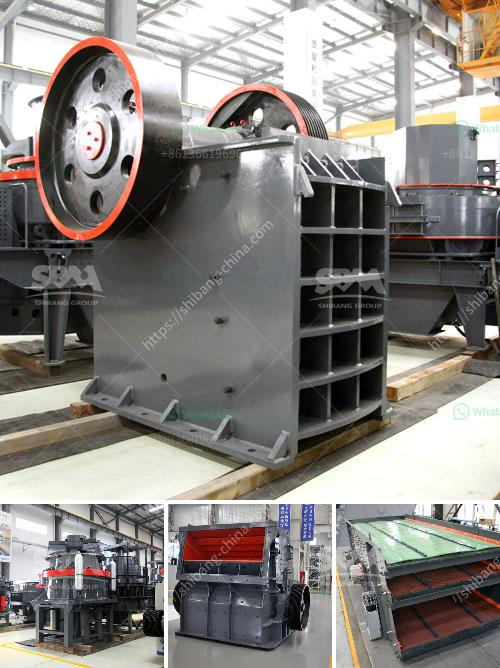

<h3>How mobile crushing plant can realize the recycling of construction waste ?</h3>
Mobile crushing plants are a game-changer in terms of handling construction waste. These plants are versatile and efficient, allowing contractors to quickly process and recycle waste materials. With advancements in technology, the mobile crushing plant has now become a key component in the recycling of construction waste.

Construction waste is a major issue these days. The rapid pace of urbanization has led to an increase in construction activities, resulting in the generation of massive amounts of waste. This waste includes materials such as concrete, bricks, wood, steel, and more. Traditionally, these materials were disposed of in landfills, occupying valuable space and causing harm to the environment.

However, with the emergence of mobile crushing plants, this waste can be transformed into valuable resources. Mobile crushing plants are essentially large pieces of machinery mounted on mobile platforms that can be easily transported to construction sites. These plants have a primary crusher that ensures efficient crushing of materials. The crushed materials are then sorted into different categories, such as concrete, wood, and steel, to be further recycled or disposed of responsibly.

One of the major advantages of mobile crushing plants is their ability to process a variety of materials. For instance, concrete waste can be crushed and used as aggregate for new construction projects. By crushing and recycling concrete waste, construction companies can reduce the need for new aggregates, thus conserving natural resources. Additionally, the use of recycled concrete can also help reduce carbon emissions associated with concrete production.

Another benefit of mobile crushing plants is their portability. Construction waste is often generated in different locations, and transporting it to a centralized recycling facility can be time-consuming and costly. With mobile crushing plants, construction waste can be crushed onsite, eliminating the need for transportation. This saves time and money while also reducing the carbon footprint associated with transportation.

The utilization of mobile crushing plants in construction waste recycling also contributes to the circular economy. By recycling materials such as concrete, wood, and steel, the demand for new raw materials is reduced. This, in turn, helps conserve natural resources and reduces the overall environmental impact of construction activities.

In addition to the environmental benefits, mobile crushing plants also offer economic advantages. The recycling of construction waste can save construction companies significant costs. Instead of purchasing new materials, companies can use recycled materials, which are often cheaper. Moreover, mobile crushing plants allow contractors to process and sell recycled materials, creating additional revenue streams.

In conclusion, mobile crushing plants are a revolutionary solution for the recycling of construction waste. These plants offer numerous benefits, including the ability to process a variety of materials, portability, and support for the circular economy. By embracing mobile crushing plants, construction companies can contribute to sustainable development, reduce costs, and minimize their environmental impact. It is evident that mobile crushing plants are changing the face of construction waste recycling and paving the way for a greener future.
<h3>Contact us</h3><ul><li><strong>Whatsapp:&nbsp;<a href="https://wa.me/8613661969651">+8613661969651</a></strong></li><li><a href="https://swt.shibang-china.com/?git&amp;zhl&amp;How mobile crushing plant can realize the recycling of construction waste "><strong>Online Service(chat now)</strong></a></li></ul><h3>Related</h3><ul><li><a href='How to design a vibrating screen.md'>How to design a vibrating screen?</a></li><li><a href='how to install a crusher in a quarry ？.md'>how to install a crusher in a quarry ？</a></li><li><a href='How to calculate the volume of ball mill packing .md'>How to calculate the volume of ball mill packing ?</a></li><li><a href='How to install a jaw crusher.md'>How to install a jaw crusher?</a></li><li><a href='How to Build Your Own Rock Crusher in the Philippines ？.md'>How to Build Your Own Rock Crusher in the Philippines ？</a></li></ul>