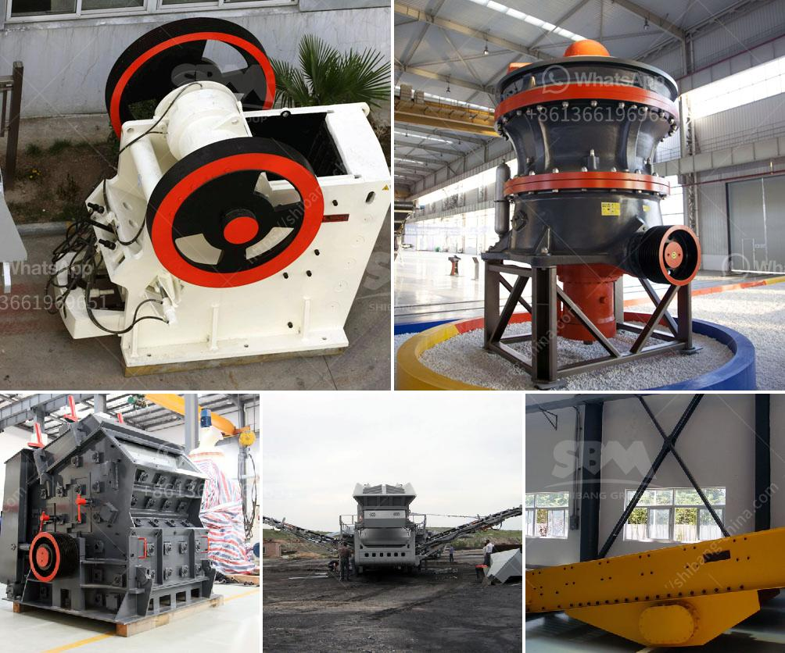

<h3>How much crushing power does a gyratory crusher have?</h3>
A gyratory crusher is used as a primary crushing solution for various industries such as mining, metallurgy, construction, chemical, ceramic and other industries. It is a high-capacity machine that can be used to crush large rocks and reduce them into smaller rocks, gravel or rock dust. This powerful machine relies on the compression force generated by two opposing concave surfaces as it crushes the material. But how much crushing power does a gyratory crusher have?

Gyratory crushers are known for their high production rates, with a higher capacity than a jaw crusher. In order to get cubical material out of a gyratory crusher, it should be choke-fed. Gyratory crushers are not suitable for crushing clay, as clay will clog the crusher.

Gyratory crushers have significant crushing power due to the large stroke and head diameter. A cone crusher, on the other hand, has less crushing cavity and less production capacity. The cone crusher's main advantage is that it can accept larger feed material and can be used for primary or secondary crushing applications.

1. Feed material characteristics: The performance and efficiency of a gyratory crusher are affected by the properties of the feed material, such as hardness, toughness, moisture content, and gradation. Brittle materials are easier to crush, whereas materials with high toughness and moisture content may require additional crushing force.

2. Crushing chamber design: The shape of the crushing chamber plays a crucial role in the crushing action of the gyratory crusher. The narrower the opening at the bottom of the crusher, the greater the crushing power. Different manufacturers may have different chamber designs, and it's important to choose the right one to optimize the performance.

3. Eccentric rotation speed: The speed at which the gyratory crusher rotates affects the crushing power. Higher rotation speeds result in higher crushing force generated within the chamber. However, excessive speed can cause the crusher to wear out quickly and increase maintenance costs.

4. Liner profiles and wear parts: The choice of liners and wear parts in a gyratory crusher can affect its crushing power. Different liner profiles can impact the size reduction ratio and the particle shape. It's important to select the right liners and wear parts to ensure optimal performance and long-lasting operation.

In conclusion, a gyratory crusher has significant crushing power due to its large stroke and head diameter. The crushing power depends on various factors, including feed material characteristics, crushing chamber design, rotation speed, and liner profiles. By considering these factors, operators can optimize the crushing process and achieve desired product sizes. However, it's important to note that crushing power alone may not guarantee the desired output, as material properties and other factors also influence the final result.
<h3>Contact us</h3><ul><li><strong>Whatsapp:&nbsp;<a href="https://wa.me/8613661969651">+8613661969651</a></strong></li><li><a href="https://swt.shibang-china.com/?git&amp;zhl&amp;How much crushing power does a gyratory crusher have"><strong>Online Service(chat now)</strong></a></li></ul><h3>Related</h3><ul><li><a href='How does the Vibrating Screen machine work？.md'>How does the Vibrating Screen machine work？</a></li><li><a href='How to reline a vertical mill.md'>How to reline a vertical mill?</a></li><li><a href='How to crush calcium carbonate.md'>How to crush calcium carbonate?</a></li><li><a href='How to install tunnel feeders in a crushing plant.md'>How to install tunnel feeders in a crushing plant?</a></li><li><a href='How to get gold from ore crushing.md'>How to get gold from ore crushing?</a></li></ul>