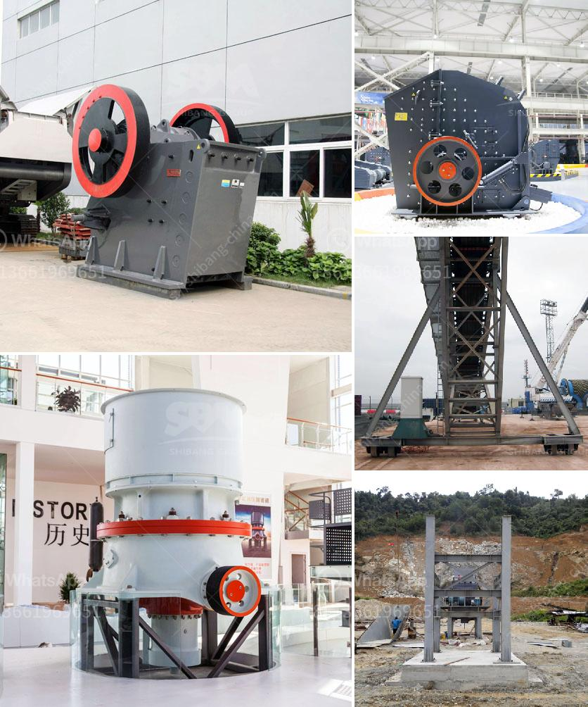

<h3>How much does a mobile crusher plant cost?</h3>
Mobile crushing plants are renowned worldwide for their quality construction, crushing efficiency, versatility, and profitability. However, it is not always easy to maintain the price competitiveness of these plants amidst highly competitive market conditions. To achieve this, manufacturers rely on a combination of strategic planning, efficient production processes, and effective marketing strategies. In this article, we will explore the factors that influence the cost of a mobile crusher plant.

The size of the mobile crusher plant is a crucial factor. Material being crushed plays a significant role too. In recent years, as recycling materials have gained popularity in many developed countries, mobile crushers have become a popular choice for recycling applications. This has increased the demand for larger, more robust mobile crushing plants that can handle a wide range of materials. Naturally, the larger the plant, the higher the cost.

Another influencing factor is the level of automation. Advances in technology have enabled manufacturers to develop highly automated mobile crushers that offer increased productivity and reduced downtime. However, this automation comes at a price. The more advanced the automation, the higher the cost of the plant. While automation offers significant cost savings in the long run through increased efficiency, it may not be suitable for all users.

The choice of the manufacturer also affects the cost. Established manufacturers with a proven track record tend to have higher prices compared to newer or less-known manufacturers. This is because established manufacturers have invested heavily in research and development, ensuring their equipment is of the highest quality. Additionally, established manufacturers often provide better after-sales service, which can contribute to a higher upfront cost.

Geographical location is another factor that affects the cost of a mobile crusher plant. Shipping costs can vary significantly depending on the distance and mode of transportation. Additionally, import taxes and regulations may also impact the final price. Choosing a manufacturer located closer to the project site can help reduce transportation costs.

Finally, additional features and customization also contribute to the cost. Mobile crusher plants can be tailored to specific customer requirements, with features such as screens, conveyors, and feeders. These additions increase the versatility of the plant but also increase the price. Similarly, specific safety features or noise reduction measures can add to the overall cost.

In conclusion, the cost of a mobile crusher plant can vary greatly depending on multiple factors. The size, level of automation, manufacturer, geographical location, and additional features all affect the final price. It is essential for buyers to carefully evaluate their needs and budget before making a purchase. By comparing multiple options, understanding the trade-offs between price and features, and working with reputable manufacturers, buyers can find a high-quality mobile crusher plant that meets their requirements without breaking the bank.
<h3>Contact us</h3><ul><li><strong>Whatsapp:&nbsp;<a href="https://wa.me/8613661969651">+8613661969651</a></strong></li><li><a href="https://swt.shibang-china.com/?git&amp;zhl&amp;How much does a mobile crusher plant cost"><strong>Online Service(chat now)</strong></a></li></ul><h3>Related</h3><ul><li><a href='How to build a coal washing plant.md'>How to build a coal washing plant?</a></li><li><a href='How to set up a clinker grinding unit.md'>How to set up a clinker grinding unit?</a></li><li><a href='How to choose manganese ore crushing machinery.md'>How to choose manganese ore crushing machinery?</a></li><li><a href='How to balance a cement mill separator.md'>How to balance a cement mill separator?</a></li><li><a href='How to calculate the energy consumption of a ball mill.md'>How to calculate the energy consumption of a ball mill?</a></li></ul>