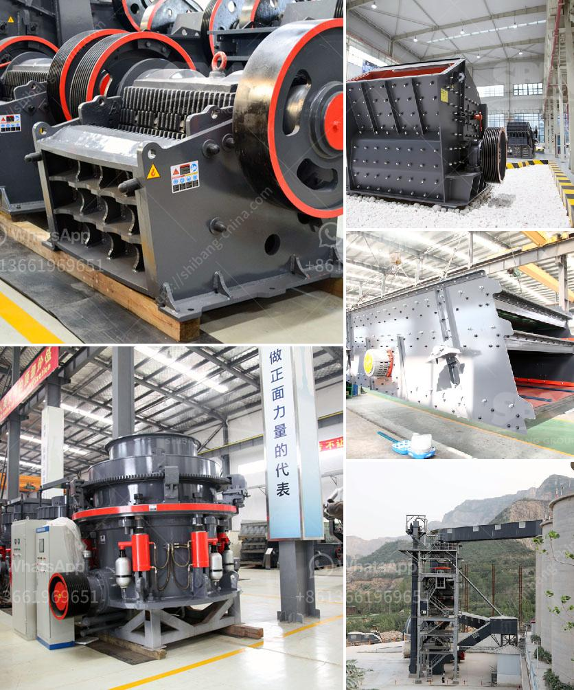

<h3>How much does a quarry crusher cost?</h3>
Quarrying is a huge industry in many countries around the world. Not only does it provide employment opportunities for people, but it also provides crucial materials for construction projects. However, as with any large-scale industrial process, there are some expenses associated with quarrying that business owners or contractors need to consider. A crucial expense in the quarrying industry is the cost of purchasing equipment like crushers. As the name suggests, a quarry crusher is used for crushing stones or rocks into smaller pieces.

When it comes to selecting the right type of quarry crusher, there are several factors to consider. These include the type of material being crushed, the required output capacity, and the specific features of the crusher. Different types of crushers have varying capabilities and functions, from jaw crushers and impact crushers to cone crushers and VSI crushers.

One significant cost when purchasing a quarry crusher is the size of the crusher. Depending on the nature of the job, you may need multiple crushers. Larger operations may choose a gyratory crusher because it can handle larger-sized rocks. However, for a smaller operation, a jaw crusher may be the better choice. Jaw crushers are simpler to operate and are capable of producing more cubically shaped materials compared to other types of crushers.

Apart from the initial cost of purchasing a quarry crusher, there are various operating costs typically associated with these types of machines. Maintenance costs, fuel costs, and replacement part costs are a few examples. To ensure smooth and efficient operations, regular maintenance is essential. This includes checks on wear parts such as jaw plates, liners, and cone mantles. Fuel costs can also be significant, especially if the quarry is located far from the main road network. Additionally, the cost of replacing worn out parts must be factored into the overall expenses.

The pricing of quarry crushers can vary significantly depending on various factors. These include the brand, the size and capacity, and the level of automation. A high-quality, well-known brand will generally come with a higher price tag, as will larger crushers with higher capacity and more automation features. It is crucial to carefully evaluate your specific needs and budget to determine the best crusher for your quarrying operation.

In conclusion, the cost of a quarry crusher can vary greatly depending on the size, brand, capacity, and features of the machine. It is important for business owners and contractors to consider both the upfront cost and the ongoing operating expenses when making a decision. Conducting thorough research, consulting with experts, and comparing multiple options can help ensure that you choose the right crusher for your quarrying needs, ultimately leading to increased efficiency, productivity, and profitability.
<h3>Contact us</h3><ul><li><strong>Whatsapp:&nbsp;<a href="https://wa.me/8613661969651">+8613661969651</a></strong></li><li><a href="https://swt.shibang-china.com/?git&amp;zhl&amp;How much does a quarry crusher cost"><strong>Online Service(chat now)</strong></a></li></ul><h3>Related</h3><ul><li><a href='How to invest in crushing machines？.md'>How to invest in crushing machines？</a></li><li><a href='How to Choose a Vibrating Feeder.md'>How to Choose a Vibrating Feeder?</a></li><li><a href='How to determine the value of a rock quarry.md'>How to determine the value of a rock quarry?</a></li><li><a href='How to improve the output of stone crusher .md'>How to improve the output of stone crusher ?</a></li><li><a href='How to maintain stone crusher equipment.md'>How to maintain stone crusher equipment?</a></li></ul>