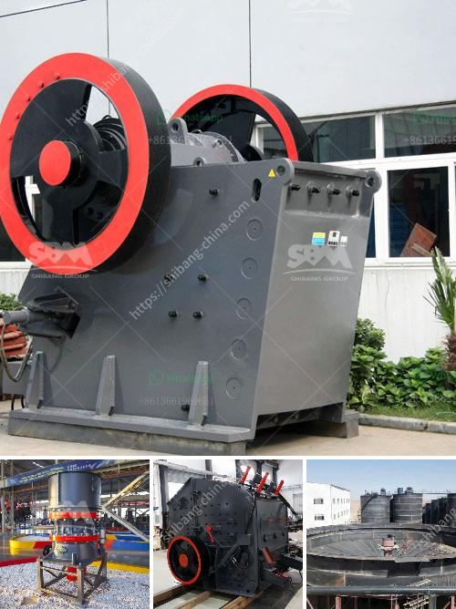

<h3>How much does a rock crusher cost in Zimbabwe?</h3>
Rock crushers are a necessary tool for most commericial mining operations. Crushers are an important part of many industrial and materials processing projects. They allow for the crushing of rocks into gravel, smaller rocks, or even miniscule dust. Equipment Traders website allows users to quickly search for the best models near to their zip code from the brands and dealers that they have come to trust.

The most popular Zimbabwe Mining Equipment & Supplies classifieds by far. 500,000 visitors per month and over 30,000 adverts.'

It is not uncommon for rock crushers to cost ten thousand dollars or more. In fact, the exact cost of rock crushers is difficult to predict, due to various factors. Depending on the type of rock crusher and the size of the rocks being crushed, a single rock crusher can cost anywhere between $40,000 to $800,000.

To buy a rock crusher, customers can take into consideration several factors. First, it is important to consider the rock crusher's capacity. The capacity determines the amount of material a rock crusher can process. When a customer buys a crusher, they are purchasing the maximum capacity of the machine. The capacity also determines if the rocks can be crushed in one pass or if they must be crushed in multiple stages.

The second factor is the desired output size. Ideally, a rock crusher will have a larger crushing ratio, which means that it can break rocks into smaller pieces more efficiently. However, this will have an impact on costs as more energy is required to crush the rocks into smaller pieces. Therefore, the desired output size should be balanced with the cost of crushing the rocks.

Thirdly, the hardness of the rocks being crushed is another factor to consider. Rocks with higher hardness levels, such as granite or basalt, require more force to crush, increasing the cost of the crushing process. Therefore, the hardness of the rocks should be considered to ensure an efficient and cost-effective crushing operation.

Lastly, the location of the mine and the transportation costs must be taken into consideration. If the mine is located in a remote area, far away from the crusher dealer, the cost of transportation can outweigh the actual cost of the crusher itself.

Due to these factors, there is no definitive answer to how much a rock crusher costs. However, it is important to take all the above-mentioned factors into consideration when considering purchasing a rock crusher. It is also advisable to check with local authorities if there are any permits or licenses required for the operation of such equipment.

In conclusion, rock crushers are essential tools in the mining and construction industry. Although the cost may vary depending on various factors, investing in a rock crusher is a profitable venture for any business or contractor looking to crush rocks efficiently and effectively.
<h3>Contact us</h3><ul><li><strong>Whatsapp:&nbsp;<a href="https://wa.me/8613661969651">+8613661969651</a></strong></li><li><a href="https://swt.shibang-china.com/?git&amp;zhl&amp;How much does a rock crusher cost in Zimbabwe"><strong>Online Service(chat now)</strong></a></li></ul><h3>Related</h3><ul><li><a href='how to do ball mill liner？.md'>how to do ball mill liner？</a></li><li><a href='how to make stone into powder how much does a grinder cost .md'>how to make stone into powder how much does a grinder cost ?</a></li><li><a href='How to Build Your Own Rock Crusher in the Philippines ？.md'>How to Build Your Own Rock Crusher in the Philippines ？</a></li><li><a href='How to feed a jaw crusher from a concrete hopper.md'>How to feed a jaw crusher from a concrete hopper?</a></li><li><a href='How to wash manufacturing sand .md'>How to wash manufacturing sand ?</a></li></ul>