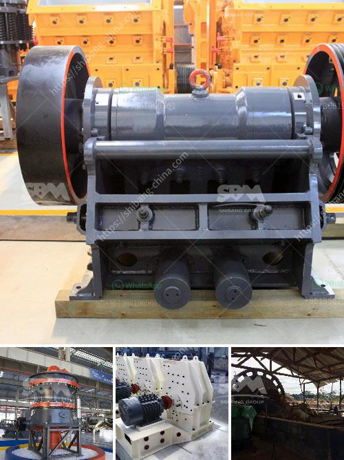

<h3>How much does a stone crusher of 150 tonnes cost?</h3>
A stone crusher is a machine designed to reduce large rocks into smaller rocks, gravel, or rock dust. Crushers may be used to reduce the size, or change the form, of waste materials so they can be more easily disposed of or recycled, or to reduce the size of a solid mix of raw materials (as in rock ore), so that pieces of different composition can be differentiated.

There are several different types of stone crushers, including primary, secondary, and tertiary crushers. Depending upon the type of stone crusher, the size and quantity of raw material, and the output size and quantity of final end products, a stone crusher machine will be designed and created accordingly.

The price and budget of a stone crusher plant may vary from 150 to 250 tonnes per hour, depending on the type and output size of the crushed stone. The raw materials used for crushing are hard rocks such as granite, basalt, limestone, river pebbles, and Rock Crushing Plants or similar materials.

Stone crushers create the raw materials for road construction and infrastructure projects. Due to the growing population and urbanization, there is a great need for and use of crushed stone aggregates, which ultimately contributes to the increase in the demand for stone crushing machinery.

The cost of a stone crusher machine will vary based on the machine that you choose. As mentioned above, machines that are stationary will be more affordable than portable machines. On the other hand, portable stone crushers are designed for easy movement and have a small footprint. They can be taken directly to the construction sites, saving time and money.

The 150-tonne per hour capacity is an average and may vary depending upon the nature of rocks, the size and quality of input materials, and the output demands and quality of end products. The machines that have 150 ton per hour capacity are impact crusher, jaw crusher, cone crusher, roller crusher, stone shredder, etc.

For the smaller tonne per hour requirement, such as for a contractor or homeowner on a smaller budget, a smaller crusher machine will be more practical. These smaller machines have a lower output capacity ranging from 50 to 150 tonnes per hour. They are designed to handle smaller rocks and are easier to move.

It is important to note that the price of a stone crusher machine is also affected by factors such as distance to the supplier, the brand, the reputation of the manufacturer, tax implications, etc. Before making a final decision, it is recommended to compare prices and research the market to get the best deal.

In conclusion, the cost of a stone crusher plant can vary greatly depending on the capacity, the type and output size of the crushed products. It is recommended to budget enough funds to ensure that you can get the best quality machine within your price range.
<h3>Contact us</h3><ul><li><strong>Whatsapp:&nbsp;<a href="https://wa.me/8613661969651">+8613661969651</a></strong></li><li><a href="https://swt.shibang-china.com/?git&amp;zhl&amp;How much does a stone crusher of 150 tonnes cost"><strong>Online Service(chat now)</strong></a></li></ul><h3>Related</h3><ul><li><a href='How to crush material from 12mm to 6mm.md'>How to crush material from 12mm to 6mm?</a></li><li><a href='How to judge how much power the jaw crusher needs？.md'>How to judge how much power the jaw crusher needs？</a></li><li><a href='How to buy mobile crusher .md'>How to buy mobile crusher ?</a></li><li><a href='How the limestone crusher works .md'>How the limestone crusher works ?</a></li><li><a href='How to improve the output of stone crusher .md'>How to improve the output of stone crusher ?</a></li></ul>