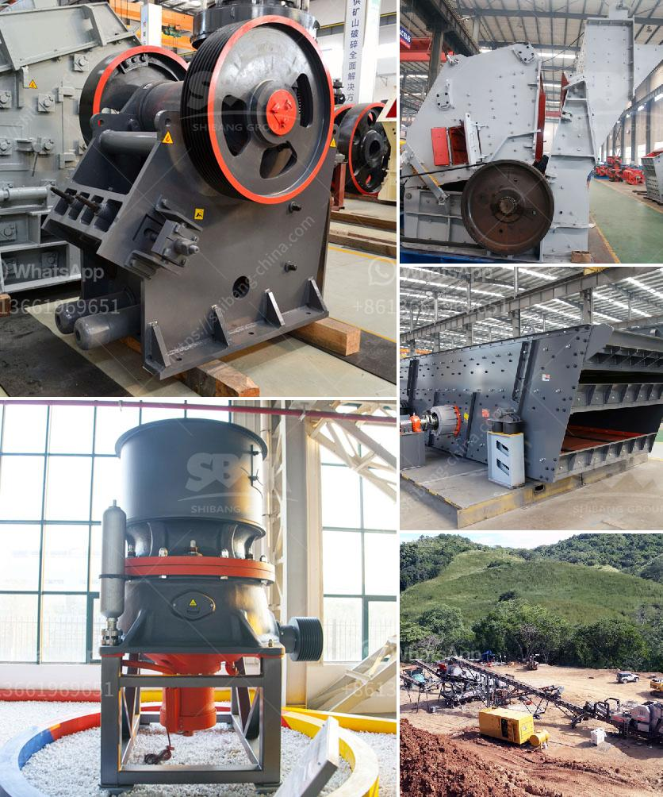

<h3>How much does an 800-ton jaw crusher cost?</h3>
When it comes to purchasing a jaw crusher, most people may only concern about the price and quality of the machine. Nowadays, there are various different types of jaw crushers on the market, such as PE jaw crusher, single toggle jaw crusher and double toggle jaw crusher. Customers may be puzzled by the question: "How much does an 800-ton jaw crusher cost?"

Fote Heavy Machinery is a famous mining machinery manufacturer in China which was established in 1982. Our company has sale jaw crusher, cone crusher, impact crusher, and stone crusher plant, etc. We have the experience and the product support the customer needs for making quarrying aggregates. Choosing the right equipment can be a bit overwhelming at times. So, we have hands-on and technical expertise to get your machinery up and running in no time.

The 800-ton jaw crusher is an upgraded version of the traditional jaw crusher. This machine has a reasonable design and its structural design is more excellent. It can smash up to 1200 tons of stone per hour, making it the ideal choice for large-scale investors. For example, one 300-ton jaw crusher is equivalent to a three-in-one impact crusher, which can crush 600-800 tons of stone per hour.

The maximum feed size is ≤1200mm, and the discharge size is 220mm. It takes 1.87-2.47 tons of stone per hour. The most suitable two-stage equipment combination is a jaw crusher (coarse and fine crushing) plus a cone crusher (medium crushing, secondary crushing). Compared with the traditional three-stage crushing method, these two-stage machines reduce investment costs by 45%, reduce energy consumption by 60%, and reduce equipment operating costs by 30%.

As for price, the grinding machine segment accounted for over 53% of the overall market revenue in 2019 and is estimated to grow significantly during the forecast period. Furthermore, the higher adoption of mobile stone crushers is expected to drive the demand for the jaw crushers segment in the years to come.

In conclusion, considering the variety of applications as well as the resulting advantages, the jaw crusher has become an undisputedly versatile tool. The price may be the most concerned factor for customers when choosing a crushing equipment. However, it is not the only factor that determines the success of your investment. To ensure a successful and profitable quarry or mining business, you need to choose a reliable and professional jaw crusher supplier, such as Fote Machinery. Only by ensuring the quality of your machine, you can guarantee its long-term and efficient operation.
<h3>Contact us</h3><ul><li><strong>Whatsapp:&nbsp;<a href="https://wa.me/8613661969651">+8613661969651</a></strong></li><li><a href="https://swt.shibang-china.com/?git&amp;zhl&amp;How much does an 800ton jaw crusher cost"><strong>Online Service(chat now)</strong></a></li></ul><h3>Related</h3><ul><li><a href='How to increase the output of jaw crusher ？.md'>How to increase the output of jaw crusher ？</a></li><li><a href='How much does it cost to set up the crusher plant.md'>How much does it cost to set up the crusher plant?</a></li><li><a href='How to measure the theoretical output of a jaw crusher .md'>How to measure the theoretical output of a jaw crusher ?</a></li><li><a href='How to collect crusher dust.md'>How to collect crusher dust?</a></li><li><a href='How to get a sandmaking mini machine.md'>How to get a sand-making mini machine?</a></li></ul>