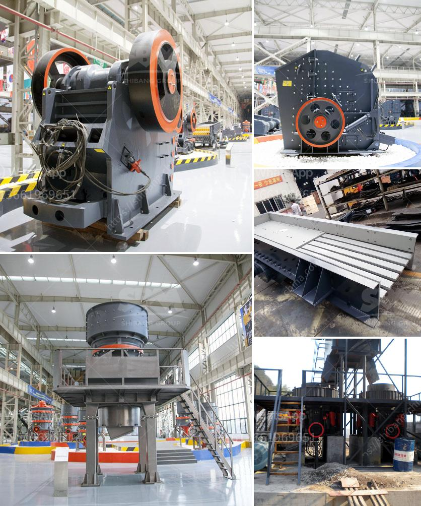

<h3>How much does calcite mineral processing equipment cost?</h3>
Calcite is a calcium carbonate mineral which is widely distributed in the natural world. It is one of the most common minerals on Earth, making up approximately 4% of the Earth's crust. Calcite deposits are found in various geological formations such as sedimentary, metamorphic, and igneous rocks.

Calcite has diverse industrial applications due to its unique physical and chemical properties. It is widely used in the construction industry as a raw material for cement and lime production. Calcite is also used in the manufacturing of glass, rubber, plastics, and paint. Additionally, it has applications in agriculture as a soil conditioner and in the production of fertilizers.

For the efficient processing of calcite, the right mineral processing equipment is crucial. Various types of equipment are used in the process depending on the desired outcome and the characteristics of the calcite ore.

The most common calcite processing equipment in the market is mainly composed of jaw crusher, impact crusher, cone crusher, ball mill, Raymond mill, beneficiation process and other equipment. These equipment are collectively referred to as calcite mineral processing equipment.

Jaw crusher is responsible for the coarse crushing of calcite particles, and it is mainly used for primary crushing. The feeding size of jaw crusher is relatively large, so it is suitable for coarse crushing of calcite. Cone crusher, on the other hand, is suitable for fine crushing of calcite particles. It has the advantages of high crushing efficiency and uniform particle size.

Ball mill and Raymond mill are the key equipment for grinding materials after crushing. Ball mill is widely used in the processing of cement, silicate products, new building materials, refractory materials, fertilizers, black and non-ferrous metal dressings, and glass ceramics. It can be used for dry or wet grinding of various ores and other grindable materials.

Raymond mill, on the other hand, is a domestic traditional grinding equipment, which is widely used in non-metallic mineral processing, metallurgy, building materials, chemicals, and other fields. It has the advantages of stable performance, reliable operation, and high grinding efficiency.

In terms of cost, the outcome of calcite processing equipment is influenced by various factors. The quality and performance of the equipment play a significant role in determining the cost. High-quality equipment tends to have a higher initial cost but offers better durability and efficiency in the long run.

Additionally, the specific configuration of the equipment can also impact the cost. Some equipment come in standard configurations, while others can be customized to meet the unique needs of the user. Customized equipment generally have a higher cost due to the additional features and specifications.

Furthermore, the cost of calcite mineral processing equipment can vary depending on the geographical location and market demand. Prices may differ between manufacturers and suppliers, and it is advisable to conduct a thorough market research and compare prices before making a purchase.

In conclusion, the cost of calcite mineral processing equipment is influenced by factors such as equipment quality, configuration, and market demand. It is essential to choose high-quality equipment that offers the desired processing capabilities while considering the long-term durability and efficiency of the equipment.
<h3>Contact us</h3><ul><li><strong>Whatsapp:&nbsp;<a href="https://wa.me/8613661969651">+8613661969651</a></strong></li><li><a href="https://swt.shibang-china.com/?git&amp;zhl&amp;How much does calcite mineral processing equipment cost"><strong>Online Service(chat now)</strong></a></li></ul><h3>Related</h3><ul><li><a href='How to start crushed limestone production.md'>How to start crushed limestone production?</a></li><li><a href='how to install a crusher in a quarry ？.md'>how to install a crusher in a quarry ？</a></li><li><a href='How is dolomite crushed for road building etc.md'>How is dolomite crushed for road building, etc.?</a></li><li><a href='how to design conveyor belt.md'>how to design conveyor belt</a></li><li><a href='How to set up a small gold crushing plant 7 steps to help you.md'>How to set up a small gold crushing plant? 7 steps to help you</a></li></ul>