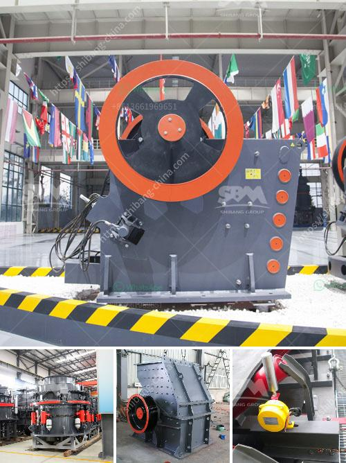

<h3>How much does it cost to hire a mini stone crusher?</h3>
When it comes to construction projects, the need for material and aggregate is inevitable. In such cases, the ideal solution is to turn to a mini stone crusher for assistance. Mini stone crushers are convenient, highly efficient, and provides an affordable solution for construction companies and contractors who require materials on site. These powerful machines are capable of crushing a variety of materials, including concrete, bricks, stones, and other materials. However, determining the cost of hiring a mini stone crusher can be challenging, as several factors influence the rental price.

One primary factor that affects the cost is the size of the mini stone crusher. Different models have varying capacities ranging from 4 to 8 tonnes per hour. Smaller models have lower capacity, so they are suitable for smaller construction projects, while larger models can handle higher volumes of materials. Naturally, the larger the machine, the higher the rental cost will be.

Another factor that plays a role in the overall cost is the duration of the hire. Generally, mini stone crushers are rented for a specific period, ranging from a few days to a few weeks. The cost per day or per week adds up based on the total rental period. It is advisable to have a clear understanding of the project timeline and estimate the required duration accurately to avoid any unexpected costs.

Transportation costs can also affect the overall price of hiring a mini stone crusher. Depending on the distance between the construction site and the rental company, the transportation fees can vary significantly. Therefore, it is important to consider the location of the rental company to minimize transportation costs.

In addition to the base rental cost, other factors such as fuel consumption and maintenance costs should also be taken into account. Mini stone crushers run on diesel engines, which means fuel costs can accumulate over time, especially for long-term projects. Similarly, regular maintenance and servicing of the machine are essential to ensure optimal performance and avoid any breakdowns. It is advisable to discuss these factors with the rental company upfront to have a clear understanding of the additional expenses involved.

Ultimately, the cost of hiring a mini stone crusher will vary depending on various factors, including the machine's size, rental duration, transportation costs, fuel consumption, and maintenance requirements. It is crucial to carefully evaluate these factors and compare quotes from different rental companies to obtain the best price possible.

To conclude, mini stone crushers offer an affordable solution for construction projects that require materials on-site. Despite the various factors influencing the rental cost, careful planning and evaluation can help construction companies and contractors find a mini stone crusher that suits their needs and budget. With the right machine at hand, construction projects can proceed smoothly, efficiently, and cost-effectively.
<h3>Contact us</h3><ul><li><strong>Whatsapp:&nbsp;<a href="https://wa.me/8613661969651">+8613661969651</a></strong></li><li><a href="https://swt.shibang-china.com/?git&amp;zhl&amp;How much does it cost to hire a mini stone crusher"><strong>Online Service(chat now)</strong></a></li></ul><h3>Related</h3><ul><li><a href='How to choose a vibration motor.md'>How to choose a vibration motor?</a></li><li><a href='How to extract manganese from ore.md'>How to extract manganese from ore?</a></li><li><a href='How to design a ball mill for cement ？.md'>How to design a ball mill for cement ？</a></li><li><a href='How to build a small cement plant ？.md'>How to build a small cement plant ？</a></li><li><a href='How to determine the capacity of impact crusher？.md'>How to determine the capacity of impact crusher？</a></li></ul>