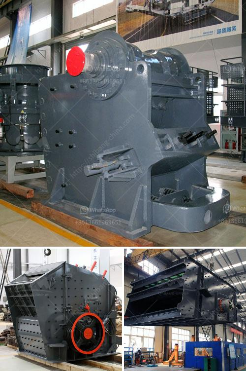

<h3>How much does it cost to set up the crusher plant?</h3>
Crusher plants are necessary for the construction industry, as they produce the important aggregate material that is used to build roads, buildings, bridges, and more. There are different types of crushers available for various tasks, such as primary crushers, secondary crushers, and tertiary crushers, depending on the types of rocks being crushed.

Setting up a crusher plant requires careful planning and budgeting. Here are some factors to consider when calculating the cost of setting up a crusher plant:

1. Types of equipment: There are different types of crushers available in the market, including compression crushers and impact crushers. Each type has its own set of features and benefits. The cost of the equipment will vary depending on the specific type of crusher selected.

2. Capacity: The capacity of the crusher plant determines the size and quantity of the crushed ore or rock. Higher capacity plants will require larger and more expensive machinery and infrastructure.

3. Location: The geographical location of the crusher plant plays a crucial role in determining the overall cost. This includes land acquisition, excavation, transportation, and other expenses related to setting up the site. Remote locations might require more investment due to logistical challenges.

4. Material availability: The availability of the raw materials near the plant site affects the overall cost as well. If the raw materials need to be transported from a long distance, it can increase the cost of setting up the crusher plant. On the contrary, if the site is located near the source of the raw materials, it can reduce the operational cost significantly.

5. Labor and workforce: The labor cost for setting up a crusher plant can significantly vary based on the availability and skillset of the workforce. Additionally, the productivity and efficiency of the team will impact the operational costs.

6. Permits and licenses: Regulatory compliances and obtaining the necessary permits and licenses add to the cost of setting up a crusher plant. These costs can vary based on the location and specific requirements of the local authorities.

One must conduct a comprehensive feasibility study and cost analysis before proceeding with setting up a crusher plant. This will help in estimating the overall cost, identifying potential challenges, and devising strategies to mitigate risks.

The cost of setting up a crusher plant can vary depending on the nature of the rocks being crushed and the project requirements. However, as a general rule, the initial cost of setting up a crusher plant should be significantly lower than the cost of raw materials.

Additionally, the installation cost and the cost of running the machinery should be taken into account when calculating the overall cost of setting up a crusher plant. This includes electricity, maintenance, and repair costs.

In conclusion, setting up a crusher plant involves multiple factors that need to be considered, taking into account the specific needs and constraints of the project. Conducting a thorough cost analysis and feasibility study will help determine the most economical and efficient way to set up the crusher plant while meeting the desired project objectives.
<h3>Contact us</h3><ul><li><strong>Whatsapp:&nbsp;<a href="https://wa.me/8613661969651">+8613661969651</a></strong></li><li><a href="https://swt.shibang-china.com/?git&amp;zhl&amp;How much does it cost to set up the crusher plant"><strong>Online Service(chat now)</strong></a></li></ul><h3>Related</h3><ul><li><a href='How to start stone mining hard rock crusher.md'>How to start stone mining hard rock crusher?</a></li><li><a href='How to Make Plaster of Phosphogypsum.md'>How to Make Plaster of Phosphogypsum</a></li><li><a href='how to remove the roller of  vertical roller mill.md'>how to remove the roller of  vertical roller mill</a></li><li><a href='how to pulverized limestone crusher ？.md'>how to pulverized limestone crusher ？</a></li><li><a href='How to extract copper from tailings.md'>How to extract copper from tailings?</a></li></ul>