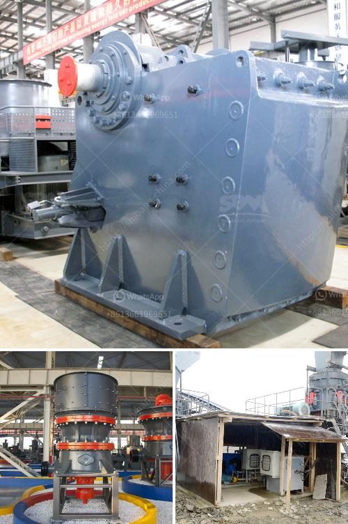

<h3>How much is the copper ore separation machine?</h3>
The mining industry plays a significant role in the global economy, with copper being one of the key commodities extracted from the earth. Copper ore is a valuable resource that provides the essential raw material for various industries, including electronics, construction, and transportation. As demand continues to rise, mining companies are constantly looking for efficient ways to extract copper ore from the ground. One such method is through the use of copper ore separation machines, which help separate the valuable copper from other minerals and impurities.

The cost of a copper ore separation machine can vary greatly depending on the technology and efficiency of the machine, as well as the geographical location of the mine and the specifications of the ore being processed. Generally, these machines range in price from around $10,000 to upwards of $1 million.

The most common type of copper ore separation machine is the flotation machine. This machine utilizes the principle of flotation to separate copper and other minerals from the ore. It works by mixing the finely ground ore with water and chemicals, known as reagents, which help to separate the copper particles from the unwanted minerals. The flotation process involves the use of air bubbles, which attach themselves to the copper particles and cause them to rise to the surface, where they can be collected and further processed.

Flotation machines come in various sizes and capacities, depending on the volume of ore being processed. Larger machines are capable of processing thousands of tons of ore per hour, making them ideal for large-scale mining operations. However, these machines also tend to be more expensive, with prices typically ranging from $500,000 to over $1 million.

For smaller mining operations or those with lower production volumes, there are also smaller and more affordable options available. These machines are typically designed for batch processing and can handle several hundred kilograms to a few tons of ore per hour. Prices for these machines can range from $10,000 to $100,000, depending on the specific requirements and capabilities.

In addition to the flotation machine, there are also other types of copper ore separation machines available on the market. These include magnetic separators, gravity separators, and electrostatic separators. The choice of machine depends on factors such as the nature of the ore, the desired end product, and the economic viability of the technology.

When considering the cost of a copper ore separation machine, it is essential to weigh the initial investment against the potential long-term benefits. A highly efficient and technologically advanced machine may have a higher upfront cost but can result in significant savings in terms of increased productivity, reduced operating costs, and improved ore recovery rates.

Overall, the cost of a copper ore separation machine can vary widely depending on various factors. It is crucial for mining companies to carefully evaluate their specific needs and budget constraints before investing in such equipment. Consulting with industry experts and suppliers can also provide valuable insights in selecting the most suitable machine for a particular mining operation, ensuring optimal efficiency and profitability in the long run.
<h3>Contact us</h3><ul><li><strong>Whatsapp:&nbsp;<a href="https://wa.me/8613661969651">+8613661969651</a></strong></li><li><a href="https://swt.shibang-china.com/?git&amp;zhl&amp;How much is the copper ore separation machine"><strong>Online Service(chat now)</strong></a></li></ul><h3>Related</h3><ul><li><a href='How to work jaw crusher and impact crusher .md'>How to work jaw crusher and impact crusher ?</a></li><li><a href='how a cone crusher works .md'>how a cone crusher works ?</a></li><li><a href='How to do ball mill operation and maintenance.md'>How to do ball mill operation and maintenance?</a></li><li><a href='how to an ore bauxite jaw crusher ？.md'>how to an ore bauxite jaw crusher ？</a></li><li><a href='how to use jaw and impact crusher.md'>how to use jaw and impact crusher</a></li></ul>