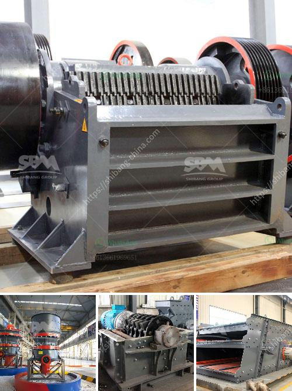

<h3>How much is the quarry machinery ?</h3>
The quarry industry is one of the most demanding and competitive sectors in terms of heavy machinery. Quarry machinery is essential equipment for every quarrying operation, and its proper functioning is crucial to ensure the productivity and profitability of a quarry. But how much does quarry machinery cost? Let's delve into the topic and find out.

First and foremost, it is important to note that the cost of quarry machinery varies depending on several factors. These factors include the type and size of the machinery, brand reputation, model specifications, country of origin, and any additional features or customization required.

When it comes to the types of machinery used in quarries, there are various options available. The most common types of quarry machinery include crushing equipment, screening equipment, excavators, loaders, and dump trucks. Each piece of machinery has its own specific purpose and cost.

The cost of quarry machinery can range from thousands to millions of dollars, depending on the size and production capacity of the machinery. For example, a small quarry may require a single crushing machine, while a large quarry may need a primary and secondary crusher, along with multiple screens, conveyors, and stacking conveyors. The cost in this case can be significantly higher.

Brand reputation also plays a significant role in the cost of quarry machinery. Well-known and established brands generally come with a higher price tag due to their reliability, performance, and durability. However, there are also cost-effective alternatives available in the market, which may be suitable for smaller quarry operations or those on a tighter budget.

Model specifications determine the capabilities and efficiency of quarry machinery. Models with advanced features and technologies usually cost more than basic models with limited functionalities. It is important to assess the specific needs of the quarry operation to determine the appropriate model and its associated cost.

The country of origin of the machinery can also impact its price. Machinery manufactured in countries with low labor and material costs may offer more competitive prices compared to those manufactured in countries with higher costs. However, it is essential to consider not only the price but also the quality and reliability of machinery from different regions.

Additional features or customization required by the quarry can also increase the cost of machinery. For example, specialized attachments, safety features, or environmental control systems may require additional investment.

It is advisable to consult with experienced quarry machinery suppliers or manufacturers to get accurate cost estimates for specific machinery requirements. Researching multiple suppliers and comparing prices, warranties, and after-sales support will help find the best value for money.

In conclusion, the cost of quarry machinery can vary significantly depending on several factors such as type, size, brand reputation, model specifications, country of origin, and additional features or customization. A thorough assessment of the quarry's needs, research, and consultation with suppliers will enable informed decision-making for investing in quarry machinery. Remember, investing in reliable and efficient machinery is crucial for long-term productivity and profitability in the quarry industry.
<h3>Contact us</h3><ul><li><strong>Whatsapp:&nbsp;<a href="https://wa.me/8613661969651">+8613661969651</a></strong></li><li><a href="https://swt.shibang-china.com/?git&amp;zhl&amp;How much is the quarry machinery "><strong>Online Service(chat now)</strong></a></li></ul><h3>Related</h3><ul><li><a href='How to Build Your Own Rock Crusher in the Philippines ？.md'>How to Build Your Own Rock Crusher in the Philippines ？</a></li><li><a href='how to run an impact jaw crusher.md'>how to run an impact jaw crusher?</a></li><li><a href='How to Adjust a Cone Crusher ？.md'>How to Adjust a Cone Crusher ？</a></li><li><a href='How to install a conveyor belt.md'>How to install a conveyor belt?</a></li><li><a href='How to calculate the cost of grinding .md'>How to calculate the cost of grinding ?</a></li></ul>