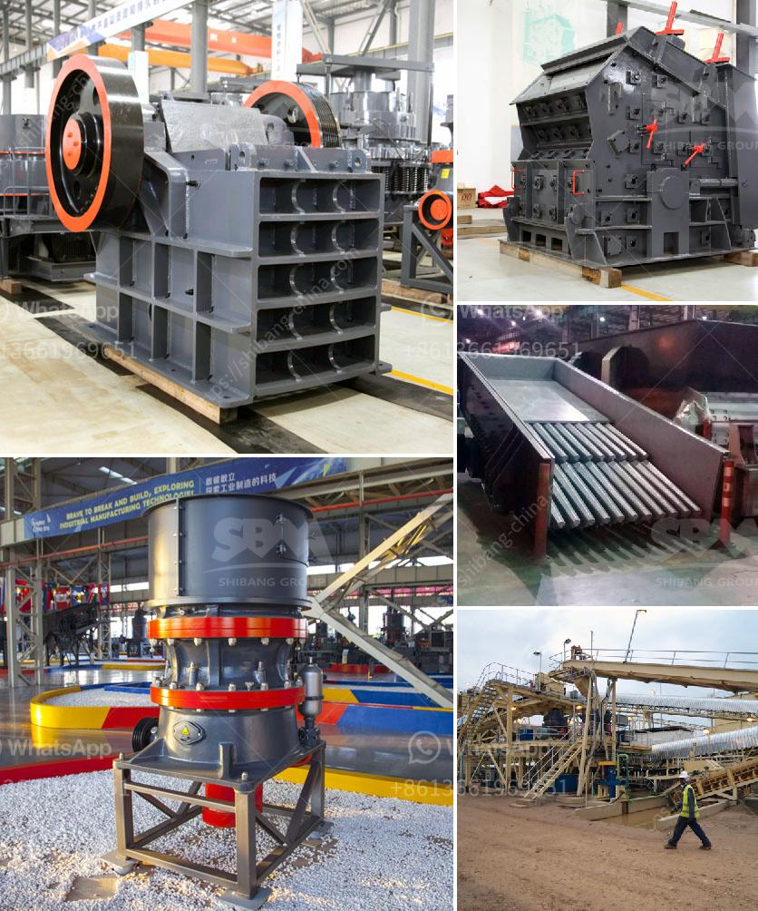

<h3>How the limestone crusher works ?</h3>
Limestone is a common mineral found in abundance in nature and is known for its versatility. It is widely used in various industries like construction, agriculture, and landscaping. Limestone is usually mined from quarries or mines, and then processed into different sizes for different applications. One important piece of equipment used in limestone processing is the limestone crusher.

Crusher, as the name suggests, is used to crush large rocks or other materials into smaller pieces. It is used in a variety of industries for different applications, such as mining, rock quarries, recycling plants, mineral processing, construction, and demolition sites.

The limestone crusher is a heavy-duty machine that is used to crush different types of materials with a compression strength of less than 200MPa. It is primarily used to crush limestone, dolomite, gypsum, granite, and other minerals into smaller particles.

The machine consists of a feeding hopper, a feeder, a rotor, a set of crushing jaws, a crushing chamber, and an outlet. The feeding hopper is used to feed the material into the machine. The feeder ensures a consistent and steady supply of material to the crusher. The rotor, which is driven by an electric motor, rotates at high speeds, causing the hammers attached to it to strike the material and break it into smaller pieces.

The set of crushing jaws, also known as the toggle plates, are located on the fixed and movable sides of the crusher. They help to reduce the size of the material by applying pressure and compression force. The crushing chamber is the space between the fixed and movable jaws, where the material is crushed. The size of the crushing chamber can be adjusted to accommodate different sizes of material.

Once the material is crushed, it passes through the outlet, which allows the smaller particles to exit the machine. The larger pieces that have not been crushed are fed back into the crusher for further processing.

The limestone crusher works on the principle of impact crushing, which means that it uses a combination of strike and compression force to reduce the size of the material. This machine is able to process rocks into different sizes, and it is widely used in industries such as mining, metallurgy, building materials, mineral processing, and chemical engineering.

In conclusion, the limestone crusher is a versatile piece of equipment that plays a crucial role in the processing of limestone. It uses impact crushing to reduce the size of the material and is widely used in various industries. Whether it is used at a mine, quarry, or construction site, the limestone crusher is an essential tool for efficient material processing. Its robust construction and ability to handle different types of materials make it a reliable choice for crushing limestone and other minerals.
<h3>Contact us</h3><ul><li><strong>Whatsapp:&nbsp;<a href="https://wa.me/8613661969651">+8613661969651</a></strong></li><li><a href="https://swt.shibang-china.com/?git&amp;zhl&amp;How the limestone crusher works "><strong>Online Service(chat now)</strong></a></li></ul><h3>Related</h3><ul><li><a href='How to reduce vibration in a jaw crusher.md'>How to reduce vibration in a jaw crusher?</a></li><li><a href='How to maintain the vibrating feeder.md'>How to maintain the vibrating feeder?</a></li><li><a href='How the limestone crusher works .md'>How the limestone crusher works ?</a></li><li><a href='How to design a marble or stone processing production line.md'>How to design a marble or stone processing production line?</a></li><li><a href='how to design conveyor belt.md'>how to design conveyor belt</a></li></ul>