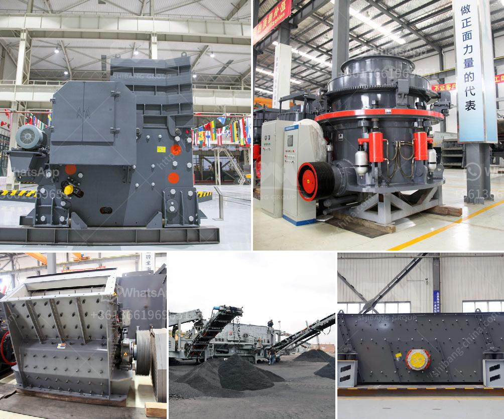

<h3>How the mechanism sand is produced ?</h3>
Mechanism sand, also known as artificial sand, is an essential construction material in today's world. As natural sand resources deplete and environmental regulations become more stringent, it has become increasingly important to find sustainable alternatives. Mechanism sand is produced through a meticulous process that involves crushing, screening, and shaping various types of stones.

The production process of mechanism sand begins with the selection of high-quality raw materials. These raw materials include hard rocks, granite, basalt, limestone, and other stones. The chosen stones are crushed into smaller sizes, usually ranging from 0-40mm, to meet specific requirements. The use of these robust stones ensures the durability and strength of the final product.

Once the stones have been crushed, they undergo a screening process. During screening, the crushed stones are separated into different sizes, which are classified according to their specific uses. To accomplish this, a vibrating screen is used. The size of the screen mesh can be adjusted to control the particle sizes of the final product. This allows for customization, depending on the specific construction needs.

The next step in the production process is shaping the screened stones. The purpose of shaping is to obtain particles that are more cubic in shape, as opposed to the natural angular shape of the stones. This is crucial for improving the workability and cohesiveness of the sand, making it more suitable for construction purposes. To shape the particles, various technologies can be employed, such as vertical shaft impact crushers or impact crushers. These machines use high-speed rotating plates or anvils to crush and shape the stones, resulting in a more uniform and consistent product.

After the shaping process, the finished mechanism sand is ready for use. However, some additional treatments may be applied depending on the specific requirements. For instance, the sand can be washed to remove any impurities or fines that may affect the quality of the final product. Additionally, some manufacturers may choose to add certain additives, such as cement or fly ash, to enhance the properties of the sand and improve its bonding characteristics.

The production of mechanism sand not only provides an alternative to natural sand but also offers several advantages. Firstly, it ensures a consistent quality and uniformity in particle size, which is crucial for achieving optimal performance in construction. Secondly, it minimizes environmental impact by reducing the demand for natural sand, preserving natural resources, and reducing the amount of excavation required. Lastly, it offers greater flexibility and customization options to meet the specific needs of different construction projects.

In conclusion, the production of mechanism sand involves a meticulous process of crushing, screening, and shaping various types of stones. By selecting high-quality raw materials and employing advanced technologies, the resulting sand meets the high standards required for construction purposes. With its consistent quality, durability, and environmental benefits, mechanism sand is becoming an essential component in the construction industry, ensuring sustainable development for the future.
<h3>Contact us</h3><ul><li><strong>Whatsapp:&nbsp;<a href="https://wa.me/8613661969651">+8613661969651</a></strong></li><li><a href="https://swt.shibang-china.com/?git&amp;zhl&amp;How the mechanism sand is produced "><strong>Online Service(chat now)</strong></a></li></ul><h3>Related</h3><ul><li><a href='How to increase the efficiency coal pulveriser on power plant.md'>How to increase the efficiency coal pulveriser on power plant?</a></li><li><a href='How to break granite rocks in a double toggle jaw crusher.md'>How to break granite rocks in a double toggle jaw crusher?</a></li><li><a href='How do you extract limestone from a quarry.md'>How do you extract limestone from a quarry?</a></li><li><a href='How to balance a cement mill separator.md'>How to balance a cement mill separator?</a></li><li><a href='How does a line ball mill working.md'>How does a line ball mill working?</a></li></ul>