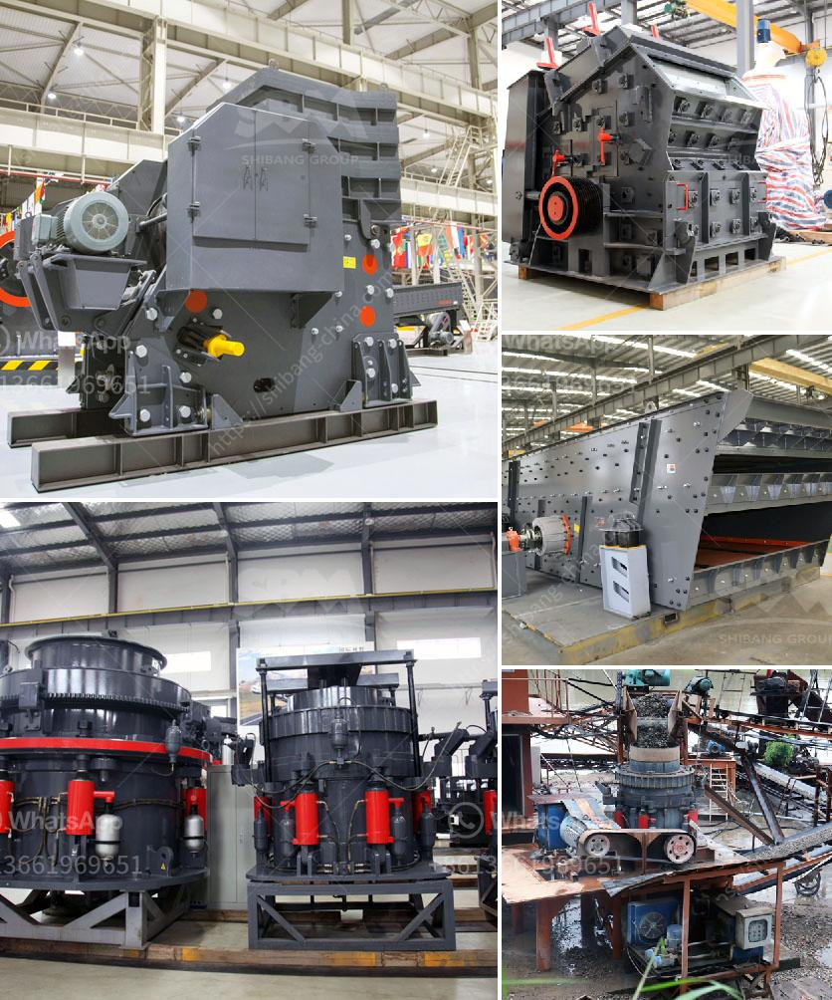

<h3>How to Adjust a Cone Crusher ？</h3>
A cone crusher is a type of secondary crusher that takes medium grained feed from a primary crusher and then further crushes the feed to a finer level as per the requirement. Modern cone crushers that use hydraulic hold-down clamping technology are enabling industries to crush along larger capacity and higher efficiency. This article will uncover the procedures for adjusting a cone crusher's closed side setting (CSS) in a few simple steps.

Before adjusting the CSS, it is important to accurately measure the opening at the bottom of the crushing chamber. This is done by placing a tape measure or ruler horizontally between the crushing liners. Ensure that the tape is level and tight, without any slack. Measure the smallest gap between the liners at different points throughout the chamber and note down the values.

To adjust the CSS, it is important to rotate the cone crusher liner to check for visible signs of wear. This can be done by manually rotating the liner and observing whether there are any grooves, cracks, or other visible deformities. If such signs are present, it may be necessary to replace the liner before proceeding with adjusting the CSS.

Before making any adjustments, it is crucial to analyze the performance of the crusher in terms of output and particle size distribution. This can be done by utilizing various tools such as particle size analyzers and/or monitoring the power draw of the crusher. By gathering this data, the operator can make informed decisions about the necessary adjustments to achieve the desired crushing performance.

The CSS can be adjusted by tightening or loosening the cone crusher's eccentric bushing. To do this, first, locate the hex nut on the side of the cone crusher's main shaft. It is typically located above the countershaft box and should be visible when looking at the crusher from the top. Using a wrench, loosen the hex nut by turning it counterclockwise.

Once the hex nut is loose, rotate the eccentric bushing clockwise to decrease the CSS or counterclockwise to increase the CSS. Make small incremental adjustments and monitor the crusher's performance after each adjustment to ensure optimal crushing capacity and product size.

After achieving the desired CSS, securely tighten the hex nut on the side of the main shaft by turning it clockwise. This will lock the eccentric bushing in its adjusted position and prevent it from moving during operation.

By following these steps, one can properly adjust a cone crusher's CSS to optimize the crushing process. It is essential to monitor the crusher's performance closely after each adjustment to ensure consistent and efficient operation. Additionally, it is advisable to follow the manufacturer's recommendations and consult their technical support team for any specific guidance or assistance.
<h3>Contact us</h3><ul><li><strong>Whatsapp:&nbsp;<a href="https://wa.me/8613661969651">+8613661969651</a></strong></li><li><a href="https://swt.shibang-china.com/?git&amp;zhl&amp;How to Adjust a Cone Crusher ？"><strong>Online Service(chat now)</strong></a></li></ul><h3>Related</h3><ul><li><a href='How to Use a Hammer Mill Kenya ？.md'>How to Use a Hammer Mill Kenya ？</a></li><li><a href='How to adjust impact crusher 7 key steps.md'>How to adjust impact crusher? 7 key steps</a></li><li><a href='How to clean copper ore with equipment .md'>How to clean copper ore with equipment ?</a></li><li><a href='how does the jaw crusher works.md'>how does the jaw crusher works</a></li><li><a href='how to give a seminar on jaw crusher .md'>how to give a seminar on jaw crusher ?</a></li></ul>