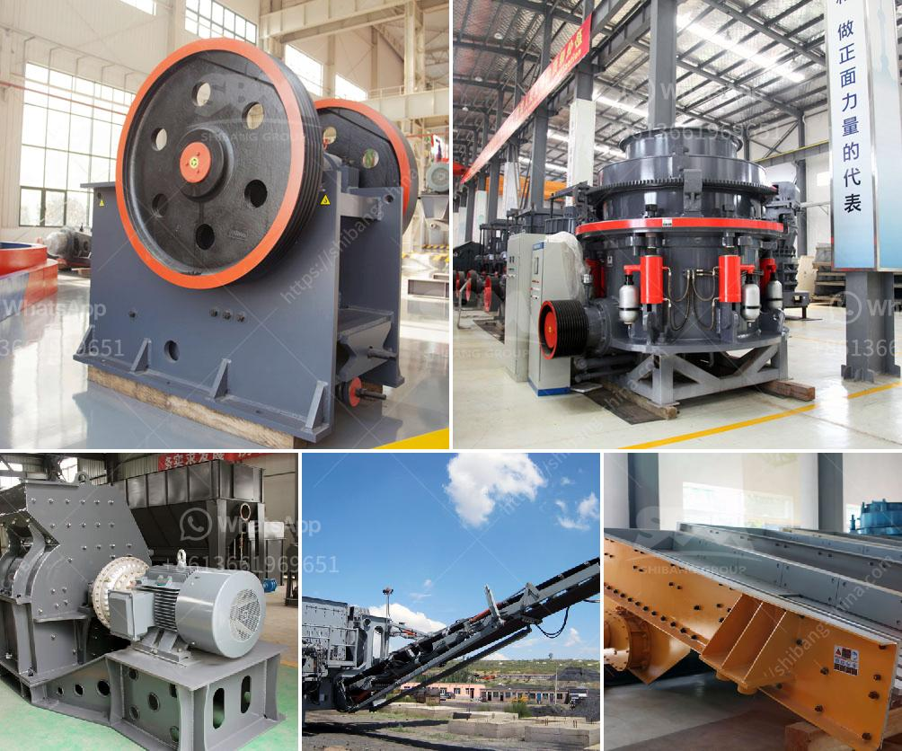

<h3>How to Artificially Make Concrete Sand？</h3>
Concrete sand is a vital ingredient in the construction industry. It is used as a key component in the production of concrete, which serves as the foundation for most structures. Natural sand, found in rivers and beaches, has been traditionally used in concrete production. However, the increasing demand for construction materials and the impact of sand mining on the environment have led to a shortage of this resource. To overcome these challenges, researchers and engineers have explored artificial methods to produce concrete sand. In this article, we will explore the process of artificially making concrete sand.

1. Choose the right raw materials: To create artificial concrete sand, you will need a combination of finely crushed rock or stone and water. The rock or stone should ideally have a composition similar to that of natural sand, such as granite or limestone. These materials can be sourced from quarries or recycled from construction and demolition waste.

2. Crushing and sieving: The first step in producing artificial concrete sand is to crush the raw materials into smaller particles. This can be achieved through various crushing techniques, such as using a jaw crusher or cone crusher. The crushed rock or stone is then sieved to obtain the desired particle size range, typically within the range of 0.15mm to 4.75mm.

3. Washing and grading: After the crushing and sieving process, the crushed rock or stone particles may contain impurities like clay, dust, or organic matter. Washing the particles with clean water helps remove these impurities, ensuring the quality of the artificial concrete sand. Gradation of the sand is important as well, as it affects the workability and strength of the concrete. Therefore, the washed sand is typically graded into different sizes according to specific standards.

4. Drying and shaping: Once the artificial concrete sand is washed and graded, it needs to be dried to achieve the desired moisture content. This is typically done by allowing the sand to air dry or using specialized drying techniques like rotary dryers or fluidized bed dryers. Additionally, the sand may need to be shaped to achieve a more rounded or angular texture, depending on the requirements of the concrete mix.

5. Testing and quality control: Before using the artificial concrete sand in construction, it is essential to test its properties and ensure its quality. Various tests, such as grading analysis, particle shape analysis, and moisture content determination, can be performed to evaluate the sand's suitability for concrete production. Quality control measures should be implemented to maintain consistent production and ensure the desired sand characteristics are met.

Artificially making concrete sand offers a sustainable solution to meet the demand for construction materials while reducing the environmental impact of sand mining. By carefully selecting raw materials, crushing and sieving, washing and grading, drying and shaping, and implementing quality control measures, it is possible to produce high-quality artificial concrete sand. These steps will help maintain a steady supply of sand for the construction industry, ensuring the continued growth and development of infrastructure projects.
<h3>Contact us</h3><ul><li><strong>Whatsapp:&nbsp;<a href="https://wa.me/8613661969651">+8613661969651</a></strong></li><li><a href="https://swt.shibang-china.com/?git&amp;zhl&amp;How to Artificially Make Concrete Sand？"><strong>Online Service(chat now)</strong></a></li></ul><h3>Related</h3><ul><li><a href='How to operate a calcite crusher plant.md'>How to operate a calcite crusher plant?</a></li><li><a href='How does a jaw crusher crush limestone.md'>How does a jaw crusher crush limestone?</a></li><li><a href='How to process metallic minerals .md'>How to process metallic minerals ?</a></li><li><a href='How to Make Plaster of Phosphogypsum.md'>How to Make Plaster of Phosphogypsum</a></li><li><a href='How to select a reversible hammer crusher as a coal crusher.md'>How to select a reversible hammer crusher as a coal crusher?</a></li></ul>