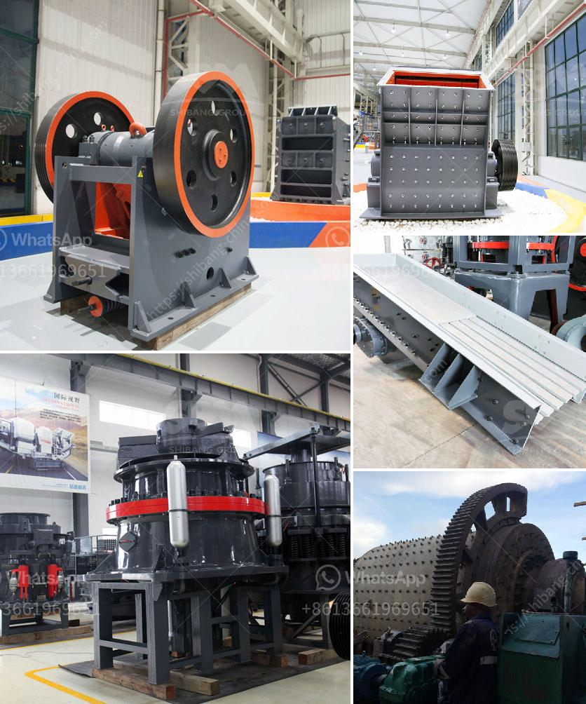

<h3>How to Build Your Own Rock Crusher in the Philippines ？</h3>
Building your own rock crusher in the Philippines can be a fun and satisfying project. You may already have some experience in construction, but if not, don't worry. We'll walk you through the process step-by-step to ensure that you can successfully build your own rock crusher.

Before we dive into the building process, let's first understand the purpose of a rock crusher. A rock crusher is a device used to crush rocks into smaller pieces, usually for gravel or some other road or building application. Most rock crushers have a hopper at the top -- a container which holds the rock above the crusher and uses gravity to feed it in. Alternately, rock crushers can use a belt drive to continuously transport the rock into the crusher.

1. Start by laying out the design or pattern for the base of the rock crusher. Use a pen or marker to outline the shape.

2. Using an angle grinder, carefully cut along the lines you marked. Wear protective gear, such as safety glasses and work gloves, to ensure your safety.

4. Next, weld the steel bar across the open end of the frame to act as a platform for the crusher. Ensure that it is securely attached before moving on to the next step.

5. Attach the flywheel to one end of the steel bar using the appropriate size bolts. The flywheel will help generate the crushing motion and provide momentum to the hammers.

6. Attach the hammers to the flywheel using steel chains. Make sure the hammers are evenly spaced and securely attached to the flywheel.

7. Finally, drill holes in the frame to insert the bearings. Use a wrench to tighten the bearings securely.

Congratulations! You have successfully built your own rock crusher. Now it's time to test it and see how it performs.

To use your rock crusher, simply feed rocks into the hopper at the top. The rock will be pulled into the crusher by the flywheel, and the hammers will crush them into smaller pieces. The crushed rock can then be used for various purposes, such as constructing roads or building foundations.

Remember to always wear protective gear when operating the rock crusher, such as safety glasses and ear protection. Never operate the rock crusher without them.

Building your own rock crusher can be a challenging but rewarding project. It allows you to craft something with your own hands while also giving you a useful tool for various construction purposes. So, gather your materials, put on your safety gear, and start building your very own rock crusher in the Philippines today!
<h3>Contact us</h3><ul><li><strong>Whatsapp:&nbsp;<a href="https://wa.me/8613661969651">+8613661969651</a></strong></li><li><a href="https://swt.shibang-china.com/?git&amp;zhl&amp;How to Build Your Own Rock Crusher in the Philippines ？"><strong>Online Service(chat now)</strong></a></li></ul><h3>Related</h3><ul><li><a href='How to fit a jaw crusher flywheel.md'>How to fit a jaw crusher flywheel?</a></li><li><a href='How can we solve the problem of the crusher bearing heating.md'>How can we solve the problem of the crusher bearing heating?</a></li><li><a href='How to concentrate gold in hard rock.md'>How to concentrate gold in hard rock?</a></li><li><a href='How to determine the value of a rock quarry.md'>How to determine the value of a rock quarry?</a></li><li><a href='How to manufacture marble powder with a mesh size of 1000.md'>How to manufacture marble powder with a mesh size of 1000?</a></li></ul>