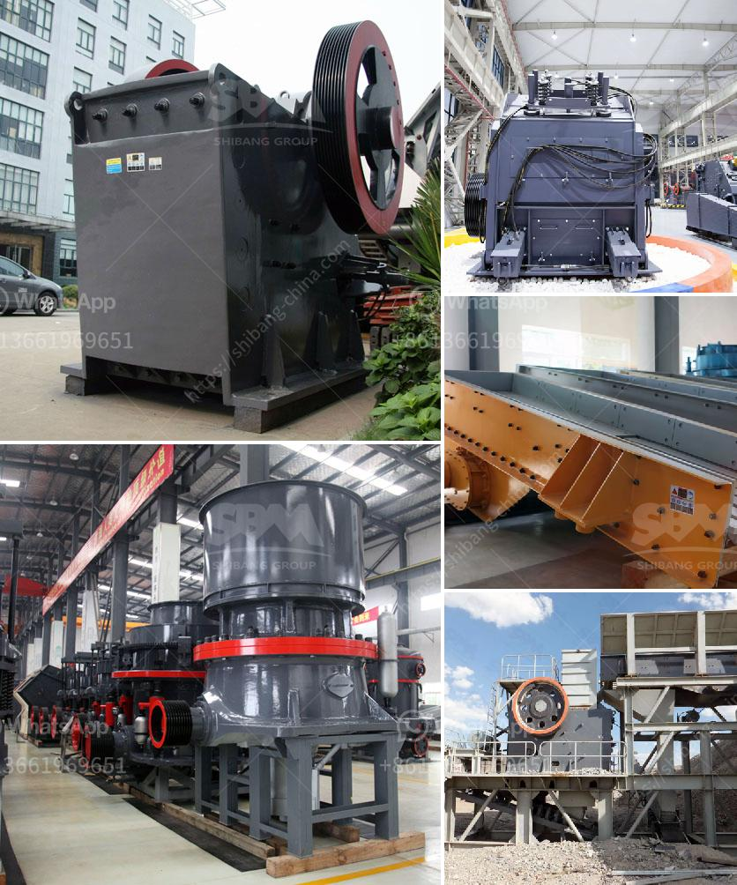

<h3>How to Build a Granite Jaw Crusher in South Africa ？</h3>
If you are in the mining or construction industry in South Africa and want to start building your own granite jaw crusher, there are a few key steps you need to follow. A jaw crusher is a machine that processes waste granite and turns it into usable aggregates for construction purposes. This article will guide you through the process of building a granite jaw crusher in South Africa.

Before you start building your granite jaw crusher, it is important to do thorough research and planning. Understand the market demand for aggregates in your area and determine the specific type and size of aggregates you want to produce. Also, research the necessary equipment and machinery required to build a jaw crusher.

Once you have done your research, it is time to design and engineer your jaw crusher. Consider factors such as the size and capacity of the crusher, the type of materials you will be processing, and the power source. It is important to design a robust and efficient jaw crusher that can handle the workload and meet your production goals.

To build a granite jaw crusher, you will need various materials and equipment. Some of the key materials include steel plates, welding electrodes, and bolts. You will also need machinery such as a welding machine, angle grinder, and a cutting torch. Make sure you have all the necessary materials and equipment before starting the construction process.

To start the fabrication and assembly process, first, cut and shape the steel plates according to the designed dimensions. Use the angle grinder and cutting torch to cut and shape the plates accurately. Next, weld the plates together to form the main structure of the jaw crusher. Ensure all the welds are strong and secure.

After fabricating the main structure, it is time to install various components such as the jaw plates, bearings, and flywheel. The jaw plates are the main crushing components and should be strong and durable. Mount them securely onto the main structure. Install the bearings and flywheel according to the manufacturer's instructions.

Once all the components are installed, connect the jaw crusher to a power source. Ensure all the connections are secure and functioning properly. Test the jaw crusher by processing some waste granite and check if it produces the desired aggregates. Make any necessary adjustments and ensure everything is working efficiently.

When operating a jaw crusher, always follow safety guidelines to prevent accidents and injuries. Keep the working area well-lit and clean. Regularly inspect and maintain the jaw crusher to ensure optimal performance and prevent breakdowns. Lubricate all moving parts and replace any worn-out components.

Building a granite jaw crusher in South Africa requires careful planning, research, and technical knowledge. Follow these steps to ensure successful construction and operation. Remember to prioritize safety and maintenance to prolong the lifespan of your jaw crusher and ensure smooth operation.
<h3>Contact us</h3><ul><li><strong>Whatsapp:&nbsp;<a href="https://wa.me/8613661969651">+8613661969651</a></strong></li><li><a href="https://swt.shibang-china.com/?git&amp;zhl&amp;How to Build a Granite Jaw Crusher in South Africa ？"><strong>Online Service(chat now)</strong></a></li></ul><h3>Related</h3><ul><li><a href='How to choose a basalt crusher？.md'>How to choose a basalt crusher？</a></li><li><a href='how to choose mill and crusher ？.md'>how to choose mill and crusher ？</a></li><li><a href='how the mine crusher operate .md'>how the mine crusher operate ?</a></li><li><a href='How to unjam a mine crushing mill.md'>How to unjam a mine crushing mill?</a></li><li><a href='How to process ore in crusher with sticky soil .md'>How to process ore in crusher with sticky soil ?</a></li></ul>