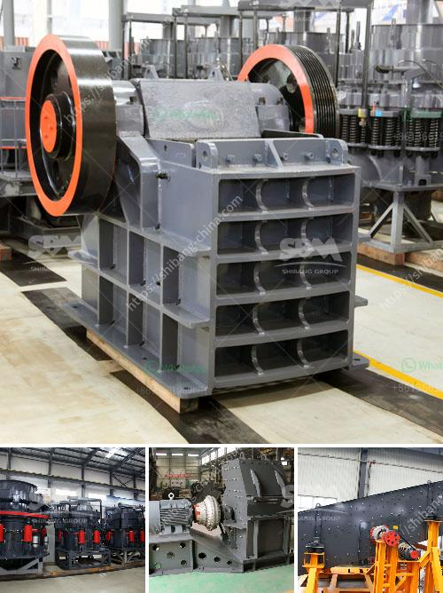

<h3>How to Build a Limestone Crusher ？</h3>
Limestone is a sedimentary rock that is made up of calcium carbonate, or CaCO3. It is widely used in the construction industry as a building material. Limestone aggregate is also used for road base, concrete, and asphalt. With the increasing demand for limestone, there is a need to expand its production capacity. One way to do this is by building a limestone crusher. In this article, we will discuss how to build a limestone crusher.

First, you will need to gather all the necessary materials and tools for the project. These include a welding machine, angle grinder, blowtorch, drill, and other metalworking tools. Additionally, you will need steel plates, bolts, and nuts, as well as a motor and pulleys.

The first step in building a limestone crusher is to lay the foundation. Dig a hole on the ground to create a space for the crusher. Make sure to compact the soil before laying the foundation to ensure stability. Once the foundation is prepared, you can begin assembling the crusher.

Start by welding the steel plates together to make the main frame of the crusher. Ensure that the welds are strong and secure. Next, attach the motor to one side of the frame using bolts and nuts. Make sure the motor is securely fastened, as it will power the crusher.

After the motor is installed, attach the pulleys to the motor and the crusher. The pulleys will transfer the rotational energy from the motor to the crusher, allowing it to crush the limestone. Make sure the pulleys are aligned and properly tensioned.

Next, you will need to build the crushing chamber. This is where the limestone will be crushed into smaller particles. Weld two steel plates together to form the crushing chamber. Attach the chamber to the main frame of the crusher using bolts and nuts. Make sure the chamber is securely fastened.

Once the crusher is fully assembled, you can test its functionality. Connect the crusher to a power source and turn it on. Feed limestone rocks into the crusher and observe how efficiently it crushes them. If the crusher is functioning properly, you can then fine-tune its settings to achieve the desired particle size.

Building a limestone crusher requires a certain level of technical skill and knowledge of metalworking techniques. If you are not familiar with welding and metalworking, it is advisable to seek assistance from a professional or experienced individual. Additionally, it is important to prioritize safety during the construction process. Always wear appropriate protective gear, such as goggles and gloves, and follow safety guidelines to prevent injuries.

In conclusion, building a limestone crusher involves various steps, including laying the foundation, assembling the crusher, and testing its functionality. By following the recommended guidelines and safety precautions, you can successfully build a limestone crusher to meet your production needs.
<h3>Contact us</h3><ul><li><strong>Whatsapp:&nbsp;<a href="https://wa.me/8613661969651">+8613661969651</a></strong></li><li><a href="https://swt.shibang-china.com/?git&amp;zhl&amp;How to Build a Limestone Crusher ？"><strong>Online Service(chat now)</strong></a></li></ul><h3>Related</h3><ul><li><a href='how to separate iron from basalt？.md'>how to separate iron from basalt？</a></li><li><a href='How to adjust the conveyor belt.md'>How to adjust the conveyor belt?</a></li><li><a href='How to build sand and gravel wash plant.md'>How to build sand and gravel wash plant?</a></li><li><a href='how to do ball mill liner？.md'>how to do ball mill liner？</a></li><li><a href='how to limit excess fines in crushing .md'>how to limit excess fines in crushing ?</a></li></ul>