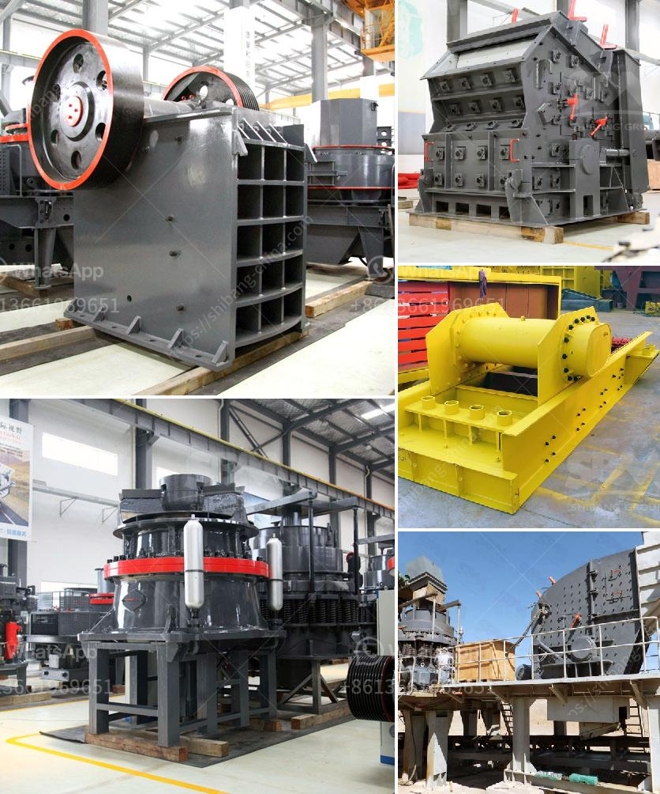

<h3>How to Build a Marble Mill ？</h3>
Marbles have been a beloved toy for centuries, captivating both young and old with their vibrant colors and smooth texture. Building a marble mill can add an extra level of excitement to your marble playing experience. Not only will you have fun constructing it, but it will also provide endless hours of entertainment as marbles roll down the tracks you've created. Whether you're a seasoned builder or a beginner, here is a step-by-step guide on how to build your very own marble mill.

1. Gather your materials: To begin, you'll need some basic supplies including wooden boards, a saw, screws or nails, a drill, marbles, and glue. Choose a sturdy and durable wood for the base and tracks, preferably hardwood, to ensure the mill's longevity.

2. Plan your design: Sketch out a rough blueprint of how you want your marble mill to look and function. Consider the size, height, and complexity of the tracks. Keep in mind that the more intricate the design, the more challenging it will be to construct. Also, think about how many tracks you want and whether you want any additional features such as tunnels or spirals.

3. Build the base: Start by cutting the wooden boards to create the base of your marble mill. The size of the base will depend on how big you want your mill to be. It should be wide enough to fit all the tracks comfortably. Use screws or nails to attach the boards securely.

4. Construct the tracks: Cut the remaining wooden boards into smaller pieces to form the tracks. You can create straight tracks or experiment with various curves and angles. Use a drill to make holes at the ends of the tracks so that marbles can flow seamlessly from one track to another. Glue the tracks to the base, ensuring they are level and secure.

5. Add additional features: If you want to make your marble mill more exciting, consider adding tunnels or spirals to the tracks. Using thin wooden dowels, create a spiral shape by drilling holes in ascending heights along the track and connecting them with the dowels. For tunnels, cut a section of the track and place a hollow tube or piping in its place.

6. Fine-tune the design: Once you have assembled the base, tracks, and any additional features, make sure they are all working smoothly. Test the movement of marbles along the tracks and make any necessary adjustments to ensure optimal flow.

7. Decorate and personalize: Let your creativity shine by painting or staining the wooden surfaces of your marble mill. You can also add colorful patterns or designs to the tracks using acrylic paint, making the playtime experience more visually appealing.

8. Enjoy the marble mill: Now that your marble mill is complete, it's time to play! Explore the joy of releasing marbles at the top of the tracks and watching them race down the slopes, encountering tunnels and spirals along the way. Invite friends and family to join in the fun, and spark their creativity by encouraging them to design their own marble mills.

Building a marble mill is not just an enjoyable DIY project, but it also enhances critical thinking, problem-solving, and creativity. Delve into the world of marbles with this engaging and educational activity that will bring hours of entertainment and joy to all involved.
<h3>Contact us</h3><ul><li><strong>Whatsapp:&nbsp;<a href="https://wa.me/8613661969651">+8613661969651</a></strong></li><li><a href="https://swt.shibang-china.com/?git&amp;zhl&amp;How to Build a Marble Mill ？"><strong>Online Service(chat now)</strong></a></li></ul><h3>Related</h3><ul><li><a href='How iron ore mining is conducted.md'>How iron ore mining is conducted</a></li><li><a href='How to crush borax .md'>How to crush borax ?</a></li><li><a href='How to judge how much power the jaw crusher needs？.md'>How to judge how much power the jaw crusher needs？</a></li><li><a href='How to remove pyrite stones from coal.md'>How to remove pyrite stones from coal?</a></li><li><a href='How to select a vibrating screen in Britain.md'>How to select a vibrating screen in Britain?</a></li></ul>