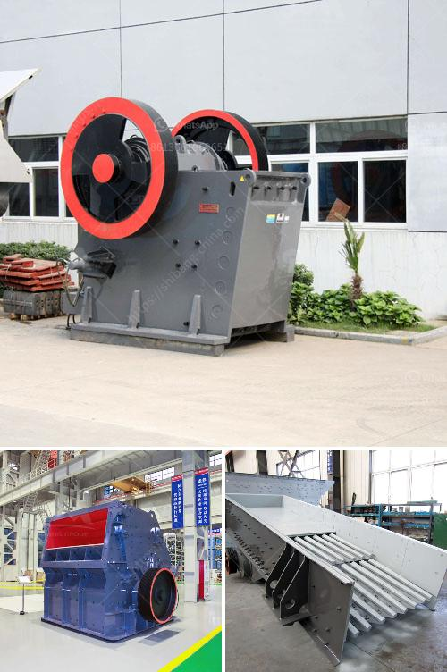

<h3>How to Build a Sand Screening Plant?</h3>
When it comes to construction projects, sand is an essential material that plays a crucial role. From providing a stable foundation for buildings to acting as a base material for roads, sand is in high demand. As a result, the need for a sand screening plant arises to ensure the quality and consistency of the sand used in construction. If you are planning to undertake such a project, here are some key aspects to consider when building a sand screening plant.

1. Location: The first step in building a sand screening plant is to find a suitable location. Look for an area with enough space to accommodate the equipment and allow for the movement of vehicles and personnel. Consider factors such as accessibility, proximity to water sources, and the potential impact on the surrounding environment.

2. Equipment Selection: Choose the appropriate equipment for your sand screening plant based on your specific requirements. Commonly used equipment includes a vibrating screen, a sand washing machine, and a conveyor system. The vibrating screen separates the sand into different sizes, while the sand washing machine helps to remove impurities and ensures that the sand is clean and free of debris. The conveyor system allows for the smooth transportation of sand from one process to another.

3. Design: Develop a detailed design plan for your sand screening plant. Consider factors such as the production capacity, material flow, and operational efficiency. Ensure that the design includes safety measures to protect workers and prevent accidents. Consult with a professional engineer if needed to ensure that your design meets industry standards and regulations.

4. Construction: Once you have the design ready, start the construction of the sand screening plant. Begin with clearing the land and preparing the foundation. Install the necessary infrastructure, such as electricity supply, water lines, and drainage systems. Assemble and install the equipment according to the manufacturer's instructions, ensuring that all connections and fastenings are secure. Test the equipment before starting the operations to ensure that everything is functioning correctly.

5. Maintenance and Upkeep: Regular maintenance is essential to ensure the smooth operation and longevity of your sand screening plant. Develop a maintenance schedule and perform routine inspections of the equipment. Lubricate moving parts, clean filters, and replace any worn-out components as necessary. Train your staff on safe operating procedures and provide them with the necessary personal protective equipment.

6. Regulatory Compliance: It is crucial to comply with all applicable laws, regulations, and permits regarding the operation of a sand screening plant. Obtain the necessary permits from the relevant authorities and adhere to environmental protection guidelines. Implement proper waste management protocols to minimize the impact on the environment.

Building a sand screening plant requires careful planning, proper equipment selection, and adherence to safety and environmental regulations. By following these steps, you can construct a sand screening plant that meets your operational needs while ensuring the quality and consistency of the sand used in construction projects.
<h3>Contact us</h3><ul><li><strong>Whatsapp:&nbsp;<a href="https://wa.me/8613661969651">+8613661969651</a></strong></li><li><a href="https://swt.shibang-china.com/?git&amp;zhl&amp;How to Build a Sand Screening Plant"><strong>Online Service(chat now)</strong></a></li></ul><h3>Related</h3><ul><li><a href='How do you calculate the size reduction ratio of a crusher.md'>How do you calculate the size reduction ratio of a crusher?</a></li><li><a href='How to design a vibrating screen.md'>How to design a vibrating screen?</a></li><li><a href='How to increase the efficiency coal pulveriser on power plant.md'>How to increase the efficiency coal pulveriser on power plant?</a></li><li><a href='How to determine the size of the conveyor belt in mining？.md'>How to determine the size of the conveyor belt in mining？</a></li><li><a href='How can we prevent rocks from coming out of the impact crushers work.md'>How can we prevent rocks from coming out of the impact crusher's work?</a></li></ul>