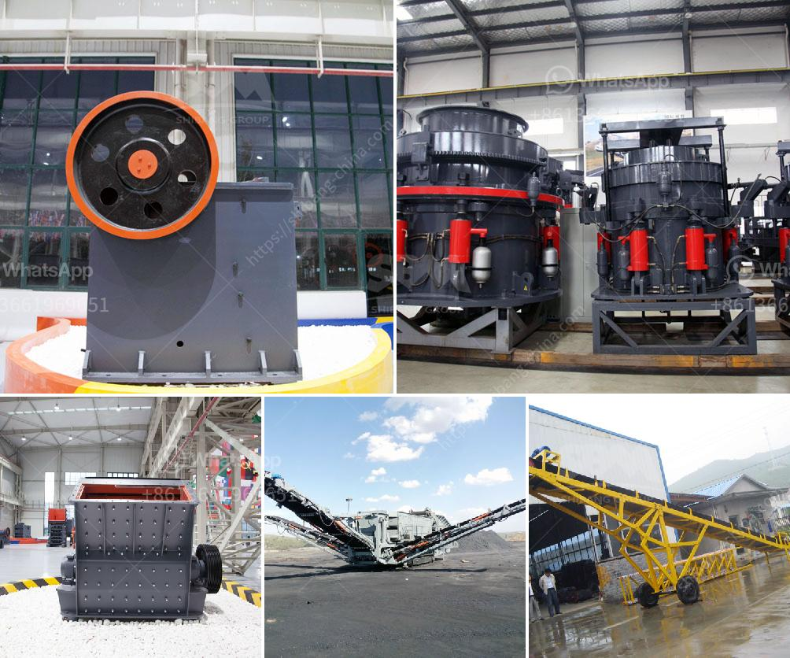

<h3>How to Build a Sand Washing Plant in Indonesia ？</h3>
Sand washing plants are used to separate sand and sediment from water in various industries. In Indonesia, this process is especially important considering the large amount of sand mining activity that takes place. However, constructing a sand washing plant can be a complex and expensive endeavor. This article will outline the steps involved in building a sand washing plant in Indonesia.

Before starting the construction of the sand washing plant, thorough research and planning are necessary to ensure its success. Identify the specific requirements of your project, including the amount of sand to be processed, the desired level of cleanliness, and the water source. Additionally, familiarize yourself with local regulations and permits required for constructing and operating a sand washing plant.

Choose a suitable location for the sand washing plant. Consider factors such as proximity to the water source, availability of infrastructure, and accessibility for transportation. The site should have enough space to accommodate all the necessary equipment and ensure ease of operation and maintenance.

Select the appropriate equipment and machinery for your sand washing plant. This may include a vibrating feeder, a sand making machine, a vibrating screen, a sand washing machine, and a dewatering screen. Ensure that the chosen equipment is compatible and can handle the desired capacity of sand processing.

Begin construction of the sand washing plant following the designed layout. This may involve building concrete foundations, erecting steel structures, and installing equipment. Use experienced workers and follow safety protocols throughout the construction process.

Establish a reliable water supply for your sand washing plant. This can be achieved using wells, rivers, or installing a water recycling system. The water used in the washing process must be managed properly to prevent contamination and ensure compliance with environmental regulations.

Once the construction is complete, start the operation of the sand washing plant. Regularly inspect the equipment, troubleshoot any issues, and perform necessary maintenance to ensure smooth functioning. Train the operators on how to operate the plant safely and efficiently.

It is crucial to mitigate the environmental impact of a sand washing plant. Implement measures to prevent sediment runoff and dust emissions. Engage in responsible sand mining practices and adopt sustainable water management practices to minimize the plant's environmental footprint.

In conclusion, building a sand washing plant in Indonesia requires careful planning, appropriate equipment selection, and compliance with environmental regulations. By following the steps outlined in this article, you can construct a efficient and environmentally friendly sand washing plant that meets your project requirements.
<h3>Contact us</h3><ul><li><strong>Whatsapp:&nbsp;<a href="https://wa.me/8613661969651">+8613661969651</a></strong></li><li><a href="https://swt.shibang-china.com/?git&amp;zhl&amp;How to Build a Sand Washing Plant in Indonesia ？"><strong>Online Service(chat now)</strong></a></li></ul><h3>Related</h3><ul><li><a href='how to start a mini cement mill ？.md'>how to start a mini cement mill ？</a></li><li><a href='How to crush and clean stone.md'>How to crush and clean stone?</a></li><li><a href='How to develope stone quarry .md'>How to develope stone quarry ?</a></li><li><a href='how to crusher river pebbles into sand ？.md'>how to crusher river pebbles into sand ？</a></li><li><a href='How does a coal mill work.md'>How does a coal mill work?</a></li></ul>