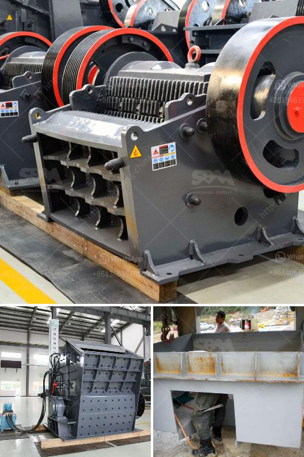

<h3>How to Build an Ore Processing Plant ？</h3>
As the demand for raw materials continues to rise in various industries, the need for efficient ore processing plants becomes evident. These plants play a crucial role in extracting and refining valuable minerals from ore, ensuring their usability in different applications. To successfully build an ore processing plant, several essential steps need to be followed to ensure a smooth and productive operation. This article will outline these steps, taking into account the key considerations and best practices for constructing a reliable and efficient processing facility.

The first step in building an ore processing plant is to carefully plan and design the facility. It is essential to conduct a thorough analysis of the ore deposits, considering their type, quantity, and quality. The chosen location should also be strategically located near the mine for ease of transportation. The plant's layout should be designed to optimize workflow, allowing for efficient material flow from one stage to another.

Before construction can commence, it is imperative to obtain the required permits and approvals from local authorities and regulatory bodies. This involves submitting the appropriate documentation and environmental impact assessments to ensure compliance with all relevant regulations and guidelines.

Choosing the right equipment and machinery is critical for the success of an ore processing plant. This includes crushers, conveyors, screens, separators, and other specialized machinery depending on the specific ore type. It is essential to source reliable and high-quality equipment from reputable manufacturers to ensure their longevity and efficiency.

Once the necessary permits are obtained, construction can begin. The infrastructure should be designed to support the plant's operations, including buildings, utilities, roads, and waste management systems. Adequate electrical supply, water sources, and waste disposal mechanisms should be integrated into the plant's design.

Safety should be a top priority when building an ore processing plant. Robust safety measures need to be in place to protect workers and minimize any potential risks. This includes providing protective gear, implementing safety training programs, and adhering to strict safety protocols throughout the construction process.

After the construction is completed, the ore processing plant needs to undergo a thorough commissioning and testing phase. This involves running equipment and processes to ensure they are functioning correctly and producing the desired outcomes. Any operational issues discovered during this stage should be promptly addressed and rectified.

Once the plant is commissioned and tested successfully, staff training on the plant's operation should be conducted. This includes training on safety protocols, equipment operation, and maintenance procedures. It is vital to have a competent and skilled workforce to ensure the plant's smooth and efficient operation.

In conclusion, building an ore processing plant requires careful planning, adherence to regulations, and diligent execution. By following the steps outlined above, one can construct a reliable and efficient processing facility that maximizes the extraction of valuable minerals from ore. Investing in proper planning, infrastructure, equipment, and safety measures will contribute to the plant's long-term success in meeting the growing demand for raw materials in various industries.
<h3>Contact us</h3><ul><li><strong>Whatsapp:&nbsp;<a href="https://wa.me/8613661969651">+8613661969651</a></strong></li><li><a href="https://swt.shibang-china.com/?git&amp;zhl&amp;How to Build an Ore Processing Plant ？"><strong>Online Service(chat now)</strong></a></li></ul><h3>Related</h3><ul><li><a href='How to Build a Limestone Crusher ？.md'>How to Build a Limestone Crusher ？</a></li><li><a href='How to build a sand washing plant.md'>How to build a sand washing plant?</a></li><li><a href='How to operate a coal crusher machine.md'>How to operate a coal crusher machine?</a></li><li><a href='How is limestone processed flowchart.md'>How is limestone processed flowchart?</a></li><li><a href='How to operate the hammer mill.md'>How to operate the hammer mill</a></li></ul>