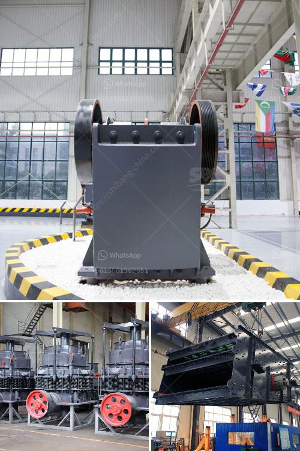

<h3>How to Calculate the Amount of Dust generated by a stone crusher</h3>
Stone crushing is a significant industrial activity that generates large quantities of dust. Dust particles are typically produced during the crushing process as stone materials are broken down into smaller sizes. However, controlling the amount of dust emitted at the source is crucial to maintaining a clean and healthy working environment. In this article, we will explore the process of calculating the amount of dust generated by a stone crusher machine.

1. Type of stone crusher: Different types of stone crushers, such as primary, secondary, or tertiary crushers, have varying levels of dust generation. The size of the stone feed and the size reduction parameters will determine the amount of dust generated.

2. Crushing equipment design: The design and spacing of the crusher's jaws or cones play a significant role in controlling the amount of dust generated. Adequate measures should be taken to minimize dust escape from the crushing chamber.

3. Operational factors: The manner in which the stone crusher is operated greatly affects dust generation. Factors such as conveyor speed, crusher feed rate, and crusher settings can also influence the amount of dust generated.

Dust control efficiency is defined as the portion of dust that is captured and contained by the system. It can be calculated using the following formula:

The dust emission rate can be measured in grams per minute (g/min) or grams per second (g/s). This can be done by using a dust sampling device or an air quality monitoring system. Place the device near the source of dust generation and run it for a specified duration to obtain an accurate reading.

The dust generation rate refers to the total amount of dust produced per unit of time. In the case of a stone crusher, it can be calculated as the product of the average feed rate (Q) and the dust concentration (C) in the stone crushing process.

Once you have determined the dust generation rate, you can calculate the amount of dust produced over a specific timeframe by multiplying it by the duration (T).

By following these steps, you can estimate the amount of dust generated by a stone crusher. This information is crucial for designing effective dust control measures such as dust suppression systems, dust enclosures, or ensuring proper ventilation to minimize the health risks associated with exposure to airborne dust.

In conclusion, controlling the amount of dust generated by a stone crusher is essential for maintaining a safe and healthy environment. By considering the factors that influence dust generation and following the steps outlined above, operators can establish measures to effectively manage and control dust emissions in their crushing operations.
<h3>Contact us</h3><ul><li><strong>Whatsapp:&nbsp;<a href="https://wa.me/8613661969651">+8613661969651</a></strong></li><li><a href="https://swt.shibang-china.com/?git&amp;zhl&amp;How to Calculate the Amount of Dust generated by a stone crusher"><strong>Online Service(chat now)</strong></a></li></ul><h3>Related</h3><ul><li><a href='How to design a hopper feeder.md'>How to design a hopper feeder?</a></li><li><a href='How can we increase the production of the jaw crusher.md'>How can we increase the production of the jaw crusher?</a></li><li><a href='how does the jaw crusher works.md'>how does the jaw crusher works</a></li><li><a href='How to improve the crushing capacity of ball mill.md'>How to improve the crushing capacity of ball mill?</a></li><li><a href='How much does it cost to set up the crusher plant.md'>How much does it cost to set up the crusher plant?</a></li></ul>