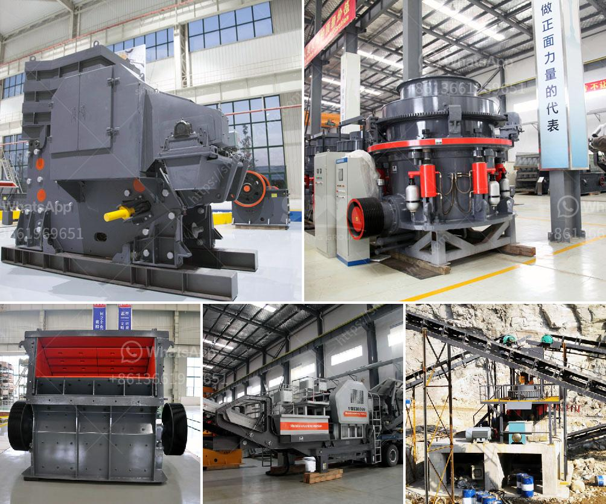

<h3>How to Calibrate Coal Mill Feeders?</h3>
The coal mill feeders play a crucial role in the coal-fired power generation process. They are responsible for transferring raw coal from the bunkers to the pulverizing system, where it is ground and transformed into energy. Proper calibration of the coal mill feeders is essential to achieve efficient combustion and minimize the environmental impact of coal-fired power plants. In this article, we will discuss the importance of calibrating coal mill feeders and provide a step-by-step guide on how to calibrate them effectively.

Calibration ensures that the coal mill feeders deliver the right amount of coal to the pulverizing system. If the feeders are not properly calibrated, there can be deviations in coal flow rate, leading to inefficient combustion, reduced boiler efficiency, increased emissions, and potential damage to the pulverizing system. By calibrating the feeders, operators can maintain a consistent and optimal coal flow rate, which is crucial for achieving stable and efficient operation of the coal-fired power plant.

1. Understand the specifications: Before starting the calibration process, it is essential to thoroughly understand the technical specifications of the coal mill feeders. This includes the rated capacity, design parameters, and operating conditions. This knowledge will help in identifying any deviations during the calibration process.

2. Check for physical obstructions: Inspect the feeders for any physical obstructions that may affect coal flow. This could include any blockages, build-ups, or damages that might impair the smooth flow of coal. Clear any obstructions and repair or replace any damaged components if required.

3. Verify and adjust the feeder settings: The next step is to verify and adjust the feeder settings. This includes checking the belt tension, roller alignment, and ensuring that the transport mechanism (belt, chain, etc.) is properly aligned and lubricated. Also, check the settings of any variable frequency drives or other control devices to ensure that they are within the specified range.

4. Conduct a test run: With the feeder settings adjusted, conduct a test run to measure the actual coal flow rate. Use appropriate measuring devices, such as coal flow sensors or weigh scales, to gather accurate data. Run the system for a sufficient duration to gather representative measurements.

5. Calculate and compare the deviation: Once the test run is complete, calculate the deviation between the measured and the desired coal flow rate. If the deviation is within an acceptable range (as specified by the manufacturer or industry standards), the calibration is successful. However, if the deviation is unacceptable, adjustments need to be made to the feeder settings.

6. Fine-tune the calibration: In case of an unacceptable deviation, fine-tune the feeder settings by making small adjustments and repeating the test run. Continue this iterative process until the measured coal flow rate matches the desired flow rate within the acceptable range.

7. Periodic recalibration: Regularly calibrate the coal mill feeders to ensure their continued accuracy and optimal performance. The frequency of recalibration may vary depending on the equipment manufacturer's recommendations, operating conditions, and any changes in coal properties or blending ratios.

In conclusion, the calibration of coal mill feeders is crucial for ensuring efficient and reliable operation of coal-fired power plants. By following the step-by-step guide mentioned above, operators can calibrate the feeders effectively, maintain optimal coal flow rate, and minimize environmental impact. Regular recalibration is recommended to account for any changes in operating conditions or feedstock properties.
<h3>Contact us</h3><ul><li><strong>Whatsapp:&nbsp;<a href="https://wa.me/8613661969651">+8613661969651</a></strong></li><li><a href="https://swt.shibang-china.com/?git&amp;zhl&amp;How to Calibrate Coal Mill Feeders"><strong>Online Service(chat now)</strong></a></li></ul><h3>Related</h3><ul><li><a href='How to set up a granite processing plant.md'>How to set up a granite processing plant?</a></li><li><a href='how to set up stone grinding machine ？.md'>how to set up stone grinding machine ？</a></li><li><a href='How to Make Plaster of Phosphogypsum.md'>How to Make Plaster of Phosphogypsum</a></li><li><a href='How to improve the quality of crusher aggregates .md'>How to improve the quality of crusher aggregates ?</a></li><li><a href='how to install and operate hammer crusher.md'>how to install and operate hammer crusher?</a></li></ul>