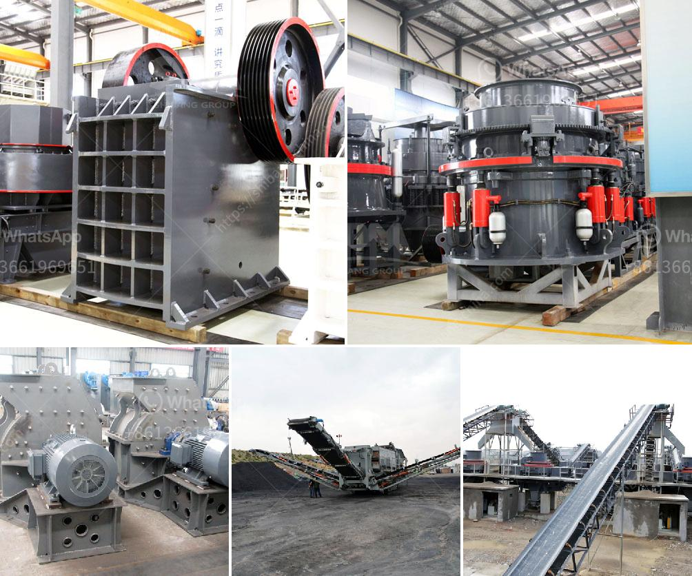

<h3>How to Choose a Vibrating Feeder?</h3>
Vibrating feeders are widely used in mining, construction, metallurgy, and other industries to transport and feed materials. They play a crucial role in various production processes. However, with the wide range of vibrating feeders available in the market, it can be challenging to select the right one for your specific needs. This article aims to guide you through the process of choosing a vibrating feeder that suits your requirements.

First and foremost, you need to identify the purpose of the vibrating feeder. Are you looking for a feeder that will convey materials or feed a specific type of machinery? Do you require a feeder for heavy-duty applications or light-duty applications? Understanding the purpose will help you narrow down your options.

Different materials have varying properties, such as bulk density, flow characteristics, and particle size distribution. It is crucial to consider these material properties when selecting a vibrating feeder. For example, cohesive materials may require vibratory feeders with specialized features, such as inclined conveyors, to ensure proper material flow.

The capacity and rate of feed are essential factors to consider when choosing a vibrating feeder. The capacity refers to the maximum amount of material the feeder can handle, while the rate of feed relates to how quickly the material is discharged. Ensure that the chosen vibrating feeder has the appropriate capacity and rate of feed to match your production requirements.

The design of the vibrating feeder should align with your specific needs. Consider factors such as feeder tray shape, size, and depth. The tray shape can be flat, trough-shaped, or tubular, depending on the material being fed. Additionally, the size should accommodate the volume of material, while the depth should prevent material spillage.

Vibrating feeders require power to operate. Analyze the available power source and electrical requirements before making a selection. Consider factors such as voltage, frequency, and whether a single-phase or three-phase power supply is needed. It is crucial to ensure that the vibrating feeder can be easily integrated into your existing power infrastructure.

Depending on your application, there may be additional features that are beneficial. Features such as adjustable vibration speed and amplitude can allow for finer control of material flow. Additionally, consider the availability of optional accessories like feed hoppers, discharge chutes, and dust covers.

If you are uncertain about which vibrating feeder to choose, it is always advisable to seek professional advice. Vibrating feeder manufacturers or experts in the field can provide valuable insights and recommendations based on their experience and knowledge. They can help ensure that you make an informed decision.

In conclusion, selecting the right vibrating feeder involves considering factors such as the purpose, material properties, capacity, feeder design, power requirements, and additional features. By carefully evaluating these aspects and seeking professional advice when needed, you can choose a vibrating feeder that meets your specific needs and contributes to improved productivity in your operations.
<h3>Contact us</h3><ul><li><strong>Whatsapp:&nbsp;<a href="https://wa.me/8613661969651">+8613661969651</a></strong></li><li><a href="https://swt.shibang-china.com/?git&amp;zhl&amp;How to Choose a Vibrating Feeder"><strong>Online Service(chat now)</strong></a></li></ul><h3>Related</h3><ul><li><a href='How to replace the vertical impact crusher on the production line.md'>How to replace the vertical impact crusher on the production line?</a></li><li><a href='How to build a granite crushing plant？.md'>How to build a granite crushing plant？</a></li><li><a href='How does a stone crusher work.md'>How does a stone crusher work?</a></li><li><a href='How to do manganese mining .md'>How to do manganese mining ?</a></li><li><a href='How to produce crushed sand.md'>How to produce crushed sand</a></li></ul>