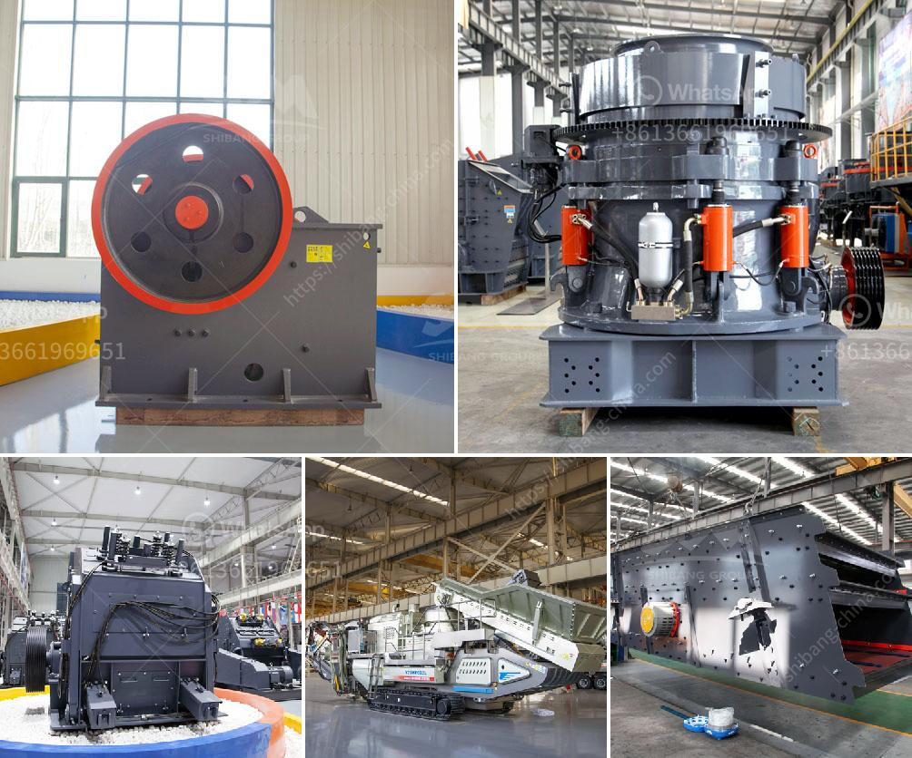

<h3>How to Configure Crusher Indonesia ？</h3>
Crusher Indonesia is a well-known company that specializes in the manufacturing and distribution of heavy-duty crushing equipment. With years of experience in the industry, they have been able to provide solutions for various sectors, including mining, construction, and recycling.

If you are considering setting up a crusher in Indonesia, it is crucial to configure it properly to maximize its efficiency and productivity. Here are some essential steps to follow:

1. Determine the Purpose: Before configuring your crusher, identify the primary purpose for which it will be used. Will it mainly process limestone for a construction project, or are you planning to crush rocks for mining? Understanding the specific requirements will help you select the appropriate crusher and configure it accordingly.

2. Choose the Right Crusher: Based on the purpose and desired output, choose the right type of crusher for your needs. There are various options available in the market, including jaw crushers, cone crushers, and impact crushers. Each has its advantages and disadvantages, so research thoroughly and consult with experts to make an informed decision.

3. Consider the Material: The type of material to be crushed also plays a significant role in configuration. Harder materials like granite and basalt may require crushers with higher horsepower and stronger structures. On the other hand, softer materials like limestone and sandstone can be efficiently processed with standard equipment.

4. Optimize Feed Size: The feed size is another critical factor that affects the configuration of the crusher. It is essential to choose a crusher that can handle the maximum feed size efficiently. Oversized materials can cause clogging and reduce overall productivity. Consult the manufacturer's specifications to determine the ideal feed size for your crusher.

5. Adjust the Crushing Chamber: Once you have selected the crusher, make sure to adjust the crushing chamber according to the desired output size. This can be achieved by modifying the crusher's eccentricity, stroke, and speed. Proper adjustment will ensure consistent and uniform size reduction.

6. Install the Proper Safety Equipment: Safety should never be compromised when configuring a crusher. Install safety devices such as emergency stop buttons, safety guards, and warning signs to protect operators and prevent accidents.

7. Regular Maintenance and Inspection: To ensure optimal performance, schedule regular maintenance and inspections for your crusher. Replace worn-out parts, lubricate moving components, and check for any potential issues. This will help prolong the lifespan of the machinery and minimize downtime.

Configuring a crusher in Indonesia requires careful consideration of various factors, including the purpose, material, feed size, and safety measures. By following these steps and consulting with experts, you can set up a crusher that meets your specific requirements and achieves optimal performance. Remember, proper configuration leads to improved productivity and profitability in the long run.
<h3>Contact us</h3><ul><li><strong>Whatsapp:&nbsp;<a href="https://wa.me/8613661969651">+8613661969651</a></strong></li><li><a href="https://swt.shibang-china.com/?git&amp;zhl&amp;How to Configure Crusher Indonesia ？"><strong>Online Service(chat now)</strong></a></li></ul><h3>Related</h3><ul><li><a href='How to segregate gold ore from copper ore .md'>How to segregate gold ore from copper ore ?</a></li><li><a href='How to control the dust of stone crusher .md'>How to control the dust of stone crusher ?</a></li><li><a href='how to make a ball mill .md'>how to make a ball mill ?</a></li><li><a href='How to crush aggregates.md'>How to crush aggregates?</a></li><li><a href='how to calculate belt feeder ？.md'>how to calculate belt feeder ？</a></li></ul>