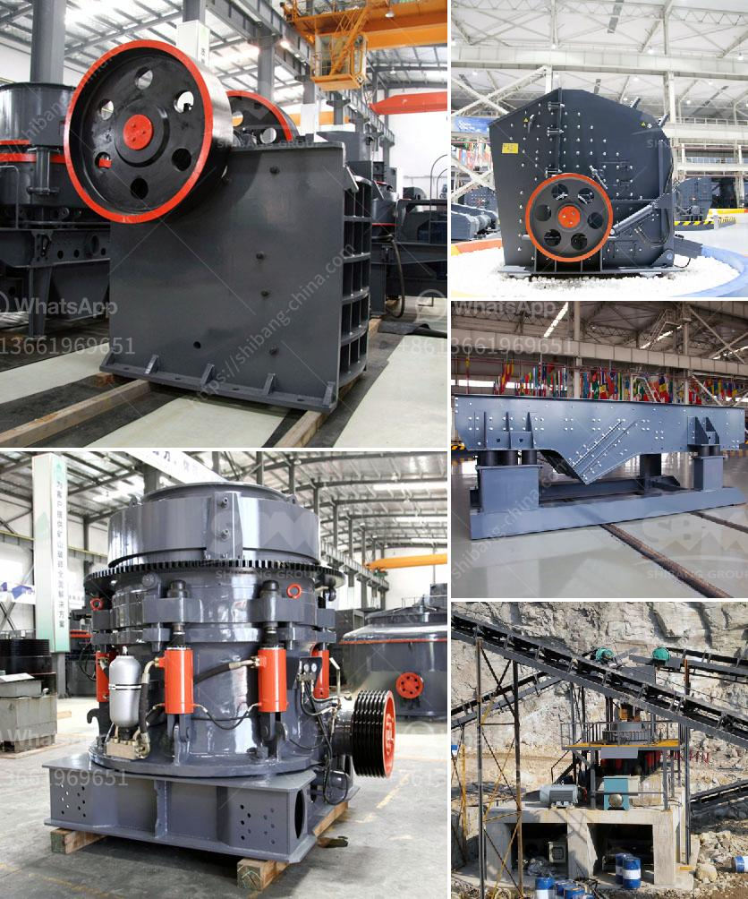

<h3>How to Grind Manganese Ores Using a Ball Mill?</h3>
Manganese ore is a critical raw material for the steel industry, as it is mainly used to make manganese alloys such as ferromanganese and manganese steel. Manganese ores need to be grinded before being used in the smelting process to obtain desirable particle size and uniformity for better alloying. One of the most commonly used methods to grind manganese ores is by using a ball mill.

A ball mill is a type of grinder used to grind and blend materials for use in mineral dressing processes, paints, pyrotechnics, ceramics, and selective laser sintering. It works on the principle of impact and attrition: size reduction is done by impact as the balls drop from near the top of the shell. A ball mill consists of a hollow cylindrical shell rotating about its axis. The axis of the shell may be either horizontal or at a small angle to the horizontal. It is partially filled with balls. The grinding media are the balls, which may be made of steel, stainless steel, ceramic, or rubber.

1. Determine the specific particle size and distribution desired for the end product. This will help in selecting the appropriate ball mill and grinding media.

2. Prepare the manganese ore by crushing and cleaning it to remove impurities such as dirt, clay, and silica.

3. Transfer the cleaned ore to the ball mill. Make sure that the ore is evenly distributed and that the balls are evenly spaced out to maximize the grinding efficiency.

4. Start the mill by closing the air valve. The mill should be operated at the lowest possible speed for the shortest possible grind time to achieve the desired particle size.

5. After a predetermined grinding time, stop the mill and check the particle size of the ground ore using a sieve or a laser particle size analyzer. Adjust the grinding time if necessary to achieve the desired particle size distribution.

6. Once the desired particle size distribution is achieved, remove the ground ore from the mill. The ground ore can be further processed or used directly in the smelting process depending on the requirements.

7. Clean the mill and grinding media to remove any remaining ore particles and prevent contamination of the next batch of ore.

Grinding manganese ores using a ball mill is a cost-effective method that ensures better particle size distribution and uniformity. By controlling the grinding process and optimizing the grinding parameters, manganese ore can be ground to the desired specifications, allowing for its efficient use in the steel industry. Remember to follow proper safety precautions when working with a ball mill, such as wearing protective gear and ensuring proper ventilation in the grinding area.

In conclusion, grinding manganese ores using a ball mill is a common and effective method to obtain the desired particle size and uniformity required for further processing. Whether for ferromanganese production or manufacturing manganese steel, a properly sized and operated ball mill can significantly enhance the efficiency and quality of the grinding process.
<h3>Contact us</h3><ul><li><strong>Whatsapp:&nbsp;<a href="https://wa.me/8613661969651">+8613661969651</a></strong></li><li><a href="https://swt.shibang-china.com/?git&amp;zhl&amp;How to Grind Manganese Ores Using a Ball Mill"><strong>Online Service(chat now)</strong></a></li></ul><h3>Related</h3><ul><li><a href='How to buy rock crusher in Sri Lanka .md'>How to buy rock crusher in Sri Lanka ?</a></li><li><a href='How to operate aggregate crushing plant.md'>How to operate aggregate crushing plant?</a></li><li><a href='How to do the maintenance of crushing screening plant.md'>How to do the maintenance of crushing screening plant?</a></li><li><a href='How to remove feldspars from sand production.md'>How to remove feldspars from sand production?</a></li><li><a href='How to start stone crusher project.md'>How to start stone crusher project?</a></li></ul>