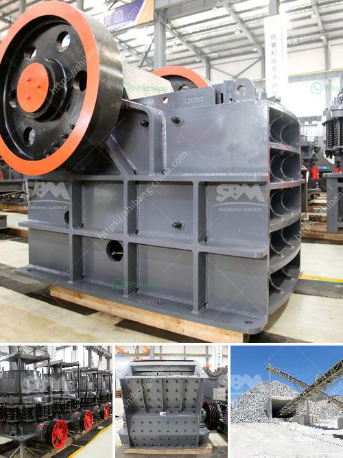

<h3>How to Improve the Crusher Productivity of Jaw Crusher ？</h3>
Crusher is a key equipment in the mining industry and its efficiency directly affects the profitability of the entire operation. So, it is critical to always optimize the productivity of the crusher. And, today, we are going to discuss the ways to improve the crusher productivity of jaw crusher.

Many production lines usually encounter problems of uneven feeding or excessive feeding, which often leads to blockage of the crusher, reducing the production efficiency. Therefore, it is essential to strictly control the feeding size within the specified range. The size of the material should neither be too large nor too small. By optimizing the feeding size, the crusher is more likely to have a continuous, stable, and efficient production process.

The jaw crusher consists of several parts like the fixed jaw plate, movable jaw plate, liner plate, side plate, etc. These parts need to be replaced frequently to ensure the stable operation of the crusher and its productivity. Regular inspections should be carried out to identify any worn parts and replace them promptly. This will prevent sudden breakdowns and unnecessary downtime, maximizing the productivity of the crusher.

The design of the jaw crusher plays a significant role in its productivity. The nip angle, number of strokes per minute, and the crushing chamber design are fundamental parameters that influence the crusher productivity. The optimum nip angle ensures high crushing efficiency. Additionally, the stroke rate directly affects the throughput of the machine. A larger crushing chamber provides more space for the material to move, thus improving productivity. Evaluating and optimizing these design parameters is crucial for enhancing the crusher productivity.

Different jaw crusher models are designed for various materials, capacity requirements, and particle sizes. Choosing the right crusher model significantly impacts productivity. The selection process should include determining the material hardness, moisture content, and input size. By choosing a proper jaw crusher model, the productivity can be optimized as the crusher will be able to handle the material efficiently, resulting in better throughput.

Preventive maintenance is crucial for the continuous and reliable operation of a jaw crusher. A well-maintained crusher reduces downtime, increases productivity, and extends the life of the equipment. Regularly inspecting and lubricating all the necessary parts, such as bearings, toggle plates, and hydraulic systems, ensures proper functioning of the crusher. Additionally, maintaining a clean working environment, free from dust and debris, will also contribute to the productivity of the jaw crusher.

In conclusion, improving the crusher productivity of a jaw crusher requires attention to various aspects. Proper control of the feeding size, regular inspection and replacement of worn parts, optimization of the design, and selecting the right crusher model are all essential steps. Furthermore, implementing a regular maintenance routine is vital for maintaining the efficiency and prolonging the lifespan of the crusher. By following these guidelines, operators can effectively enhance the productivity of their jaw crusher, leading to better overall operational performance.
<h3>Contact us</h3><ul><li><strong>Whatsapp:&nbsp;<a href="https://wa.me/8613661969651">+8613661969651</a></strong></li><li><a href="https://swt.shibang-china.com/?git&amp;zhl&amp;How to Improve the Crusher Productivity of Jaw Crusher ？"><strong>Online Service(chat now)</strong></a></li></ul><h3>Related</h3><ul><li><a href='How do I change the mantle of a cone crusher.md'>How do I change the mantle of a cone crusher?</a></li><li><a href='How to use the sand making machine.md'>How to use the sand making machine?</a></li><li><a href='How to use mineral processing equipment for tin ore beneficiation .md'>How to use mineral processing equipment for tin ore beneficiation ?</a></li><li><a href='How to Use a Hammer Mill Kenya ？.md'>How to Use a Hammer Mill Kenya ？</a></li><li><a href='how a cone crusher works .md'>how a cone crusher works ?</a></li></ul>