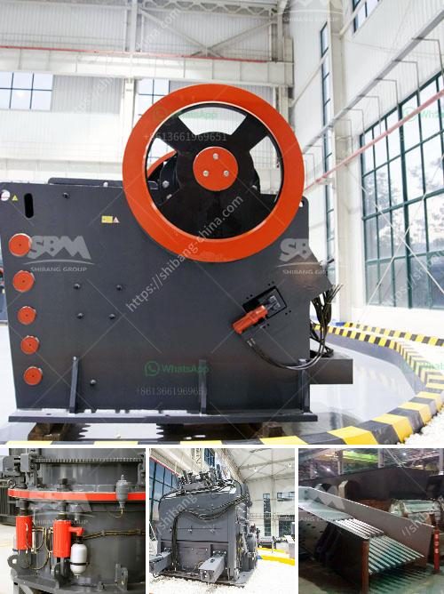

<h3>How to Install a crusher equipment ？</h3>
Crusher equipment is a vital tool in the mining industry. It helps reduce large rocks into smaller rocks or gravel, making it easier to handle and transport. However, installing a crusher requires expertise and experience. Therefore, in this article, we will guide you on how to install a crusher equipment properly.

Before starting the installation process, it is crucial to have a clear plan and layout for the crusher equipment. This will involve determining the location, position, and foundation requirements. Here are the steps to follow for a successful installation.

Begin by preparing the site where the crusher equipment will be installed. Clear any vegetation, level the ground, and mark the boundaries. Ensure that the area is accessible and free from any obstacles that may hinder the installation process.

The next step is to construct a stable and proper foundation for the crusher equipment. A concrete foundation is typically used for this purpose. Ensure that the foundation is leveled, reinforced with steel, and adequately sized to withstand the weight and vibrations produced by the equipment.

The crusher equipment usually arrives in separate parts that need to be assembled. Follow the manufacturer's instructions carefully to ensure correct assembly. This may involve attaching different components, such as the frame, hopper, and conveyor belts. Use appropriate tools and equipment, and ensure that all connections are tight.

Carefully position the assembled crusher equipment onto the foundation. Use a level to ensure that it is perfectly aligned. Depending on the equipment's size and weight, it may require heavy machinery such as cranes or forklifts to move and position it correctly. Take all necessary safety precautions during this process.

Connect the crusher equipment to the power supply. It is crucial to follow the wiring diagrams and instructions provided by the manufacturer. If in doubt, consult a certified electrician to ensure proper connections. Safety is paramount, so make sure to turn off the power supply before working on the electrical connections.

Once the electrical connections are complete, test the crusher equipment to ensure that it operates smoothly. Run it empty to check for any vibrations, unusual noises, or malfunctions. If everything is working correctly, proceed to commission the equipment for production. This may involve adjusting settings and performing initial maintenance tasks.

After installation, it is essential to provide safety and operation training to the personnel who will be operating the crusher equipment. This includes familiarizing them with safety protocols, emergency procedures, and regular maintenance tasks. It is crucial to follow the manufacturer's recommendations regarding maintenance to prolong the equipment's lifespan and ensure maximum efficiency.

In conclusion, installing a crusher equipment requires careful planning, proper foundation, correct assembly, and electrical connections. Following these steps will help ensure a successful installation and safe operation. It is always advisable to consult with experts or professionals in the field to ensure that the installation is carried out correctly and efficiently.
<h3>Contact us</h3><ul><li><strong>Whatsapp:&nbsp;<a href="https://wa.me/8613661969651">+8613661969651</a></strong></li><li><a href="https://swt.shibang-china.com/?git&amp;zhl&amp;How to Install a crusher equipment ？"><strong>Online Service(chat now)</strong></a></li></ul><h3>Related</h3><ul><li><a href='How to wash manufacturing sand .md'>How to wash manufacturing sand ?</a></li><li><a href='How to select a reversible hammer crusher as a coal crusher.md'>How to select a reversible hammer crusher as a coal crusher?</a></li><li><a href='How industry crush graphite.md'>How industry crush graphite?</a></li><li><a href='How to clean manganese ore .md'>How to clean manganese ore ?</a></li><li><a href='How to adjust the eccentric spindle of a cone crusher.md'>How to adjust the eccentric spindle of a cone crusher?</a></li></ul>