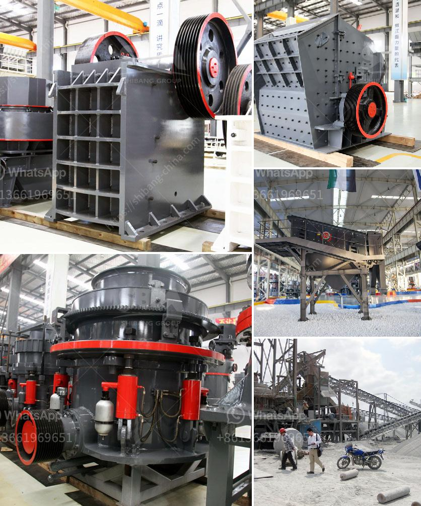

<h3>How to Make Cement Powder Using a Ball Mill ？</h3>
Cement powder is commonly used as a crucial ingredient in construction projects. Whether you are working on a large-scale project or a DIY home improvement, knowing how to make cement powder using a ball mill is a handy skill to have. A ball mill can help you to grind and homogenize small sample volumes, allowing for accurate measurement and quality control. Cement is a complex mixture of limestone, clay, and other minerals that need to be carefully handled to ensure consistent quality.

To make cement powder using a ball mill, you will need first and foremost, a suitable ball mill. The ball mill is a cylindrical drum that operates on low to medium rotation speeds. The ball mill contains a grinding medium (usually steel balls) that flatten and crush the materials in the drum as it rotates. There are different sizes of ball mills available to suit your needs, so be sure to choose the appropriate size for your project.

To start the process of making cement powder, the raw materials need to be broken into smaller pieces. This can be achieved using a crusher or hammer mill. Once the raw materials are broken down sufficiently, they are then fed into the ball mill. The ball mill is filled with a specific amount of grinding media (such as steel balls) and the raw materials are milled for a specific duration to achieve the desired fineness.

During the grinding process, the ball mill produces a fine powder known as cement powder. This powder is then carefully collected and stored. The cement powder can be used immediately or packed into bags for future use.

To ensure consistent quality cement powder, it is important to follow certain guidelines during the milling process. Firstly, the ball mill should be operated at a consistent speed to achieve a uniform grind. Additionally, the duration of the milling process should be carefully monitored to prevent over-grinding, which can lead to a loss of cement powder yield.

Furthermore, maintaining the desired moisture content in the raw materials is crucial for the quality of the cement powder. Excess moisture can lead to clumping and decrease the efficiency of the milling process. On the other hand, insufficient moisture content can result in a more coarse and less homogeneous powder.

In conclusion, making cement powder using a ball mill is a useful skill to have. By carefully controlling the variables involved in the process, one can achieve consistent and high-quality cement powder. Understanding the importance of a suitable ball mill, properly breaking down raw materials, and monitoring the grinding process are key aspects of successfully making cement powder. With practice and attention to detail, anyone can acquire the skills to make their own cement powder for various construction projects.
<h3>Contact us</h3><ul><li><strong>Whatsapp:&nbsp;<a href="https://wa.me/8613661969651">+8613661969651</a></strong></li><li><a href="https://swt.shibang-china.com/?git&amp;zhl&amp;How to Make Cement Powder Using a Ball Mill ？"><strong>Online Service(chat now)</strong></a></li></ul><h3>Related</h3><ul><li><a href='how to set up screening and crushing plant .md'>how to set up screening and crushing plant ?</a></li><li><a href='How to install ore jaw crusher.md'>How to install ore jaw crusher?</a></li><li><a href='How to make sand from rocks.md'>How to make sand from rocks?</a></li><li><a href='How to crush basalt rock.md'>How to crush basalt rock?</a></li><li><a href='How do you calculate the motor power for a vibrator screen.md'>How do you calculate the motor power for a vibrator screen?</a></li></ul>