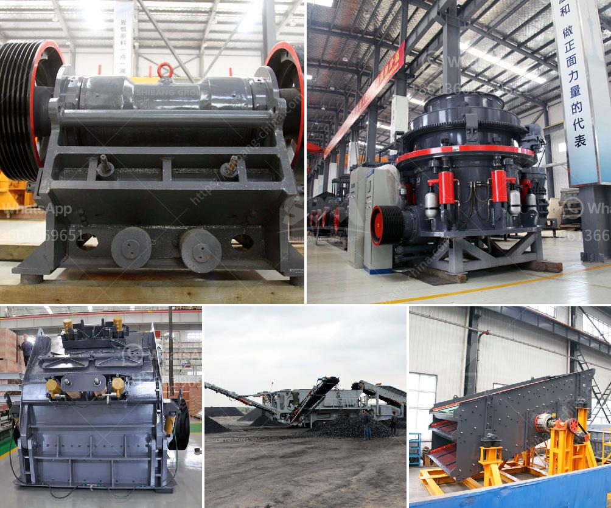

<h3>How to Make Plaster of Phosphogypsum</h3>
Plaster of Paris is a common construction material used for various applications, from creating molds to repairing cracks in walls. However, it is not the only type of plaster available. Another type, known as plaster of phosphogypsum, can be made using phosphogypsum, a byproduct of the phosphate fertilizer industry. In this article, we will provide a step-by-step guide on how to make plaster of phosphogypsum.

Using a measuring cup, measure the desired amount of phosphogypsum depending on how much plaster you want to make. Generally, a ratio of 2 parts phosphogypsum to 1 part water is used. Make sure to adjust the measurements accordingly.

In the mixing container, pour the measured water and slowly add the phosphogypsum. It is essential to add the phosphogypsum gradually while continuously stirring to ensure a lump-free mixture.

Once all the phosphogypsum has been added to the water, stir the mixture thoroughly. The consistency should resemble pancake batter, smooth and free from lumps. It is important to stir for a few minutes until the desired consistency is achieved.

After stirring, let the mixture sit undisturbed for around 5 to 10 minutes. This allows the plaster to properly set and eliminates any air bubbles that may have formed during mixing.

Once the mixture has set, you can pour it into molds or onto a desired surface. Make sure to pour or mold the plaster immediately after the waiting period as it starts to harden quickly.

Depending on the thickness of the plaster and environmental conditions, the drying time may vary. Generally, it takes around 24 to 48 hours for plaster of phosphogypsum to fully dry. During this time, it is crucial to keep the plaster away from moisture and direct sunlight.

After the plaster has dried, you can further refine and smooth the surface using sandpaper or a fine-grit sanding block. This step is particularly important if you plan to paint or decorate the plaster.

In conclusion, making plaster of phosphogypsum is a simple process that can be done using readily available materials. By following these steps, you can create a versatile construction material that is not only cost-effective but also helps in reducing the environmental impact of phosphogypsum waste. Remember to take necessary precautions while working with materials and tools, and enjoy the process of creating your own plaster of phosphogypsum.
<h3>Contact us</h3><ul><li><strong>Whatsapp:&nbsp;<a href="https://wa.me/8613661969651">+8613661969651</a></strong></li><li><a href="https://swt.shibang-china.com/?git&amp;zhl&amp;How to Make Plaster of Phosphogypsum"><strong>Online Service(chat now)</strong></a></li></ul><h3>Related</h3><ul><li><a href='How to design a crushing plant .md'>How to design a crushing plant ?</a></li><li><a href='How to increase the efficiency coal pulveriser on power plant.md'>How to increase the efficiency coal pulveriser on power plant?</a></li><li><a href='How to balance a cement mill separator.md'>How to balance a cement mill separator?</a></li><li><a href='How does a work of impact crusher.md'>How does a work of impact crusher?</a></li><li><a href='How to maintain the longterm advantages of the impact crusher.md'>How to maintain the long-term advantages of the impact crusher</a></li></ul>