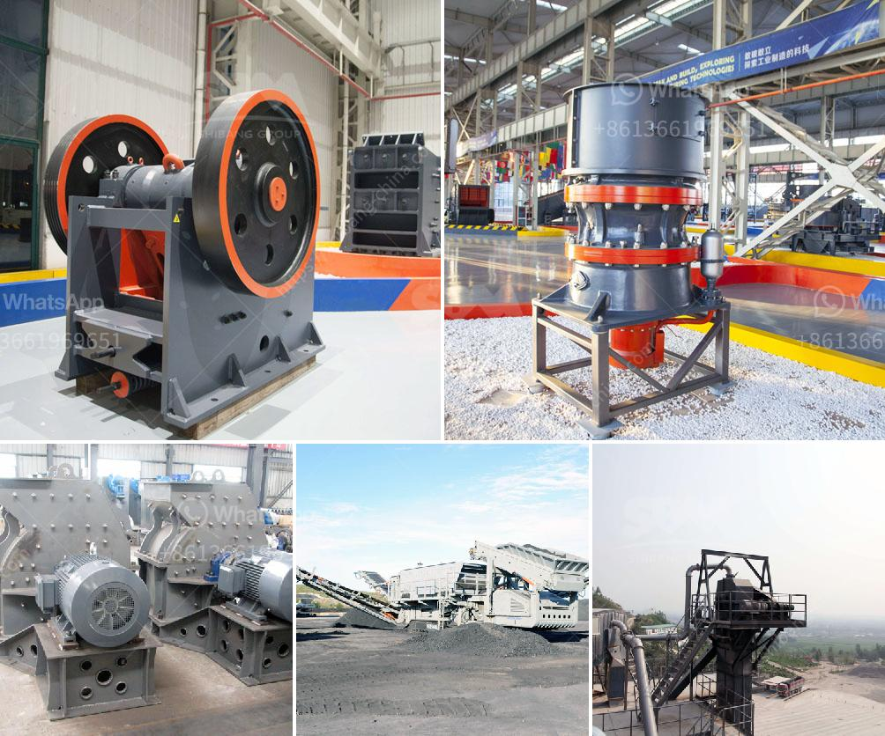

<h3>How to Operate Calcite Crushing Plant ？</h3>
Calcite is a naturally occurring mineral that has many uses in various industries. One of the most common applications of calcite is in the construction of crushing plants. These plants are used to crush rocks and other materials into smaller pieces for further processing. If you are looking to operate a calcite crushing plant, here are some tips to help you get started.

1. Choose the Right Equipment: The first step in operating a calcite crushing plant is choosing the right equipment. You will need a primary crusher, secondary crusher, and possibly a tertiary crusher. The primary crusher will break the raw material into smaller pieces, which will then be processed by the secondary and tertiary crushers. Make sure to select a machine that is capable of handling the size and hardness of the material you are working with.

2. Prepare the Material: Before feeding the material into the crushing plant, it is important to properly prepare it. Remove any large pieces of debris and check for any foreign materials that could damage the equipment. Additionally, ensure that the material is dry and free from moisture, as wet or moist material can cause blockages and reduce the efficiency of the crushers.

3. Set the Crushing Parameters: Once the material is prepared, it is time to set the crushing parameters. This includes adjusting the gap between the primary and secondary crushers, as well as the speed and amplitude of the crushers' movements. These settings will depend on the size and hardness of the material, as well as the desired final product size.

4. Monitor the Feed: It is important to constantly monitor the feed to the crushing plant. This includes checking the flow rate of the material and adjusting it if necessary. A steady and consistent feed will help ensure efficient operation and prevent any blockages or overloading of the crushers.

5. Regular Maintenance: Like any other equipment, a calcite crushing plant requires regular maintenance to ensure its optimal performance. This includes inspecting and cleaning the crushers, checking the wear parts for any signs of damage or wear, and lubricating the moving parts. Regular maintenance will help prevent breakdowns and prolong the life of the equipment.

6. Safety Measures: It is crucial to prioritize safety when operating a calcite crushing plant. Make sure all workers are properly trained in operating the equipment and aware of the safety procedures. Provide protective equipment such as goggles, gloves, and safety harnesses for those working in close proximity to the crushers. Additionally, regularly inspect the plant for any potential hazards and address them immediately.

In conclusion, operating a calcite crushing plant requires careful planning and attention to detail. By choosing the right equipment, preparing the material properly, setting the crushing parameters, monitoring the feed, regular maintenance, and implementing safety measures, you can ensure efficient operation of your crushing plant and achieve the desired results.
<h3>Contact us</h3><ul><li><strong>Whatsapp:&nbsp;<a href="https://wa.me/8613661969651">+8613661969651</a></strong></li><li><a href="https://swt.shibang-china.com/?git&amp;zhl&amp;How to Operate Calcite Crushing Plant ？"><strong>Online Service(chat now)</strong></a></li></ul><h3>Related</h3><ul><li><a href='How to run granite quarry .md'>How to run granite quarry ?</a></li><li><a href='How to Improve the Crusher Productivity of Jaw Crusher ？.md'>How to Improve the Crusher Productivity of Jaw Crusher ？</a></li><li><a href='How to adjust rotary kiln support rollers.md'>How to adjust rotary kiln support rollers?</a></li><li><a href='how to crusher river pebbles into sand ？.md'>how to crusher river pebbles into sand ？</a></li><li><a href='How to beneficiation tungsten ore.md'>How to beneficiation tungsten ore?</a></li></ul>