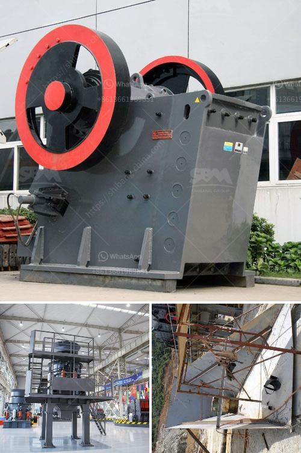

<h3>How to Operate a Portable Cone Crusher?</h3>
Portable cone crushers are prominent pieces of machinery used for crushing rocks, ore, and other materials. They are portable and can be easily transported from one site to another. The operation of a portable cone crusher is simple and straightforward, thanks to its user-friendly design that allows for easy navigation and maneuverability.

1. Pre-Start Checks: Prior to starting the cone crusher, it is imperative to conduct a thorough inspection of all the machine's components. Checking for any damages, loose bolts, or excessive wear is crucial to ensure safe and efficient operation. It is also essential to check the oil levels and ensure there is enough fuel.

2. Position the Crusher: Once the pre-start checks have been completed, position the portable cone crusher in the desired location. Ensure that it is placed on level ground to enhance stability and avoid any accidents while in operation.

3. Start-Up Procedure: To start the cone crusher, follow the manufacturer's instructions carefully. Turn on the power supply and allow the machine to warm up before getting into full operation. It is advisable to let the crusher run for a few minutes before loading it with materials to ensure smooth and efficient functioning.

4. Material Loading: Load the portable cone crusher with the desired material to be crushed. Ensure that the material is evenly distributed within the crusher's chamber to avoid overloading and to achieve an optimal crushing performance.

5. Adjustments and Controls: Use the control panel to adjust the settings of the portable cone crusher according to the desired output size and production capacity. The operator can choose the appropriate crushing mode, adjust the speed of the feeder, fine-tune the discharge opening, and set various other parameters to optimize the crusher's performance.

6. Feeding and Operation: Control the flow of material into the cone crusher using the feeding equipment. Make sure the material is evenly fed into the crusher's chamber to avoid any obstructions or clogging. Monitor the crusher during operation to ensure smooth crushing and detect any abnormalities or issues that may arise.

7. Maintenance and Lubrication: Regular maintenance and lubrication are essential for the proper functioning of a portable cone crusher. Follow the manufacturer's recommendations for oil changes, filter replacements, and general maintenance procedures to prolong the machine's lifespan and minimize downtime.

8. Shutdown: When you are done operating the portable cone crusher, follow the manufacturer's recommendations for the proper shutdown procedure. Turn off the power supply, allow the machine to cool down, and perform a final inspection to identify any damages or issues that need attention.

In conclusion, operating a portable cone crusher requires adherence to safety guidelines and the manufacturer's instructions. Following the correct procedures for start-up, material loading, adjustments, maintenance, and shutdown will ensure a seamless and efficient operation. By mastering these steps, operators can successfully operate a portable cone crusher and achieve consistent crushing results.
<h3>Contact us</h3><ul><li><strong>Whatsapp:&nbsp;<a href="https://wa.me/8613661969651">+8613661969651</a></strong></li><li><a href="https://swt.shibang-china.com/?git&amp;zhl&amp;How to Operate a Portable Cone Crusher"><strong>Online Service(chat now)</strong></a></li></ul><h3>Related</h3><ul><li><a href='How to operate a vibrating screen.md'>How to operate a vibrating screen?</a></li><li><a href='How to adjust the conveyor belt.md'>How to adjust the conveyor belt?</a></li><li><a href='how to choose mobile jaw crusher machinery ？.md'>how to choose mobile jaw crusher machinery ？</a></li><li><a href='how to an ore bauxite jaw crusher ？.md'>how to an ore bauxite jaw crusher ？</a></li><li><a href='How to choose a basalt crusher？.md'>How to choose a basalt crusher？</a></li></ul>