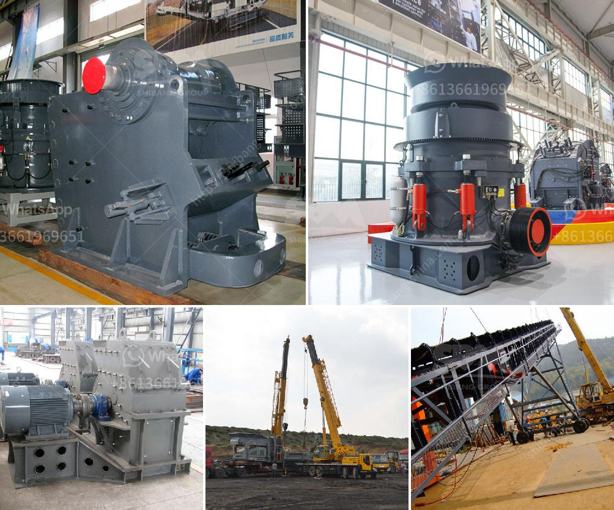

<h3>How to Select a Type of Crusher</h3>
Crushers are machines designed to reduce large rocks into smaller rocks, gravel, or rock dust. They are commonly used in various industries such as mining, construction, and recycling. Selecting the right type of crusher for your application can be crucial to achieving desired results. With a plethora of options available in the market, it is essential to understand the factors that influence the selection process. In this article, we will discuss some important considerations to help you select the most suitable crusher for your needs.

The first step in selecting a crusher is to analyze the characteristics of the material to be crushed. Different materials have varying hardness, abrasiveness, and moisture content. For instance, a jaw crusher is ideal for hard and abrasive materials like granite, while an impact crusher works better for softer materials like limestone. Understanding the material's characteristics will guide you towards choosing the most efficient crushing machine.

Assessing the required capacity or the amount of material that needs to be processed per hour is crucial. If you have a high-volume production requirement, a cone crusher or a gyratory crusher may be more suitable due to their ability to handle large volumes of material efficiently. On the other hand, if your production demands are relatively low, a jaw crusher might suffice.

Another critical factor to consider is the operating costs associated with the crusher. This includes the cost of energy consumption, maintenance, and replacement parts. Different types of crushers have varying operational costs. For example, cone crushers typically have higher operating costs than impact crushers. It is important to assess the long-term financial implications before making a decision.

The physical size of the crusher and the available space at your site are important factors to account for. Some crushers have larger footprints and require a significant amount of space for installation. If you have limited space or need a mobile solution, a compact crusher such as a jaw crusher or an impact crusher might be a better choice. Consider not only the immediate space requirements but also the accessibility for maintenance and repairs.

In today's environmentally conscious world, considering the environmental impact of your crushing operations is crucial. Some crushers emit excessive dust, noise, or vibrations, which can be detrimental to the surrounding environment and the health of the workers. Ensure you choose a crusher with appropriate mitigation measures, such as dust suppression systems or noise reduction features, to minimize the impact on the environment and improve the overall working conditions.

Lastly, think about your future requirements and the possibility of expanding your operations. Selecting a versatile crusher that can adapt to changing needs might be beneficial in the long run. For instance, a mobile crusher provides flexibility and allows you to relocate it easily if needed.

In conclusion, selecting the right type of crusher involves assessing the material characteristics, capacity requirements, operating costs, size constraints, environmental impact, and future expansion plans. It is essential to thoroughly evaluate these factors to make an informed decision. Consulting experts or manufacturers can also provide invaluable guidance based on their experience and expertise. Remember, investing time and effort in selecting the most suitable crusher can significantly impact the efficiency and profitability of your operations in the long term.
<h3>Contact us</h3><ul><li><strong>Whatsapp:&nbsp;<a href="https://wa.me/8613661969651">+8613661969651</a></strong></li><li><a href="https://swt.shibang-china.com/?git&amp;zhl&amp;How to Select a Type of Crusher"><strong>Online Service(chat now)</strong></a></li></ul><h3>Related</h3><ul><li><a href='how to wash stone chippings ？.md'>how to wash stone chippings ？</a></li><li><a href='How to maintain the vibrating feeder.md'>How to maintain the vibrating feeder?</a></li><li><a href='how the mine crusher operate .md'>how the mine crusher operate ?</a></li><li><a href='how ores are classified .md'>how ores are classified ?</a></li><li><a href='How to maintain vertical raw mill in cement plant.md'>How to maintain vertical raw mill in cement plant?</a></li></ul>