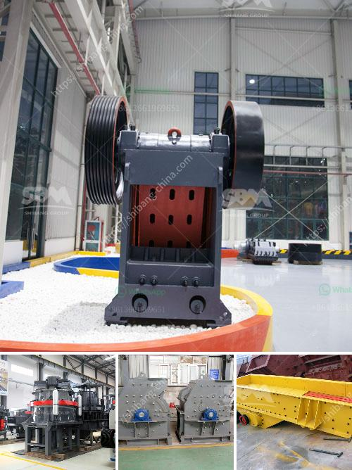

<h3>How to Splice Crusher Belt Conveyor ？</h3>
A crusher belt conveyor is an essential component found in various industries and is commonly used for transporting bulk materials. Over time, the belt may experience wear and tear, or there might be a need to replace it due to damage. In such cases, it becomes necessary to splice the belt conveyor to ensure its proper functioning. Splicing a crusher belt conveyor can be a complex process, but with the right tools and techniques, it can be done efficiently. In this article, we will discuss the steps involved in splicing a crusher belt conveyor.

Before we dive into the splicing process, it is essential to have the necessary tools and equipment readily available. Some of the tools you will need include a belt splicing kit, belt cutters, a measuring tape, a knife, and a roller. It is also crucial to make sure that the area where the splicing will take place is clean and free from any debris.

The first step in splicing a crusher belt conveyor is to measure and cut the new belt to the appropriate length. The belt should be cut with precision to ensure a smooth and seamless splice. It is important to measure the belt accurately to avoid any overlaps or gaps.

Once the new belt is cut to the desired length, the next step is to remove the old belt from the conveyor system. This can be done by loosening any tensioners and loosening the bolts or screws that hold the belt in place. Care should be taken to avoid damaging the conveyor system during this process.

After the old belt is removed, the next step is to prepare the new belt for splicing. This involves applying adhesive to the belt ends to ensure a strong and secure splice. The adhesive should be spread evenly and allowed to dry according to the manufacturer's instructions.

Once the adhesive is dry, the next step is to align the belt ends for splicing. This can be done by overlapping the ends and using a cutting tool to create a precise splice point. It is important to ensure that the splice is straight and aligned correctly to prevent any future issues with the belt conveyor.

After the splice point is created, the next step is to apply pressure to the splice and secure it using a belt splicing kit. The kit will typically include a roller, which should be used to apply sufficient pressure to the splice. This will ensure that the adhesive bonds securely and holds the splice in place.

Once the splice is complete, it is crucial to verify its strength and integrity. This can be done by conducting a thorough inspection of the entire belt conveyor system. Any loose or damaged components should be addressed and repaired before operating the system again.

In conclusion, splicing a crusher belt conveyor is a necessary process to ensure the smooth functioning of the conveyor system. By following the proper steps and using the right tools, the splicing process can be completed efficiently. However, it is important to exercise caution and seek professional assistance if needed, particularly when working with heavy-duty conveyor systems.
<h3>Contact us</h3><ul><li><strong>Whatsapp:&nbsp;<a href="https://wa.me/8613661969651">+8613661969651</a></strong></li><li><a href="https://swt.shibang-china.com/?git&amp;zhl&amp;How to Splice Crusher Belt Conveyor ？"><strong>Online Service(chat now)</strong></a></li></ul><h3>Related</h3><ul><li><a href='How to build a small rock crusher.md'>How to build a small rock crusher?</a></li><li><a href='How does a jaw crusher crush limestone.md'>How does a jaw crusher crush limestone?</a></li><li><a href='How to maintain the vibrating feeder.md'>How to maintain the vibrating feeder?</a></li><li><a href='how to calculate the production capacity of cone crusher .md'>how to calculate the production capacity of cone crusher ?</a></li><li><a href='How to select cone crusher parts.md'>How to select cone crusher parts?</a></li></ul>