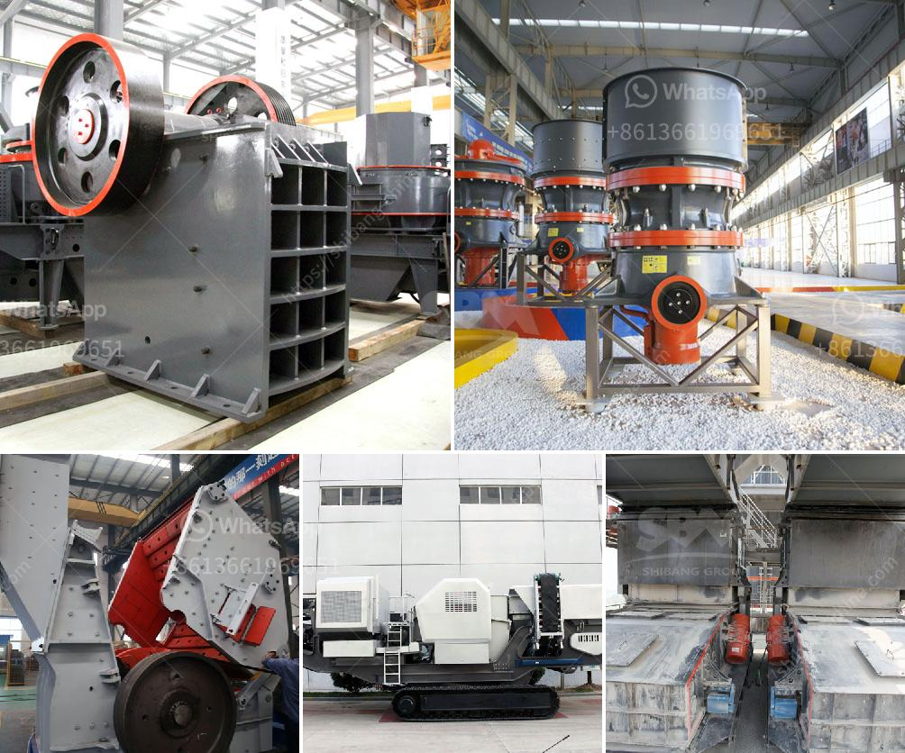

<h3>How to Start a South African Manganese Ore Processing Plant ？</h3>
Manganese ore is a crucial resource that is predominantly used in the production of steel. South Africa, the third-largest producer of manganese ore in the world, is a prime location to establish a processing plant. However, to fully utilize its abundant resource, there are certain steps and considerations that need to be taken into account when starting a manganese ore processing plant in South Africa.

1. Conduct a feasibility study: Before embarking on any new venture, it is essential to conduct a detailed feasibility study to determine the viability of the project. This study should include an analysis of the manganese ore reserves in the area, market demand, anticipated production capacity, investment costs, and potential profitability.

2. Obtain the necessary licenses and permits: To operate a manganese ore processing plant, you will need to acquire various licenses and permits from the relevant authorities. These include mining rights, environmental permits, and other regulatory clearances. It is crucial to understand and comply with all legal requirements to avoid any complications in the future.

3. Secure financing: Starting a processing plant requires a significant amount of capital investment. Therefore, it is essential to secure adequate financing. This can be through self-funding, loans from financial institutions, or attracting investors interested in the manganese mining industry. A well-prepared business plan highlighting the potential returns on investment can help in attracting financing partners.

4. Select an appropriate location: Choose a location that offers easy access to manganese ore reserves and has well-developed infrastructure such as transportation, water, and electricity. The proximity to major ports can facilitate the export of processed manganese ore to international markets.

5. Set up the processing plant: The processing plant should be designed and equipped with suitable machinery and equipment to efficiently extract and process manganese ore. This may include crushers, screens, magnetic separators, and flotation equipment, among others. It is crucial to select high-quality and reliable machinery to ensure smooth operations.

6. Establish partnerships: Collaborating with other stakeholders, such as suppliers, logistics providers, and shipping companies, can enhance the efficiency and effectiveness of the manganese ore processing plant. Establishing long-term partnerships can help secure a steady supply of manganese ore and expedite the transport of processed ore to markets.

7. Consider sustainability: Adopting sustainable practices in the processing plant can have positive impacts on the environment and enhance the plant's reputation. For instance, implementing environmentally friendly processes, utilizing renewable energy sources, and minimizing waste generation are crucial considerations.

8. Develop a marketing and sales strategy: Once the processing plant is operational, it is crucial to develop a robust marketing and sales strategy to identify and target potential customers both domestically and internationally. Establishing long-term contracts with steel producers and other manganese ore buyers is crucial for securing stable demand and maximizing profitability.

In conclusion, starting a manganese ore processing plant in South Africa requires careful planning, extensive research, securing necessary licenses and permits, obtaining financing, setting up the plant, and developing marketing strategies. By following these steps and considering the unique challenges and opportunities in the South African market, entrepreneurs can establish a successful and profitable manganese ore processing plant.
<h3>Contact us</h3><ul><li><strong>Whatsapp:&nbsp;<a href="https://wa.me/8613661969651">+8613661969651</a></strong></li><li><a href="https://swt.shibang-china.com/?git&amp;zhl&amp;How to Start a South African Manganese Ore Processing Plant ？"><strong>Online Service(chat now)</strong></a></li></ul><h3>Related</h3><ul><li><a href='How to increase the capacity of ball mill .md'>How to increase the capacity of ball mill ?</a></li><li><a href='How to determine the capacity of impact crusher？.md'>How to determine the capacity of impact crusher？</a></li><li><a href='How to set up a quarry plant.md'>How to set up a quarry plant?</a></li><li><a href='How to crush lumps of coal.md'>How to crush lumps of coal?</a></li><li><a href='how to start a stone crushing business in USA .md'>how to start a stone crushing business in USA ?</a></li></ul>