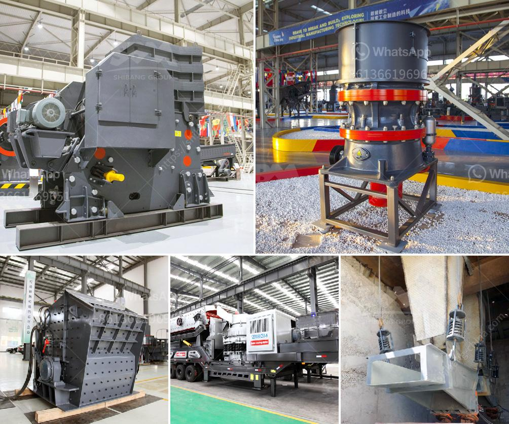

<h3>How to Use Cone Crusher and Jaw Crusher ？</h3>
When it comes to using cone crushers and jaw crushers, it is essential to understand the basics of both machines and their respective applications. A cone crusher operates by crushing rock between an eccentrically gyrating spindle, whereas a jaw crusher utilizes compressive force to break particles.

Here are some tips to maximize the efficiency and productivity of both cone crushers and jaw crushers.

- Start the cone crusher and allow it to run for a few minutes before feeding it ore. This allows the machine to reach its optimal operating condition.

- Feed the material evenly into the crusher. Uneven feed distribution may cause an uneven crushing process, affecting the final product quality.

- Make sure the material is pre-screened, removing any oversized particles that could cause blockages and damage to the cone crusher.

- Regularly inspect and maintain the cone crusher's components, such as the mantle and concave. The wear and tear on these parts can impact the crusher's performance.

- Adjust the CSS (Closed Side Setting) to ensure the desired product size. A smaller CSS results in finer output, while a larger CSS produces coarser output.

- Optimize the crushing chamber by utilizing the correct liner configuration. Different settings can enhance the overall efficiency of the cone crusher.

- Start the jaw crusher and let it run for a few minutes before feeding it any material. This will allow the machine to reach its optimal operating condition.

- Regularly check the jaw crusher's wear parts, such as the jaw plates and liners, for signs of wear. If any damage or excessive wear is found, it should be replaced promptly to ensure the machine's efficiency.

- Check the jaw crusher's CSS (Closed Side Setting) regularly. The CSS determines the product size output from the crusher. Adjusting the CSS can help achieve the desired product size.

- Avoid overloading the jaw crusher by ensuring that the material fed into the machine is within its capacity. Overloading can cause damage to the jaw crusher and reduce its lifespan.

- Keep the jaw crusher's choke feed level, i.e., the level at which the chamber is kept full, consistent to ensure optimal productivity. A choke feed ensures a steady flow of material into the jaw crusher.

In conclusion, understanding how to use cone crushers and jaw crushers correctly can significantly enhance the efficiency and productivity of these machines. Regular maintenance, proper feed distribution, adjusting CSS, and optimizing the crushing chamber are all crucial aspects to consider. By following these tips, users can make the most of their cone crushers and jaw crushers, resulting in better quality products and increased profitability.
<h3>Contact us</h3><ul><li><strong>Whatsapp:&nbsp;<a href="https://wa.me/8613661969651">+8613661969651</a></strong></li><li><a href="https://swt.shibang-china.com/?git&amp;zhl&amp;How to Use Cone Crusher and Jaw Crusher ？"><strong>Online Service(chat now)</strong></a></li></ul><h3>Related</h3><ul><li><a href='How to operate a calcite crusher plant.md'>How to operate a calcite crusher plant?</a></li><li><a href='How does a line ball mill working.md'>How does a line ball mill working?</a></li><li><a href='how to size a limestone screen？.md'>how to size a limestone screen？</a></li><li><a href='How to balance a cement mill separator.md'>How to balance a cement mill separator?</a></li><li><a href='How to set up a clinker grinding unit.md'>How to set up a clinker grinding unit?</a></li></ul>