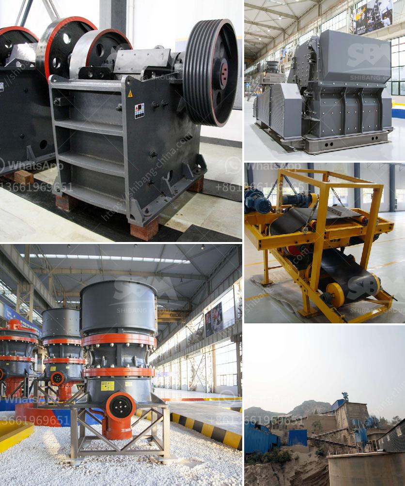

<h3>How to Use a Hammer Mill Kenya ？</h3>
A hammer mill is a versatile machine used in various industries for grinding raw materials into fine powders or granules. In Kenya, hammer mills are used to grind maize, wheat, sorghum, millet, and other grains into flour or animal feed. In this article, we will discuss the basic steps on how to use a hammer mill in Kenya.

Before using the hammer mill, it is important to assemble and install all the necessary components. Begin by attaching the blades or hammers onto the rotor shaft. Ensure that each blade is firmly secured to avoid accidents during operation. Next, install the screen plates or sieves. These screens determine the size of the ground material. Choose the appropriate screen size for your desired output. Finally, connect the machine to a power source and ensure that it is properly grounded.

Before feeding the raw material into the hammer mill, it is essential to prepare it properly. Remove any foreign objects such as stones, metal fragments, or large pieces of wood that may damage the machine. Clean and dry the raw material to prevent clogging or sticking during the grinding process. Cut the material into small pieces or flakes if necessary for easier processing.

The grinding parameters of the hammer mill need to be adjusted according to the desired final product. These parameters include rotor speed, hammer configuration, screen size, and feed rate. A higher rotor speed will result in finer ground material, while a lower speed will produce coarser particles. The hammer configuration determines the type of grinding action and impact on the material. Experiment with different screen sizes and feed rates to achieve the desired particle size distribution.

Carefully feed the prepared raw material into the hopper of the hammer mill. Avoid overloading the machine, as this may lead to poor grinding performance or damage to the mill. Gradually increase the feed rate to maximize the throughput without compromising the quality of the ground material. Monitor the machine during operation and make adjustments if necessary.

Once the material has been adequately ground, it will pass through the screen plates and collect in a container or bag attached to the mill's outlet. Ensure that the collection container is clean and properly sealed to prevent contamination or loss of the ground material. Use a sieve or air classifier to separate any oversized or undersized particles, if desired.

After each use, it is essential to clean the hammer mill thoroughly to prevent cross-contamination between different materials. Disconnect the power supply and remove any residual material from the machine. Inspect the blades, screens, and other components for wear or damage and replace as necessary. Regular maintenance and lubrication will prolong the lifespan of the machine and ensure optimal performance.

In conclusion, a hammer mill is a valuable tool for grinding various raw materials in Kenya. By following the above steps, you can effectively use a hammer mill to process grains into flour or animal feed. Proper assembly, preparation, and adjustment of grinding parameters are crucial for efficient and safe operation. Regular cleaning and maintenance will help maintain the machine's performance and prolong its lifespan.
<h3>Contact us</h3><ul><li><strong>Whatsapp:&nbsp;<a href="https://wa.me/8613661969651">+8613661969651</a></strong></li><li><a href="https://swt.shibang-china.com/?git&amp;zhl&amp;How to Use a Hammer Mill Kenya ？"><strong>Online Service(chat now)</strong></a></li></ul><h3>Related</h3><ul><li><a href='How to choose a limestone hammer mill ？.md'>How to choose a limestone hammer mill ？</a></li><li><a href='How to clean copper ore with equipment .md'>How to clean copper ore with equipment ?</a></li><li><a href='How to process tantalite mineral.md'>How to process tantalite mineral?</a></li><li><a href='how to  granite rocks in double toggle jaw crusher.md'>how to  granite rocks in double toggle jaw crusher</a></li><li><a href='How to reduce VSI crusher noise.md'>How to reduce VSI crusher noise?</a></li></ul>