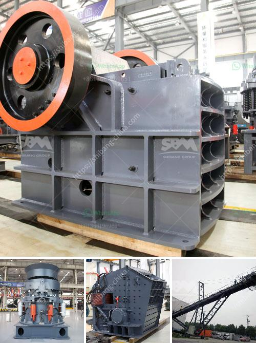

<h3>How to achieve a smooth coal pulverizer?</h3>
Coal pulverizers play a vital role in the efficient and effective utilization of coal for power generation. These machines are responsible for grinding coal into fine powder, which enables better combustion and ensures maximum heat release during the combustion process. However, achieving a smooth coal pulverizer operation can be a challenge due to several factors. In this article, we will discuss some key steps to help achieve a smooth coal pulverizer.

1. Regular Inspection and Maintenance: Regular inspection and maintenance of coal pulverizers are crucial in ensuring their smooth operation. This includes checking for wear and tear of grinding elements, clearances, and alignment of all parts. Any signs of excessive wear or misalignment should be addressed promptly to prevent further damage and ensure optimal performance.

2. Proper Fuel Preparation: To achieve a smooth coal pulverizer, it is essential to have consistent and properly prepared fuel. The coal feed should have a consistent particle size distribution, as variations can lead to uneven grinding and poor combustion. Utilizing coal screening equipment and ensuring a proper coal drying process can help achieve the desired fuel consistency.

3. Optimal Pulverizer Settings: Tuning the pulverizer settings is critical to achieving a smooth operation. The pulverizer settings should be optimized based on factors such as coal type, desired fineness, and mill capacity. Adjusting the pulverizer settings can involve altering the airflow and adjusting the classifier settings to achieve the desired coal fineness.

4. Utilize Grinding Aids: Grinding aids can enhance the grinding efficiency of coal pulverizers. These additives are often used to improve the flow characteristics of coal particles, reduce grinding energy requirements, and increase the overall pulverizer capacity. Different grinding aids are available in the market, and their selection should be based on coal properties and desired performance improvements.

5. Monitor Pulverizer Performance: Regularly monitoring pulverizer performance is crucial in detecting any deviations from the desired operation. Monitoring parameters such as coal flow rates, air-to-fuel ratios, and outlet temperature can help identify potential issues before they lead to significant disruptions. Using advanced monitoring tools and technologies can provide real-time insights into the pulverizer's performance and facilitate timely adjustments.

6. Upgrading Pulverizer Technology: Upgrading the coal pulverizer technology can significantly improve its efficiency and reliability. Modern pulverizers are equipped with advanced features such as dynamic classifiers, improved grinding elements, and enhanced control systems. Upgrading to these technologies can lead to better fuel fineness control, reduced emissions, and enhanced overall pulverizer performance.

In conclusion, achieving a smooth coal pulverizer operation is crucial for optimal power generation efficiency. Regular inspection and maintenance, proper fuel preparation, optimal pulverizer settings, utilization of grinding aids, monitoring performance, and upgrading technology are essential steps in achieving this objective. By following these steps, power plant operators can enhance coal pulverizer performance, improve combustion efficiency, and ensure reliable power generation.
<h3>Contact us</h3><ul><li><strong>Whatsapp:&nbsp;<a href="https://wa.me/8613661969651">+8613661969651</a></strong></li><li><a href="https://swt.shibang-china.com/?git&amp;zhl&amp;How to achieve a smooth coal pulverizer"><strong>Online Service(chat now)</strong></a></li></ul><h3>Related</h3><ul><li><a href='How to determine the value of a rock quarry.md'>How to determine the value of a rock quarry?</a></li><li><a href='how to make a ball mill .md'>how to make a ball mill ?</a></li><li><a href='How to establish a 60ton coal crusher plant.md'>How to establish a 60-ton coal crusher plant?</a></li><li><a href='How to install a stone crusher plant.md'>How to install a stone crusher plant?</a></li><li><a href='how to calculate belt feeder ？.md'>how to calculate belt feeder ？</a></li></ul>