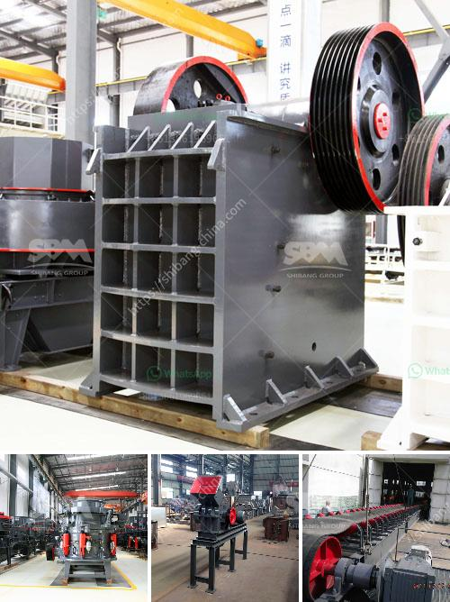

<h3>How to adjust a jaw crusher ?</h3>
A jaw crusher is one of the most commonly used crushing machines in mining and quarry industries, jaw crusher is widely used for crushing various materials like stone, granite, trap rock, coke, coal, manganese ore, iron ore, emery, fused aluminum, oxide, fused calcium carbide, lime stone, quartzite, alloys, etc.

Jaw crushers are recommended for primary and secondary crushing of large stones or ores. It is essential to adjust the jaw crusher to a specific size of the desired material in order to avoid the over-crushing or under-crushing of the material.

Here are a few steps to adjust your jaw crusher's closed side setting (CSS) conveniently and correctly:

Checking the CSS- zero setting or the gap between the jaws of the jaw crusher is mandatory. This gap is known as the crusher setting and the specified value can be found within the user manual of the specific jaw crusher.

Jaw crushers are equipped with a wedge-shaped gap adjustment system that allows the gap to be adjusted by pulling or pushing a lever. The system is used to determine the gap between the jaws and set the desired width. The gap adjustment can be mechanical or hydraulic.

For mechanical adjustment, the crusher jaws are pulled or pushed hydraulically to reduce or increase the size of the gap. For hydraulic adjustment, the crusher jaws are adjusted by utilizing a hydraulic cylinder within the crusher frame, ensuring that the gap is evenly adjusted on both sides.

Jaw crushers are capable of producing a wide range of discharge sizes. The final product size depends on the gap setting and is determined by the specifications of the crushing chamber and the eccentric throw of the crusher.

To adjust the jaw crusher's discharge size, operators need to change the size of the jaw crusher's discharge port. The adjustment of the discharge port is relatively simple, with the use of a hydraulic cylinder to permit the mechanism to operate.

After adjusting the jaw crusher, it is necessary to check the final product size. It is recommended to use a sieve with appropriate size openings to check whether the jaw crusher produces the desired size of crushed material.

If the final product size is not as desired, further adjustments may be required by repeating the above steps until the desired result is achieved.

In conclusion, adjusting a jaw crusher requires a thorough understanding of the machine and its capabilities. It is important to follow the manufacturer's instructions and guidelines to ensure proper adjustment.

Regular maintenance and inspection of the jaw crusher are also crucial to avert potential problems and maximize its performance. By following the correct adjustment procedures, operators can optimize their jaw crusher's production and attain the desired output size for their specific application.
<h3>Contact us</h3><ul><li><strong>Whatsapp:&nbsp;<a href="https://wa.me/8613661969651">+8613661969651</a></strong></li><li><a href="https://swt.shibang-china.com/?git&amp;zhl&amp;How to adjust a jaw crusher "><strong>Online Service(chat now)</strong></a></li></ul><h3>Related</h3><ul><li><a href='How is the cone crusher working.md'>How is the cone crusher working?</a></li><li><a href='How to remove calcium oxide from manganese ore.md'>How to remove calcium oxide from manganese ore?</a></li><li><a href='How to choose the right grinder for the processing mineral materials.md'>How to choose the right grinder for the processing mineral materials?</a></li><li><a href='How to find capacity of a cone crusher.md'>How to find capacity of a cone crusher?</a></li><li><a href='How to make a foundation for sand crusher.md'>How to make a foundation for sand crusher?</a></li></ul>