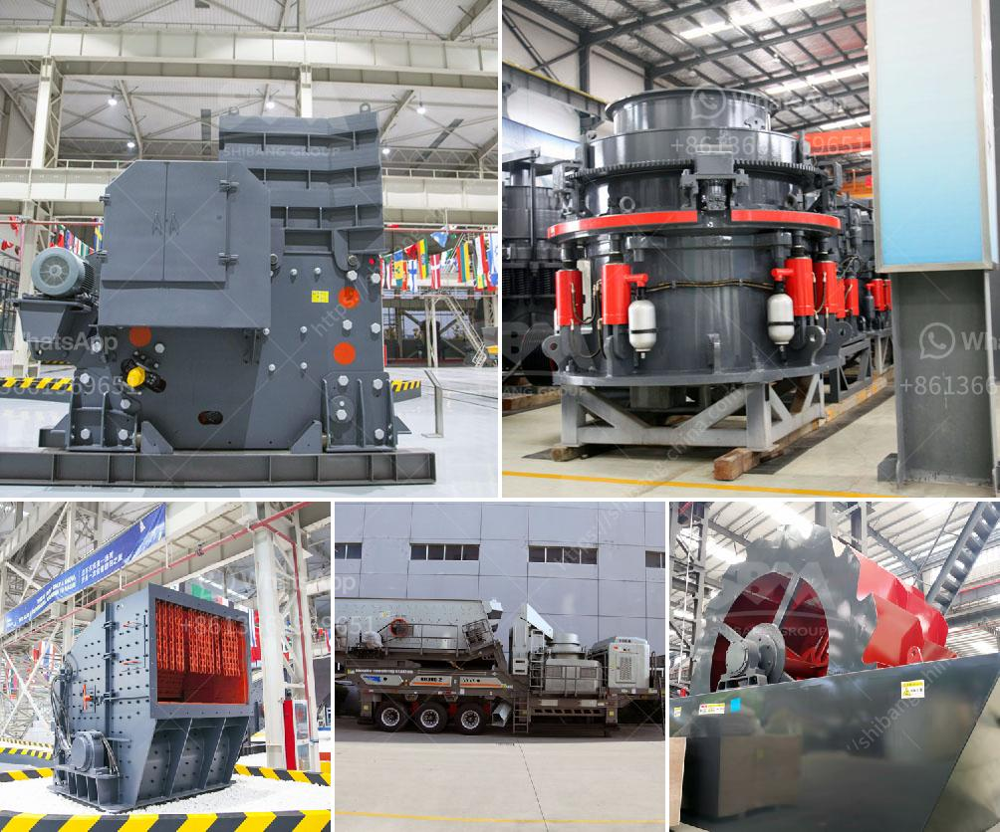

<h3>How to adjust a single-toggle jaw crusher?</h3>
A single-toggle jaw crusher is a type of jaw crusher that is widely used in many industries. The key component of the single toggle jaw crusher is the pitman, which is the main moving part of the jaw crusher. It is often made from cast steel and fitted with replaceable liners, made of manganese steel or Ni-hard, a nickel-chromium alloyed cast iron.

In a single-toggle jaw crusher, the moving jaw is itself suspended from an eccentric shaft and the lower part is supported by a toggle plate. It is used to adjust the size of the discharge opening and to compensate for wear between the jaw plates caused by feeding materials and jaws wear during operation. The toggle plate also plays a role in protecting the jaw crusher by acting as a fuse, which helps prevent damage to the machine if uncrushable material enters the crushing chamber.

1. Replace liners: Before starting the adjustment process, it is necessary to replace the liners, especially if they are worn. Worn liners can affect the crushing capacity and cause uneven wear of the jaw plates, leading to decreased efficiency and increased costs.

2. Check the discharge opening: Measure the distance between the valley of the corrugations on one jaw plate to the top of the opposite jaw plate. This measurement represents the closed side setting (CSS), which determines the size of the crushed material. If necessary, adjust the CSS by adding or removing shims between the toggle plate and the main frame.

3. Adjust the toggle plate: The toggle plate is connected to the pitman and controls the movement of the moving jaw. If the discharge opening needs further adjustment, adjust the toggle plate accordingly. This can be done by adjusting the tension rods, which are used to push the toggle plate against the main frame. Loosen the tension rods and turn them in or out to change the position of the toggle plate and the size of the discharge opening.

4. Lubricate moving parts: During operation, the moving parts of the jaw crusher need regular lubrication to reduce friction and prevent excessive wear. Make sure to lubricate the pitman bearings, eccentric shaft bearings, and the toggle plate connections with high-quality lubricating oil or grease.

5. Check the jaw plates: Regularly inspect the jaw plates for signs of wear or damage. If the jaw plates are excessively worn or damaged, they should be replaced to maintain the efficiency and performance of the jaw crusher.

Adjusting a single-toggle jaw crusher requires careful attention to detail and proper maintenance practices. By following these steps, operators can ensure that their jaw crusher operates at its peak performance and achieves optimal crushing results. Remember, always prioritize safety and consult the manufacturer's guidelines and instructions when making any adjustments or replacements to the crusher.
<h3>Contact us</h3><ul><li><strong>Whatsapp:&nbsp;<a href="https://wa.me/8613661969651">+8613661969651</a></strong></li><li><a href="https://swt.shibang-china.com/?git&amp;zhl&amp;How to adjust a singletoggle jaw crusher"><strong>Online Service(chat now)</strong></a></li></ul><h3>Related</h3><ul><li><a href='How to build a granite crushing plant？.md'>How to build a granite crushing plant？</a></li><li><a href='How to start stone crusher project.md'>How to start stone crusher project?</a></li><li><a href='How to adjust the discharge opening of a spring cone crusher.md'>How to adjust the discharge opening of a spring cone crusher?</a></li><li><a href='How to select a jaw crusher.md'>How to select a jaw crusher?</a></li><li><a href='How much does a mobile crusher plant cost.md'>How much does a mobile crusher plant cost?</a></li></ul>