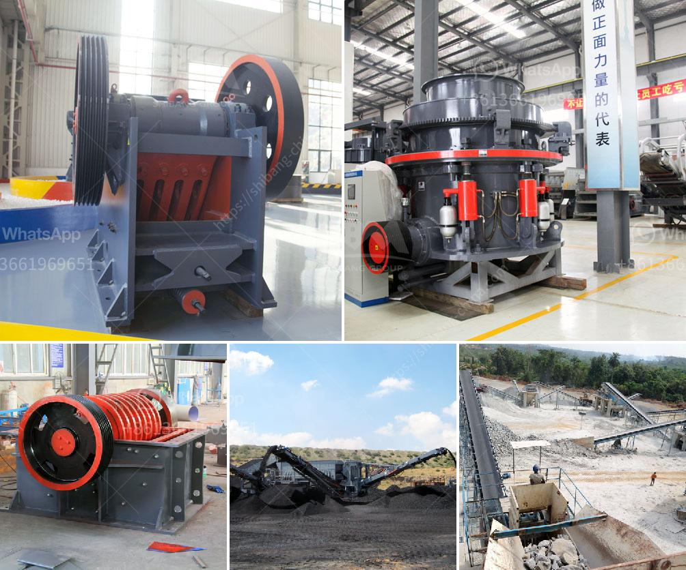

<h3>How to adjust a toggle spring on a jaw crusher?</h3>
A jaw crusher is a versatile piece of equipment that is used for crushing hard rock and ore. In essence, a jaw crusher is used to reduce the size of materials through squeezing and crushing. This process is achieved by using a toggle spring, otherwise known as a toggle plate.

The toggle spring is responsible for the downward movement of the jaw, while the eccentric motion is generated by the eccentric shaft. This movement helps to achieve the desired crushing process, thus reducing the size of large rocks and materials for subsequent treatment. However, over time, the toggle spring may become loose or damaged, requiring adjustment or replacement.

The first step in adjusting the toggle spring is to locate the tension rod, which is the metal rod that connects the toggle plate to the movable jaw. It is important to ensure that the tension rod is securely tightened before supplying power to the crusher. To adjust the tension rod, the spring seat must be loosened by unscrewing the set screws located on the back of the crusher.

Once the set screws are loosened, the hydraulic cylinder piston can be retracted and the toggle plate can be removed. It is important to note that the toggle plate should be replaced if it is worn or damaged, as this can affect the overall performance of the jaw crusher.

To adjust the toggle spring tension, the spring nut must be positioned and tightened accordingly. Once the toggle spring tension is set, the spring nut lock can be tightened to prevent any movement of the toggle plate. To adjust the toggle alignment, the tension springs must be tightened or loosened.

If the tension spring breaks, it will need to be replaced. Once the toggle tension has been set, the spring adjustment bolts can be loosened and the spring can be compressed or decompressed to change the length and pressure of the spring. This will help to ensure that the toggle spring is exerting the right amount of force on the toggle plates, preventing them from wearing prematurely.

It is important to regularly check and adjust the toggle spring tension on a jaw crusher. This will help to prolong the lifespan of the toggle plates and prevent unnecessary downtime. Proper maintenance and adjustment of the toggle spring will also contribute to the overall efficiency and performance of the jaw crusher.

In summary, adjusting the toggle spring on a jaw crusher is a crucial yet often overlooked part of maintaining a jaw crusher. This article provides tips to help you properly adjust the toggle spring on your jaw crusher. Be sure to follow the instructions provided by the manufacturer for the best results and continued safe use of your jaw crusher.
<h3>Contact us</h3><ul><li><strong>Whatsapp:&nbsp;<a href="https://wa.me/8613661969651">+8613661969651</a></strong></li><li><a href="https://swt.shibang-china.com/?git&amp;zhl&amp;How to adjust a toggle spring on a jaw crusher"><strong>Online Service(chat now)</strong></a></li></ul><h3>Related</h3><ul><li><a href='How to determine the size of the conveyor belt in mining？.md'>How to determine the size of the conveyor belt in mining？</a></li><li><a href='How to crush the California sandstone .md'>How to crush the California sandstone ?</a></li><li><a href='How does a raw mill work in a cement plant.md'>How does a raw mill work in a cement plant?</a></li><li><a href='how jaw crusher working .md'>how jaw crusher working ?</a></li><li><a href='How to adjust the discharge port of stone cone crusher ？.md'>How to adjust the discharge port of stone cone crusher ？</a></li></ul>